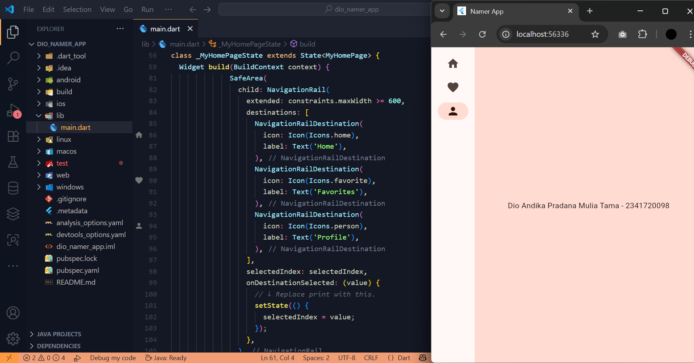

# Pemrograman Mobile - Aplikasi Pertama dan Widget Dasar Flutter

NIM : 2341720098 <br>
NAMA : Dio Andika Pradana Mulia Tama <br>
KELAS : TI-3F

## Praktikum 1: Membuat Project Flutter Baru

### Langkah 4

Jika sudah selesai proses pembuatan project baru, pastikan tampilan seperti berikut. Pesan akan tampil berupa "**Your Flutter Project is ready!**" artinya Anda telah berhasil membuat project Flutter baru.


## Praktikum 2: Menghubungkan Perangkat Android atau Emulator

Melanjutkan dari praktikum 1, Anda diminta untuk menjalankan aplikasi ke perangkat fisik (device Android atau iOS). Silakan ikuti langkah-langkah pada codelab tautan berikut ini.

https://developer.android.com/codelabs/basic-android-kotlin-compose-connect-device?hl=id#0

### Bukti


## Praktikum 3: Membuat Repository GitHub dan Laporan

### Langkah 10

Lakukan push juga untuk semua file lainnya dengan pilih **Stage All Changes**. Beri pesan commit "**project hello_world**". Maka akan tampil di repository GitHub Anda seperti berikut.


### Langkah 11

Kembali ke VS Code, ubah platform di pojok kanan bawah ke emulator atau device atau bisa juga menggunakan browser Chrome. Lalu coba running project **hello_world** dengan tekan **F5** atau **Run > Start Debugging**. Tunggu proses kompilasi hingga selesai, maka aplikasi flutter pertama Anda akan tampil seperti berikut.


### Langkah 12:

Silakan screenshot seperti pada Langkah 11, namun teks yang ditampilkan dalam aplikasi berupa nama lengkap Anda. Simpan file screenshot dengan nama **01.png** pada folder **images** (buat folder baru jika belum ada) di project hello_world Anda. Lalu ubah isi README.md seperti berikut, sehingga tampil hasil screenshot pada file README.md. Kemudian push ke repository Anda.


## Praktikum 4: Menerapkan Widget Dasar

### Langkah 1: Text Widget

Buat folder baru **basic_widgets** di dalam folder **lib**. Kemudian buat file baru di dalam basic_widgets dengan nama `text_widget.dart`. Ketik atau salin kode program berikut ke project hello_world Anda pada file `text_widget.dart`.

```dart
import 'package:flutter/material.dart';

class MyTextWidget extends StatelessWidget {
  const MyTextWidget({Key? key}) : super(key: key);

  @override
  Widget build(BuildContext context) {
    return const Text(
      "Nama saya Dio Andika, sedang belajar Pemrograman Mobile",
      style: TextStyle(color: Colors.red, fontSize: 14),
      textAlign: TextAlign.center,
    );
  }
}
```

Lakukan import file `text_widget.dart` ke main.dart, lalu ganti bagian text widget dengan kode di atas. Maka hasilnya seperti gambar berikut. Screenshot hasil milik Anda, lalu dibuat laporan pada file README.md.


### Langkah 2: Image Widget

Buat sebuah file `image_widget.dart` di dalam folder basic_widgets dengan isi kode berikut.

```dart
import 'package:flutter/material.dart';

class MyImageWidget extends StatelessWidget {
  const MyImageWidget({Key? key}) : super(key: key);

  @override
  Widget build(BuildContext context) {
    return const Image(
      image: AssetImage("logo_polinema.jpg")
    );
  }
}
```

Lakukan penyesuaian asset pada file `pubspec.yaml` dan tambahkan file logo Anda di folder `assets` project hello_world.


Jangan lupa sesuaikan kode dan import di file `main.dart` kemudian akan tampil gambar seperti berikut.


## Praktikum 5: Menerapkan Widget Material Design dan iOS Cupertino

### Langkah 1: Cupertino Button dan Loading Bar

Buat file di basic_widgets > `loading_cupertino.dart`. Import stateless widget dari material dan cupertino. Lalu isi kode di dalam method Widget build adalah sebagai berikut.

```dart
return MaterialApp(
      home: Container(
        margin: const EdgeInsets.only(top: 30),
        color: Colors.white,
        child: Column(
          children: <Widget>[
            CupertinoButton(
              child: const Text(
                "Contoh button - 2341720098\nDio Andika Pradana Mulia Tama ",
              ),
              onPressed: () {},
            ),
            const CupertinoActivityIndicator(),
          ],
        ),
      ),
    );
```

Output:<br>


### Langkah 2: Floating Action Button (FAB)

Button widget terdapat beberapa macam pada flutter yaitu ButtonBar, DropdownButton, TextButton, FloatingActionButton, IconButton, OutlineButton, PopupMenuButton, dan ElevatedButton.

Buat file di basic_widgets > `fab_widget.dart`. Import stateless widget dari material. Lalu isi kode di dalam method Widget build adalah sebagai berikut.

```dart
import 'package:flutter/material.dart';

class FabWidget extends StatelessWidget {
  const FabWidget({super.key});

  @override
  Widget build(BuildContext context) {
    return FloatingActionButton(
      onPressed: () {
        // Add your onPressed code here!
      },
      child: const Icon(Icons.thumb_up),
      backgroundColor: Colors.pink,
    );
  }
}
```

Output:<br>


### Langkah 3: Scaffold Widget

Scaffold widget digunakan untuk mengatur tata letak sesuai dengan material design.

Buat file di basic_widgets > `scaffold_widget.dart`. Import stateless widget dari material.

```dart
import 'package:flutter/material.dart';

// Widget ini (MyHomePage) adalah halaman utama yang berisi state (data yang bisa berubah).
class MyHomePage extends StatefulWidget {
  const MyHomePage({Key? key, required this.title}) : super(key: key);

  // Variabel final untuk menyimpan judul yang dikirim dari MyApp.
  final String title;

  @override
  State<MyHomePage> createState() => _MyHomePageState();
}

// Class _MyHomePageState adalah tempat state dan UI dari MyHomePage dikelola.
class _MyHomePageState extends State<MyHomePage> {
  // State: variabel _counter akan berubah setiap kali tombol ditekan.
  int _counter = 0;

  // Fungsi untuk menambah nilai _counter dan memperbarui UI.
  void _incrementCounter() {
    // setState memberi tahu Flutter bahwa ada perubahan state,
    // sehingga build() akan dipanggil lagi untuk me-render ulang UI.
    setState(() {
      _counter++;
    });
  }

  @override
  Widget build(BuildContext context) {
    return Scaffold(
      appBar: AppBar(
        // Mengakses title dari widget MyHomePage di atas.
        title: Text(widget.title),
      ),
      body: Center(
        child: Column(
          mainAxisAlignment: MainAxisAlignment.center,
          children: <Widget>[
            const Text('You have pushed the button this many times:'),
            Text(
              '$_counter',
              style: Theme.of(context).textTheme.headlineMedium,
            ),
          ],
        ),
      ),
      bottomNavigationBar: const BottomAppBar(child: SizedBox(height: 50.0)),
      floatingActionButton: FloatingActionButton(
        onPressed: _incrementCounter,
        tooltip: 'Increment Counter',
        child: const Icon(Icons.add),
      ),
      floatingActionButtonLocation: FloatingActionButtonLocation.centerDocked,
    );
  }
}
```

Output:<br>


### Langkah 4: Dialog Widget

Dialog widget pada flutter memiliki dua jenis dialog yaitu `AlertDialog` dan `SimpleDialog`.

Buat file di basic_widgets > `dialog_widget.dart`. Import stateless widget dari material.

```dart
import 'package:flutter/material.dart';

class DialogWidget extends StatelessWidget {
  const DialogWidget({Key? key}) : super(key: key);

  @override
  Widget build(BuildContext context) {
    return Padding(
      padding: const EdgeInsets.all(8.0),
      // Pusatkan tombol di tengah layar
      child: Center(
        child: ElevatedButton(
          child: const Text('Show Alert'),
          onPressed: () {
            showAlertDialog(context);
          },
        ),
      ),
    );
  }
}

// Fungsi untuk menampilkan dialog
showAlertDialog(BuildContext context) {
  Widget okButton = TextButton(
    child: const Text("OK"),
    onPressed: () {
      // Menutup dialog saat tombol ditekan
      Navigator.pop(context);
    },
  );

  AlertDialog alert = AlertDialog(
    title: const Text("Dio Andika P. M. T."),
    content: const Text("Dio Andika P. M. T. - 2341720098"),
    actions: [okButton],
  );

  // Menampilkan dialog
  showDialog(
    context: context,
    builder: (BuildContext context) {
      return alert;
    },
  );
}
```

Output:<br>


### Langkah 5: Input dan Selection Widget

Flutter menyediakan widget yang dapat menerima input dari pengguna aplikasi yaitu antara lain Checkbox, Date and Time Pickers, Radio Button, Slider, Switch, TextField.

Contoh penggunaan TextField widget adalah sebagai berikut:

```dart
import 'package:flutter/material.dart';

// Widget ini hanya berisi TextField
class InputSelectionWidget extends StatelessWidget {
  const InputSelectionWidget({super.key});

  @override
  Widget build(BuildContext context) {
    return TextField(
      obscureText: false,
      decoration: InputDecoration(border: OutlineInputBorder()),
    );
  }
}
```

Output:<br>


### Langkah 6: Date and Time Pickers

Date and Time Pickers termasuk pada kategori input dan selection widget, berikut adalah contoh penggunaan Date and Time Pickers.

```dart
import 'dart:async';
import 'package:flutter/material.dart';

// Widget ini (MyHomePage) adalah halaman utama yang berisi state (tanggal yang dipilih).
class MyHomePage extends StatefulWidget {
  const MyHomePage({Key? key, required this.title}) : super(key: key);

  final String title;

  @override
  _MyHomePageState createState() => _MyHomePageState();
}

// Class _MyHomePageState mengelola state dan UI untuk MyHomePage.
class _MyHomePageState extends State<MyHomePage> {
  // State untuk menyimpan tanggal yang dipilih, diinisialisasi dengan tanggal saat ini.
  DateTime selectedDate = DateTime.now();

  // Fungsi async untuk menampilkan dialog Date Picker.
  Future<void> _selectDate(BuildContext context) async {
    // Menunggu pengguna memilih tanggal dari dialog.
    final DateTime? picked = await showDatePicker(
      context: context,
      initialDate: selectedDate,
      firstDate: DateTime(2015, 8), // Tanggal paling awal yang bisa dipilih
      lastDate: DateTime(2101), // Tanggal paling akhir yang bisa dipilih
    );

    // Jika pengguna memilih tanggal (tidak null) dan tanggalnya berbeda dari yang sudah ada,
    // perbarui state.
    if (picked != null && picked != selectedDate) {
      setState(() {
        selectedDate = picked;
      });
    }
  }

  @override
  Widget build(BuildContext context) {
    return Scaffold(
      appBar: AppBar(title: Text(widget.title)),
      body: Center(
        child: Column(
          mainAxisSize: MainAxisSize.min,
          children: <Widget>[
            // Menampilkan tanggal yang dipilih dalam format YYYY-MM-DD.
            Text("${selectedDate.toLocal()}".split(' ')[0]),
            const SizedBox(height: 20.0),
            ElevatedButton(
              onPressed: () {
                // Memanggil fungsi untuk menampilkan date picker saat tombol ditekan.
                _selectDate(context);
              },
              child: const Text('Pilih Tanggal'),
            ),
          ],
        ),
      ),
    );
  }
}
```

Output:<br>


## Tugas Praktikum

1. Selesaikan Praktikum 1 sampai 5, lalu dokumentasikan dan push ke repository Anda berupa screenshot setiap hasil pekerjaan beserta penjelasannya di file `README.md`! ꪜ
2. Selesaikan Praktikum 2 dan Anda wajib menjalankan aplikasi _hello_world_ pada perangkat fisik (device Android/iOS) agar Anda mempunyai pengalaman untuk menghubungkan ke perangkat fisik. Capture hasil aplikasi di perangkat, lalu buatlah laporan praktikum pada file **README.md**. ꪜ <br>
   Capture hasil aplikasi di perangkat:
   
   
3. Pada praktikum 5 mulai dari Langkah 3 sampai 6, buatlah file widget tersendiri di folder `basic_widgets`, kemudian pada file `main.dart` cukup melakukan import widget sesuai masing-masing langkah tersebut! ꪜ
4. Selesaikan Codelabs: Your first Flutter app, lalu buatlah laporan praktikumnya dan push ke repository GitHub Anda! ꪜ <br>
   Bukti:
   
   
   

   

5. `README.md` berisi: capture hasil akhir tiap praktikum (_side-by-side_, bisa juga berupa file GIF agar terlihat proses perubahan ketika ada aksi dari pengguna) dengan menampilkan NIM dan Nama Anda sebagai ciri pekerjaan Anda. ꪜ
6. Kumpulkan berupa link repository/commit GitHub Anda kepada dosen yang telah disepakati! ꪜ
