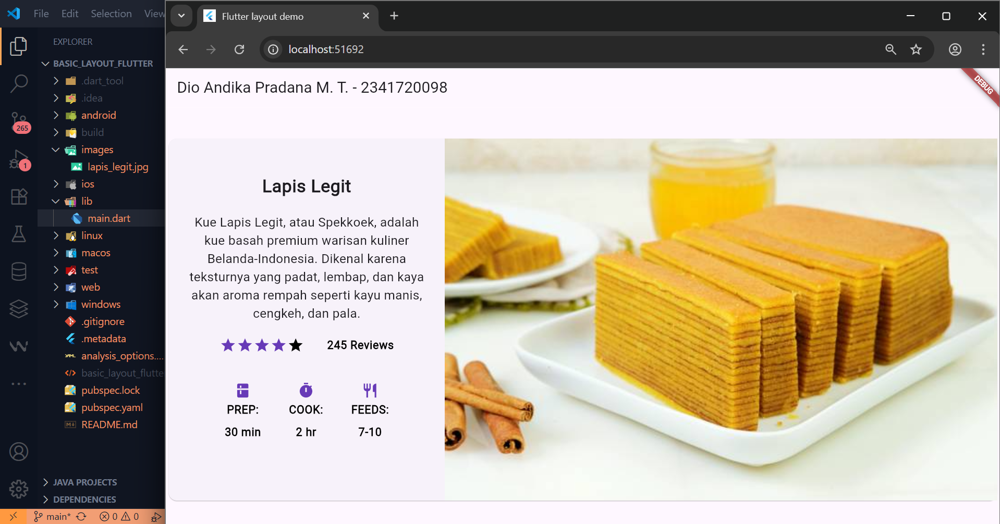

# Pemrograman Mobile - Layout dan Navigasi

NIM : 2341720098 <br>
NAMA : Dio Andika Pradana Mulia Tama <br>
KELAS : TI-3F

## Praktikum 1: Membangun Layout di Flutter

### Langkah 1: Buat Project Baru

Buatlah sebuah project flutter baru dengan nama **layout_flutter**. Atau sesuaikan style laporan praktikum yang Anda buat.

### Langkah 2: Buka file lib/main.dart

Buka file `main.dart` lalu ganti dengan kode berikut. Isi nama dan NIM Anda di `text title`.

```dart
import 'package:flutter/material.dart';

void main() => runApp(const MyApp());

class MyApp extends StatelessWidget {
  const MyApp({super.key});

  @override
  Widget build(BuildContext context) {
    return MaterialApp(
      title: 'Flutter layout: Dio Andika Pradana Mulia Tama - 2341720098',
      home: Scaffold(
        appBar: AppBar(
          title: const Text('Flutter layout demo'),
        ),
        body: const Center(
          child: Text('Hello World'),
        ),
      ),
    );
  }
}
```

### Langkah 4: Implementasi title row

Pertama, Anda akan membuat kolom bagian kiri pada judul. Tambahkan kode di bagian atas metode `build()` di dalam kelas `MyApp`.

**soal 1** Letakkan widget `Column` di dalam widget `Expanded` agar menyesuaikan ruang yang tersisa di dalam widget `Row`. Tambahkan properti `crossAxisAlignment` ke `CrossAxisAlignment.start` sehingga posisi kolom berada di awal baris.

**soal 2** Letakkan baris pertama teks di dalam `Container` sehingga memungkinkan Anda untuk menambahkan padding = 8. Teks ‘`Batu, Malang, Indonesia`' di dalam `Column`, set warna menjadi abu-abu.

**soal 3** Dua item terakhir di baris judul adalah ikon bintang, set dengan warna merah, dan teks "41". Seluruh baris ada di dalam `Container` dan beri padding di sepanjang setiap tepinya sebesar 32 piksel. Kemudian ganti isi `body text` ‘`Hello World`' dengan variabel `titleSection`.

Kode program:

```dart
import 'package:flutter/material.dart';

void main() => runApp(const MyApp());

class MyApp extends StatelessWidget {
  const MyApp({super.key});

  @override
  Widget build(BuildContext context) {
    Widget titleSection = Container(
      // Padding untuk seluruh baris
      padding: const EdgeInsets.all(32),
      child: Row(
        children: [
          Expanded(
            /* soal 1*/
            child: Column(
              crossAxisAlignment:
                  CrossAxisAlignment.start, // Posisi kolom di awal (kiri)
              children: [
                /* soal 2*/
                Container(
                  padding: const EdgeInsets.only(bottom: 8), // Padding bawah 8
                  child: const Text(
                    'Wisata Gunung di Malang',
                    style: TextStyle(fontWeight: FontWeight.bold),
                  ),
                ),
                Text(
                  'Malang, Jawa Timur, Indonesia',
                  style: TextStyle(
                    color: Colors.grey[500], // set warna menjadi abu-abu
                  ),
                ),
              ],
            ),
          ),
          /* soal 3*/
          Icon(
            Icons.star, // ikon bintang
            color: Colors.red[500], // set warna menjadi merah
          ),
          const Text('41'),
        ],
      ),
    );
    return MaterialApp(
      title: 'Flutter layout: Dio Andika Pradana Mulia Tama - 2341720098',
      home: Scaffold(
        appBar: AppBar(title: const Text('Flutter layout demo')),
        body: Column(children: [titleSection]),
      ),
    );
  }
}
```

Output:<br>


## Praktikum 2: Implementasi button row

### Langkah 1: Buat method Column \_buildButtonColumn

Bagian tombol berisi 3 kolom yang menggunakan tata letak yang sama—sebuah ikon di atas baris teks. Kolom pada baris ini diberi jarak yang sama, dan teks serta ikon diberi warna primer.

Karena kode untuk membangun setiap kolom hampir sama, buatlah metode pembantu pribadi bernama `buildButtonColumn()`, yang mempunyai parameter warna, `Icon` dan `Text`, sehingga dapat mengembalikan kolom dengan widgetnya sesuai dengan warna tertentu.

**lib/main.dart (\_buildButtonColumn)**

```dart
class MyApp extends StatelessWidget {
  const MyApp({super.key});

  @override
  Widget build(BuildContext context) {
    // ···
  }

  Column _buildButtonColumn(Color color, IconData icon, String label) {
    return Column(
      mainAxisSize: MainAxisSize.min,
      mainAxisAlignment: MainAxisAlignment.center,
      children: [
        Icon(icon, color: color),
        Container(
          margin: const EdgeInsets.only(top: 8),
          child: Text(
            label,
            style: TextStyle(
              fontSize: 12,
              fontWeight: FontWeight.w400,
              color: color,
            ),
          ),
        ),
      ],
    );
  }
}
```

#### Langkah 2: Buat widget buttonSection

Buat Fungsi untuk menambahkan ikon langsung ke kolom. Teks berada di dalam `Container` dengan margin hanya di bagian atas, yang memisahkan teks dari ikon.

Bangun baris yang berisi kolom-kolom ini dengan memanggil fungsi dan set warna, `Icon`, dan teks khusus melalui parameter ke kolom tersebut. Sejajarkan kolom di sepanjang sumbu utama menggunakan `MainAxisAlignment.spaceEvenly` untuk mengatur ruang kosong secara merata sebelum, di antara, dan setelah setiap kolom. Tambahkan kode berikut tepat di bawah deklarasi `titleSection` di dalam metode `build()`:

**lib/main.dart (buttonSection)**

```dart
    Color color = Theme.of(context).primaryColor;

    Widget buttonSection = Row(
      mainAxisAlignment: MainAxisAlignment.spaceEvenly,
      children: [
        _buildButtonColumn(color, Icons.call, 'CALL'),
        _buildButtonColumn(color, Icons.near_me, 'ROUTE'),
        _buildButtonColumn(color, Icons.share, 'SHARE'),
      ],
    );
```

### Langkah 3: Tambah button section ke body

Tambahkan variabel `buttonSection` ke dalam `body` seperti berikut:

```dart
    return MaterialApp(
      title: 'Flutter layout: Dio Andika Pradana Mulia Tama - 2341720098',
      home: Scaffold(
        appBar: AppBar(title: const Text('Flutter layout demo')),
        body: Column(children: [titleSection, buttonSection]),
      ),
    );
```

Output:<br>


## Praktikum 3: Implementasi text section

### Langkah 1: Buat widget textSection

Tentukan bagian teks sebagai variabel. Masukkan teks ke dalam `Container` dan tambahkan padding di sepanjang setiap tepinya. Tambahkan kode berikut tepat di bawah deklarasi `buttonSection`:

```dart
    Widget textSection = Container(
      padding: const EdgeInsets.all(32),
      child: const Text(
        'Gunung Bromo, sebuah keajaiban vulkanik di Jawa Timur, menawarkan '
        'pemandangan matahari terbit yang magis dari Puncak Penanjakan. '
        'Lautan pasirnya yang luas dan kawahnya yang aktif menciptakan '
        'lanskap sureal yang memukau setiap pengunjung. '
        'Pengalaman mendaki ke bibir kawah menjadi petualangan tak terlupakan.\n\n'
        'Dio Andika Pradana M. T.\n'
        '2341720098',
        softWrap: true,
      ),
    );
```

Dengan memberi nilai `softWrap = true`, baris teks akan memenuhi lebar kolom sebelum membungkusnya pada batas kata.

### Langkah 2: Tambahkan variabel text section ke body

Tambahkan widget variabel `textSection` ke dalam `body` seperti berikut:

```dart
    return MaterialApp(
      title: 'Flutter layout: Dio Andika Pradana Mulia Tama - 2341720098',
      home: Scaffold(
        appBar: AppBar(title: const Text('Flutter layout DIO Andika')),
        body: Column(children: [titleSection, buttonSection, textSection]),
      ),
    );
```

Output:<br>


## Praktikum 4: Implementasi image section

### Langkah 1: Siapkan aset gambar

Anda dapat mencari gambar di internet yang ingin ditampilkan. Buatlah folder `images` di root project **layout_flutter**. Masukkan file gambar tersebut ke folder `images`, lalu set nama file tersebut ke file `pubspec.yaml` seperti berikut:

```dart
flutter:
  uses-material-design: true

  assets:
    - images/bromo.jpeg
```

Contoh nama file gambar di atas adalah `bromo.jpeg`

### Langkah 2: Tambahkan gambar ke body

Tambahkan aset gambar ke dalam `body` seperti berikut:

```dart
        body: Column(
          children: [
            Image.asset(
              'images/bromo.jpeg',
              width: 600,
              height: 240,
              fit: BoxFit.cover,
            ),
            titleSection,
            buttonSection,
            textSection,
          ],
        ),
```

`BoxFit.cover` memberi tahu kerangka kerja bahwa gambar harus sekecil mungkin tetapi menutupi seluruh kotak rendernya.

### Langkah 3: Terakhir, ubah menjadi ListView

Pada langkah terakhir ini, atur semua elemen dalam `ListView`, bukan Column, karena `ListView` mendukung scroll yang dinamis saat aplikasi dijalankan pada perangkat yang resolusinya lebih kecil.

```dart
        body: ListView(
          children: [
            Image.asset(
              'images/bromo.jpeg',
              width: 600,
              height: 240,
              fit: BoxFit.cover,
            ),
            titleSection,
            buttonSection,
            textSection,
          ],
        ),
```

Output:<br>


## Tugas Praktikum 1

1. Selesaikan Praktikum 1 sampai 4, lalu dokumentasikan dan push ke repository Anda berupa screenshot setiap hasil pekerjaan beserta penjelasannya di file `README.md`! ꪜ

2. Silakan implementasikan di project baru **"basic_layout_flutter**" dengan mengakses sumber ini: https://docs.flutter.dev/codelabs/layout-basics ꪜ <br>
   Hasil Output:<br>
   

3. Kumpulkan link commit repository GitHub Anda kepada dosen yang telah disepakati! ꪜ

## Praktikum 5: Membangun Navigasi di Flutter

### Langkah 1: Siapkan project baru

Sebelum melanjutkan praktikum, buatlah sebuah project baru Flutter dengan nama **belanja** dan susunan folder seperti pada gambar berikut. Penyusunan ini dimaksudkan untuk mengorganisasi kode dan widget yang lebih mudah.


### Langkah 2: Mendefinisikan Route

Buatlah dua buah file dart dengan nama `home_page.dart` dan `item_page.dart` pada folder **pages**. Untuk masing-masing file, deklarasikan `class HomePage` pada file `home_page.dart` dan `ItemPage` pada `item_page.dart`. Turunkan class dari `StatelessWidget`. Gambaran potongan kode dapat anda lihat sebagai berikut.

- Kode program `home_page.dart`:

  ```dart
  import 'package:flutter/material.dart';

  class HomePage extends StatelessWidget {
    @override
    Widget build(BuildContext context) {
      // TODO: implement build
      throw UnimplementedError();
    }
  }
  ```

- Kode program `item_page.dart`:

  ```dart
  import 'package:flutter/material.dart';

  class ItemPage extends StatelessWidget {
    @override
    Widget build(BuildContext context) {
      // TODO: implement build
      throw UnimplementedError();
    }
  }
  ```

### Langkah 3: Lengkapi Kode di main.dart

Setelah kedua halaman telah dibuat dan didefinisikan, bukalah file `main.dart`. Pada langkah ini anda akan mendefinisikan **Route** untuk kedua halaman tersebut. Definisi penamaan **route** harus bersifat **unique**. Halaman **HomePage** didefinisikan sebagai /. Dan halaman **ItemPage** didefinisikan sebagai **/item**. Untuk mendefinisikan halaman awal, anda dapat menggunakan `named argument initialRoute`. Gambaran tahapan ini, dapat anda lihat pada potongan kode berikut.

```dart
import 'package:flutter/material.dart';
import 'package:belanja/pages/home_page.dart';
import 'package:belanja/pages/item_page.dart';

void main() {
  runApp(
    MaterialApp(
      initialRoute: '/',
      routes: {'/': (context) => HomePage(), '/item': (context) => ItemPage()},
    ),
  );
}
```

### Langkah 4: Membuat data model

Sebelum melakukan perpindahan halaman dari `HomePage` ke `ItemPage`, dibutuhkan proses pemodelan data. Pada desain mockup, dibutuhkan dua informasi yaitu nama dan harga. Untuk menangani hal ini, buatlah sebuah file dengan nama `item.dart` dan letakkan pada folder **models**. Pada file ini didefinisikan pemodelan data yang dibutuhkan. Ilustrasi kode yang dibutuhkan, dapat anda lihat pada potongan kode berikut.

```dart
class Item {
  String name;
  int price;

  Item({required this.name, required this.price});
}
```

### Langkah 5: Lengkapi kode di class HomePage

Pada halaman `HomePage` terdapat `ListView` widget. Sumber data `ListView` diambil dari model List dari object Item. Gambaran kode yang dibutuhkan untuk melakukan definisi model dapat anda lihat sebagai berikut.

```dart
class HomePage extends StatelessWidget {
  final List<Item> items = [
    Item(name: 'Sugar', price: 5000),
    Item(name: 'Salt', price: 2000),
  ];
```

#### Langkah 6: Membuat ListView dan itemBuilder

Untuk menampilkan `ListView` pada praktikum ini digunakan `itemBuilder`. Data diambil dari definisi model yang telah dibuat sebelumnya. Untuk menunjukkan batas data satu dan berikutnya digunakan widget `Card`. Kode yang telah umum pada bagian ini tidak ditampilkan. Gambaran kode yang dibutuhkan dapat anda lihat sebagai berikut.

```dart
      body: Container(
        margin: EdgeInsets.all(8),
        child: ListView.builder(
          padding: EdgeInsets.all(8),
          itemCount: items.length,
          itemBuilder: (context, index) {
            final item = items[index];
            return Card(
              child: Container(
                margin: EdgeInsets.all(8),
                child: Row(
                  children: [
                    Expanded(child: Text(item.name)),
                    Expanded(
                      child: Text(
                        item.price.toString(),
                        textAlign: TextAlign.end,
                      ),
                    ),
                  ],
                ),
              ),
            );
          },
        ),
      ),
```

Jalankan aplikasi pada emulator atau pada device anda.

Output:<br>


### Langkah 7: Menambahkan aksi pada ListView

Item pada ListView saat ini ketika ditekan masih belum memberikan aksi tertentu. Untuk menambahkan aksi pada ListView dapat digunakan widget `InkWell` atau `GestureDetector`. Perbedaan utamanya `InkWell` merupakan material widget yang memberikan efek ketika ditekan. Sedangkan `GestureDetector` bersifat umum dan bisa juga digunakan untuk gesture lain selain sentuhan. Pada praktikum ini akan digunakan widget `InkWell`.

Untuk menambahkan sentuhan, letakkan cursor pada widget pembuka `Card`. Kemudian gunakan shortcut quick fix dari VSCode (**Ctrl +** . pada Windows atau **Cmd +** . pada MacOS). Sorot menu `wrap with widget...` Ubah nilai widget menjadi `InkWell` serta tambahkan named argument `onTap` yang berisi fungsi untuk berpindah ke halaman `ItemPage`. Ilustrasi potongan kode dapat anda lihat pada potongan berikut.

```dart
            return InkWell(
              onTap: () {
                Navigator.pushNamed(context, '/item');
              },
```

Jalankan aplikasi kembali dan pastikan ListView dapat disentuh dan berpindah ke halaman berikutnya. Periksa kembali jika terdapat kesalahan.


Akan muncul error Unimplemented saat apliaksi dijalankan, hal ini terjadi karena di halaman `ItemPage` belum ada kode untuk menampilkan sebuah widget (hanya melemparkan `UnimplementedError()`).

Berikut perbaikan kode item_page.dart:

```dart
import 'package:flutter/material.dart';
import 'package:belanja/models/item.dart';

class ItemPage extends StatelessWidget {
  const ItemPage({super.key});

  @override
  Widget build(BuildContext context) {
    final item = ModalRoute.of(context)!.settings.arguments as Item;

    return Scaffold(
      appBar: AppBar(
        title: Text('Detail: ${item.name}'),
        backgroundColor: Colors.blueAccent,
        foregroundColor: Colors.white,
      ),
      body: Center(
        child: Card(
          elevation: 4.0, // Memberi efek bayangan pada card
          margin: const EdgeInsets.all(16.0),
          child: Container(
            padding: const EdgeInsets.all(24.0), // Memberi jarak di dalam card
            child: Column(
              mainAxisSize:
                  MainAxisSize.min, // Membuat tinggi Column sesuai isinya
              children: [
                Text(
                  item.name,
                  style: const TextStyle(
                    fontSize: 32,
                    fontWeight: FontWeight.bold,
                  ),
                ),
                const SizedBox(height: 16),
                Text(
                  'Rp ${item.price}',
                  style: const TextStyle(
                    fontSize: 24,
                    color: Colors.deepOrange,
                  ),
                ),
              ],
            ),
          ),
        ),
      ),
    );
  }
}
```

Output:<br>


## Tugas Praktikum 2

1. Untuk melakukan pengiriman data ke halaman berikutnya, cukup menambahkan informasi arguments pada penggunaan `Navigator`. Perbarui kode pada bagian `Navigator` menjadi seperti berikut. ꪜ

```dart
Navigator.pushNamed(context, '/item', arguments: item);
```

2. Pembacaan nilai yang dikirimkan pada halaman sebelumnya dapat dilakukan menggunakan `ModalRoute`. Tambahkan kode berikut pada blok fungsi build dalam halaman `ItemPage`. Setelah nilai didapatkan, anda dapat menggunakannya seperti penggunaan variabel pada umumnya. <br>(https://docs.flutter.dev/cookbook/navigation/navigate-with-arguments) ꪜ

```dart
final item = ModalRoute.of(context)!.settings.arguments as Item;
```

**_Note: Soal 1 dan soal 2 sudah dikerjakan dan hasil outputnya terdapat pada praktikum 5 langkah 7_**

3. Pada hasil akhir dari aplikasi **belanja** yang telah anda selesaikan, tambahkan atribut foto produk, stok, dan rating. Ubahlah tampilan menjadi `GridView` seperti di aplikasi marketplace pada umumnya. ꪜ <br>
   Hasil Output:

   

4. Silakan implementasikan `Hero widget` pada aplikasi **belanja** Anda dengan mempelajari dari sumber ini: https://docs.flutter.dev/cookbook/navigation/hero-animations ꪜ <br>
   Hasil Output:

   

5. Sesuaikan dan modifikasi tampilan sehingga menjadi aplikasi yang menarik. Selain itu, pecah widget menjadi kode yang lebih kecil. Tambahkan **Nama** dan **NIM** di footer aplikasi **belanja** Anda. ꪜ <br>
   Hasil Output:

   

   

6. Selesaikan Praktikum 5: Navigasi dan Rute tersebut. Cobalah modifikasi menggunakan plugin go_router, lalu dokumentasikan dan push ke repository Anda berupa screenshot setiap hasil pekerjaan beserta penjelasannya di file `README.md`. Kumpulkan link commit repository GitHub Anda kepada dosen yang telah disepakati! ꪜ <br>
   Hasil Output:

   
