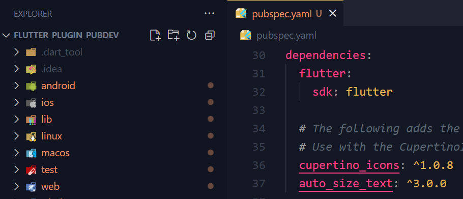
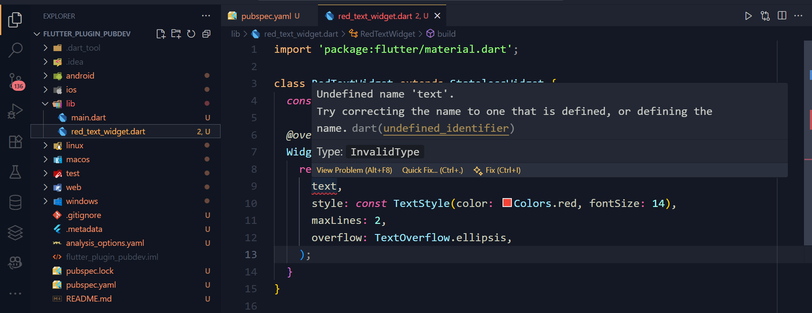
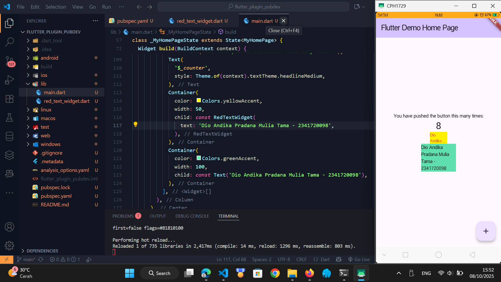

# Pemrograman Mobile - Manajemen Plugin

NIM : 2341720098 <br>
NAMA : Dio Andika Pradana Mulia Tama <br>
KELAS : TI-3F

## Praktikum Menerapkan Plugin di Project Flutter

### Langkah 1: Buat Project Baru

Buatlah sebuah project flutter baru dengan nama **flutter_plugin_pubdev**. Lalu jadikan repository di GitHub Anda dengan nama **flutter_plugin_pubdev**. ꪜ

### Langkah 2: Menambahkan Plugin

Tambahkan plugin `auto_size_text` menggunakan perintah berikut di terminal

```dart
flutter pub add auto_size_text
```

Jika berhasil, maka akan tampil nama plugin beserta versinya di file `pubspec.yaml` pada bagian dependencies.



### Langkah 3: Buat file red_text_widget.dart

Buat file baru bernama `red_text_widget.dart` di dalam folder lib lalu isi kode seperti berikut.

```dart
import 'package:flutter/material.dart';

class RedTextWidget extends StatelessWidget {
  const RedTextWidget({Key? key}) : super(key: key);

  @override
  Widget build(BuildContext context) {
    return Container();
  }
}
```

### Langkah 4: Tambah Widget AutoSizeText

Masih di file `red_text_widget.dart`, untuk menggunakan plugin `auto_size_text`, ubahlah kode `return Container()` menjadi seperti berikut.

```dart
return AutoSizeText(
      text,
      style: const TextStyle(color: Colors.red, fontSize: 14),
      maxLines: 2,
      overflow: TextOverflow.ellipsis,
);
```

Setelah Anda menambahkan kode di atas, Anda akan mendapatkan info error. Mengapa demikian? Jelaskan dalam laporan praktikum Anda!



Terjadi error karena variabel `text` yang digunakan di dalam widget `AutoSizeText` tidak pernah dibuat atau didefinisikan di dalam _scope_ class `RedTextWidget`. Selain itu, untuk menggunakan widget `AutoSizeText`, harus diimport terlebih dahulu.

### Langkah 5: Buat Variabel text dan parameter di constructor

Tambahkan variabel `text` dan parameter di constructor seperti berikut.

```dart
final String text;

const RedTextWidget({Key? key, required this.text}) : super(key: key);
```

### Langkah 6: Tambahkan widget di main.dart

Buka file `main.dart` lalu tambahkan di dalam `children:` pada `class \_MyHomePageState`

```dart
Container(
   color: Colors.yellowAccent,
   width: 50,
   child: const RedTextWidget(
             text: 'Dio Andika Pradana Mulia Tama - 2341720098',
          ),
),
Container(
    color: Colors.greenAccent,
    width: 100,
    child: const Text(
           'Dio Andika Pradana Mulia Tama - 2341720098',
          ),
),
```

**Run** aplikasi tersebut dengan tekan **F5**, maka hasilnya akan seperti berikut.



# Tugas Praktikum

1. Selesaikan Praktikum tersebut, lalu dokumentasikan dan push ke repository Anda berupa screenshot hasil pekerjaan beserta penjelasannya di file `README.md`! ꪜ
2. Jelaskan maksud dari langkah 2 pada praktikum tersebut! <br>
   Perintah `flutter pub add auto_size_text` akan menambahkan dan mengintegrasikan package atau plugin eksternal yaitu `auto_size_text` ke dalam project Flutter. Flutter akan terhubung ke repositori package resmi (pub.dev), kemudian mencari `auto_size_text`, dan mengunduh kode plugin tersebut ke dalam komputer. Lalu pada file `pubspec.yaml` akan secara otomatis menambahkan baris auto_size_text: diikuti versi terbarunya di bawah bagian `dependencies`.
3. Jelaskan maksud dari langkah 5 pada praktikum tersebut!<br>
   Langkah 5 bertujuan untuk membuat `RedTextWidget` menjadi dinamis dan dapat digunakan kembali (reusable) dengan cara mengizinkannya menerima data dari luar. Jadi, langkah 5 ini mengubah `RedTextWidget` dari yang awalnya widget statis menjadi komponen fleksibel yang bisa menampilkan teks apa pun yang diberikan kepadanya.

   - `final String text;`: Baris ini mendeklarasikan sebuah properti di dalam widget yang bernama text dengan tipe String. `final` berarti setelah nilai ini diisi, maka nilainya tidak bisa diubah lagi, ini merupakan syarat untuk properti di dalam StatelessWidget.
   - `required this.text`: `required` menandakan bahwa siapapun yang ingin membuat `RedTextWidget` wajib memberikan nilai untuk properti `text`.

4. Pada langkah 6 terdapat dua widget yang ditambahkan, jelaskan fungsi dan perbedaannya! <br>
   Tujuan utama dari penambahan kedua widget ini adalah untuk membandingkan secara visual bagaimana teks ditampilkan oleh widget kustom `RedTextWidget` (yang menggunakan `auto_size_text`) dengan widget `Text` standar dari Flutter, terutama ketika keduanya diberi batasan lebar yang berbeda. Kedua widget tersebut akan menampilkan sebuah teks di dalam sebuah kotak (Container) yang memiliki warna latar dan lebar yang sudah ditentukan. Perbedaannya terletak pada bagaimana teks di dalamnya merespons batasan lebar dari Container:
   - Widget custom dengan `RedTextWidget` (kotak warna kuning) menggunakan plugin `auto_size_text`. Artinya, ia akan secara otomatis mengecilkan ukuran font agar teks bisa muat di dalam lebar 50 pixel. Widget ini berfungsi untuk menampilkan teks panjang di dalam sebuah Container berwarna kuning yang sangat sempit (lebarnya hanya 50 pixel). Teks dibatasi maksimal 2 baris (`maxLines: 2`). Jika teks masih tidak muat setelah dikecilkan, maka akan dipotong dan diakhiri dengan `ellipsis` (...).
   - Widget `Text` standar dari Flutter (kotak warna hijau) berfungsi untuk menampilkan teks yang sama di dalam sebuah Container berwarna hijau yang lebih lebar (100 pixel). Widget ini akan menampilkan teks dengan ukuran font yang konsisten. Jadi, font tidak akan mengecil secara otomatis. Widget ini akan mencoba memotong teks dan memindahkannya ke baris baru (wrapping) agar muat di dalam lebar 100 pixel. Akan tetapi, jika teks masih terlalu panjang bahkan setelah di-wrap, widget `Text` akan menyebabkan visual overflow (ditandai dengan garis kuning-hitam) karena tidak ada properti `overflow` yang diatur.
5. Jelaskan maksud dari tiap parameter yang ada di dalam plugin `auto_size_text` berdasarkan tautan pada dokumentasi ini! <br>

   - `text`: Merupakan parameter utama yang berisi String atau teks yang ingin ditampilkan. Contoh: `AutoSizeText('Dio Andika P. M. T.')`.
   - `style`: Menggunakan TextStyle untuk mengatur tampilan visual teks, seperti warna, ketebalan, dan jenis font. `fontSize` yang diatur di dalam `style` akan menjadi ukuran font awal sebelum plugin `auto_size_text` mulai mengecilkan ukurannya agar pas.
   - `maxLines`: Untuk membatasi jumlah baris maksimum yang bisa ditempati oleh teks. Jika tidak diatur, teks akan menyesuaikan diri berdasarkan lebar dan tinggi yang tersedia.
   - `minFontSize`: Parameter ini menentukan batas ukuran font terkecil yang diizinkan. Nilai default untuk parameter ini adalah 12. Jika teks masih tidak muat bahkan setelah mencapai ukuran ini, maka akan diberlakukan aturan `overflow`.
   - `maxFontSize`: Parameter ini menentukan batas ukuran font terbesar yang diizinkan. Ini berguna untuk membatasi ukuran teks agar tidak menjadi terlalu besar pada wadah yang luas.
   - `group`: Parameter ini digunakan untuk menyinkronkan ukuran font pada beberapa `AutoSizeText` yang berbeda. Semua widget yang berada dalam group yang sama akan memiliki ukuran font yang sama, yang disesuaikan dengan anggota grup yang memiliki ukuran font efektif paling kecil.
   - `stepGranularity`: Untuk mengatur "langkah" atau seberapa besar pengurangan ukuran font pada setiap iterasi saat plugin `auto_size_text` mencoba menemukan ukuran yang pas. Nilai default-nya adalah 1. Pada dokumentasi plugin menyarankan untuk tidak menggunakan nilai di bawah 1 demi performa terbaik.
   - `presetFontSizes`: Parameter ini menyediakan daftar ukuran font spesifik yang diizinkan. Jika parameter ini diatur, maka `minFontSize`, `maxFontSize`, dan `stepGranularity` akan diabaikan. **Note: daftar ukuran ini harus diurutkan dari besar ke kecil** (contoh: `[40, 20, 14]`).
   - `overflowReplacement`: Jika teks tidak muat (overflow), maka bisa menampilkan widget lain sebagai pengganti. Ini sangat berguna untuk mencegah teks menjadi terlalu kecil hingga tidak bisa dibaca.
   - `overflow`: Parameter ini mengatur bagaimana tampilan teks jika masih tidak muat setelah semua upaya penyesuaian ukuran. Contohnya adalah `TextOverflow.ellipsis`, yang akan memotong teks dan menambahkan titik-titik (...) di akhir.
   - `wrapWords`: Parameter ini menentukan apakah kata yang tidak muat dalam satu baris harus dipisah dan dilanjutkan ke baris berikutnya (word wrapping). Nilai default-nya adalah `true` agar perilakunya sama seperti widget `Text` biasa.
   - Adapun parameter lainnya seperti `key`, `textAlign`, `textDirection`, `locale`, `softWrap`, `textScaleFactor`, dan `semanticsLabel` memiliki fungsi yang persis sama dengan yang ada pada widget Text bawaan Flutter.

6. Kumpulkan laporan praktikum Anda berupa link repository GitHub kepada dosen! ꪜ
