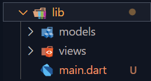
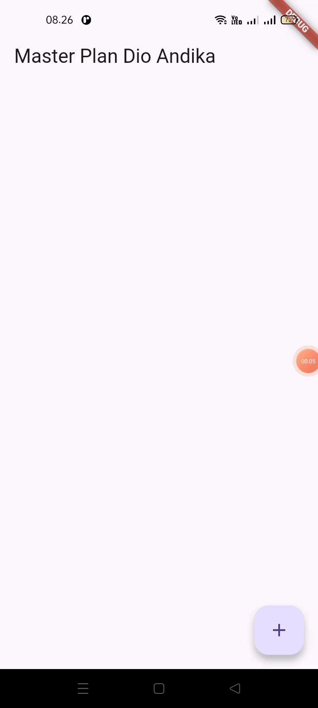
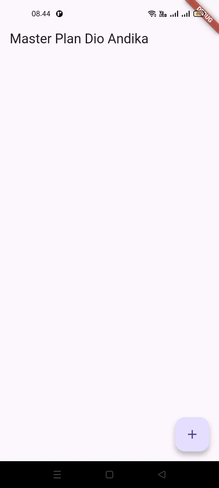

# Pemrograman Mobile - Dasar State Management

NIM : 2341720098 <br>
NAMA : Dio Andika Pradana Mulia Tama <br>
KELAS : TI-3F

## Praktikum 1: Dasar State dengan Model-View

### Langkah 1: Buat Project Baru

Buatlah sebuah project flutter baru dengan nama **master_plan** di folder **src week-10** repository GitHub Anda atau sesuai style laporan praktikum yang telah disepakati. Lalu buatlah susunan folder dalam project seperti gambar berikut ini.



### Langkah 2: Membuat model `task.dart`

Praktik terbaik untuk memulai adalah pada lapisan data (_data layer_). Ini akan memberi Anda gambaran yang jelas tentang aplikasi Anda, tanpa masuk ke detail antarmuka pengguna Anda. Di folder model, buat file bernama `task.dart` dan buat `class Task`. Class ini memiliki atribut `description` dengan tipe data String dan `complete` dengan tipe data Boolean, serta ada konstruktor. Kelas ini akan menyimpan data tugas untuk aplikasi kita. Tambahkan kode berikut:

```dart
class Task {
  final String description;
  final bool complete;

  const Task({
    this.complete = false,
    this.description = '',
  });
}
```

### Langkah 3: Buat file `plan.dart`

Kita juga perlu sebuah List untuk menyimpan daftar rencana dalam aplikasi to-do ini. Buat file `plan.dart` di dalam folder **models** dan isi kode seperti berikut.

```dart
import './task.dart';

class Plan {
  final String name;
  final List<Task> tasks;

  const Plan({this.name = '', this.tasks = const []});
}
```

### Langkah 4: Buat file `data_layer.dart`

Kita dapat membungkus beberapa data layer ke dalam sebuah file yang nanti akan mengekspor kedua model tersebut. Dengan begitu, proses impor akan lebih ringkas seiring berkembangnya aplikasi. Buat file bernama `data_layer.dart` di folder **models**. Kodenya hanya berisi `export` seperti berikut.

```dart
export 'plan.dart';
export 'task.dart';
```

### Langkah 5: Pindah ke file `main.dart`

Ubah isi kode `main.dart` sebagai berikut.

```dart
import 'package:flutter/material.dart';
import './views/plan_screen.dart';

void main() => runApp(MasterPlanApp());

class MasterPlanApp extends StatelessWidget {
  const MasterPlanApp({super.key});

  @override
  Widget build(BuildContext context) {
    return MaterialApp(
     theme: ThemeData(primarySwatch: Colors.purple),
     home: PlanScreen(),
    );
  }
}
```

### Langkah 6: buat `plan_screen.dart`

Pada folder `views`, buatlah sebuah file `plan_screen.dart` dan gunakan templat `StatefulWidget` untuk membuat `class PlanScreen`. Isi kodenya adalah sebagai berikut. Gantilah teks **‘Namaku'** dengan nama panggilan Anda pada `title AppBar`.

```dart
import '../models/data_layer.dart';
import 'package:flutter/material.dart';

class PlanScreen extends StatefulWidget {
  const PlanScreen({super.key});

  @override
  State createState() => _PlanScreenState();
}

class _PlanScreenState extends State<PlanScreen> {
  Plan plan = const Plan();

  @override
  Widget build(BuildContext context) {
   return Scaffold(
    // ganti ‘Namaku' dengan Nama panggilan Anda
    appBar: AppBar(title: const Text('Master Plan Dio Andika')),
    body: _buildList(),
    floatingActionButton: _buildAddTaskButton(),
   );
  }
}
```

### Langkah 7: buat method `_buildAddTaskButton()`

Anda akan melihat beberapa error di langkah 6, karena method yang belum dibuat. Ayo kita buat mulai dari yang paling mudah yaitu tombol **Tambah Rencana**. Tambah kode berikut di bawah method `build` di dalam `class _PlanScreenState`.

```dart
Widget _buildAddTaskButton() {
  return FloatingActionButton(
   child: const Icon(Icons.add),
   onPressed: () {
     setState(() {
      plan = Plan(
       name: plan.name,
       tasks: List<Task>.from(plan.tasks)
       ..add(const Task()),
     );
    });
   },
  );
}
```

### Langkah 8: buat widget `\_buildList()`

Kita akan buat widget berupa `List` yang dapat dilakukan scroll, yaitu `ListView.builder`. Buat widget `ListView` seperti kode berikut ini.

```dart
Widget _buildList() {
  return ListView.builder(
   itemCount: plan.tasks.length,
   itemBuilder: (context, index) =>
   _buildTaskTile(plan.tasks[index], index),
  );
}
```

### Langkah 9: buat widget `\_buildTaskTile`

Dari langkah 8, kita butuh `ListTile` untuk menampilkan setiap nilai dari `plan.tasks`. Kita buat dinamis untuk setiap `index` data, sehingga membuat `view` menjadi lebih mudah. Tambahkan kode berikut ini.

```dart
 Widget _buildTaskTile(Task task, int index) {
    return ListTile(
      leading: Checkbox(
          value: task.complete,
          onChanged: (selected) {
            setState(() {
              plan = Plan(
                name: plan.name,
                tasks: List<Task>.from(plan.tasks)
                  ..[index] = Task(
                    description: task.description,
                    complete: selected ?? false,
                  ),
              );
            });
          }),
      title: TextFormField(
        initialValue: task.description,
        onChanged: (text) {
          setState(() {
            plan = Plan(
              name: plan.name,
              tasks: List<Task>.from(plan.tasks)
                ..[index] = Task(
                  description: text,
                  complete: task.complete,
                ),
            );
          });
        },
      ),
    );
  }
```

**Run** atau tekan **F5** untuk melihat hasil aplikasi yang Anda telah buat. Capture hasilnya untuk soal praktikum nomor 4.



### Langkah 10: Tambah Scroll Controller

Anda dapat menambah tugas sebanyak-banyaknya, menandainya jika sudah beres, dan melakukan scroll jika sudah semakin banyak isinya. Namun, ada salah satu fitur tertentu di iOS perlu kita tambahkan. Ketika keyboard tampil, Anda akan kesulitan untuk mengisi yang paling bawah. Untuk mengatasi itu, Anda dapat menggunakan `ScrollController` untuk menghapus focus dari semua `TextField` selama event scroll dilakukan. Pada file `plan_screen.dart`, tambahkan variabel scroll controller di class State tepat setelah variabel `plan`.

```dart
late ScrollController scrollController;
```

### Langkah 11: Tambah Scroll Listener

Tambahkan method `initState()` setelah deklarasi variabel `scrollController` seperti kode berikut.

```dart
@override
void initState() {
  super.initState();
  scrollController = ScrollController()
    ..addListener(() {
      FocusScope.of(context).requestFocus(FocusNode());
    });
}
```

### Langkah 12: Tambah controller dan keyboard behavior

Tambahkan controller dan keyboard behavior pada ListView di method `_buildList` seperti kode berikut ini.

```dart
return ListView.builder(
  controller: scrollController,
 keyboardDismissBehavior: Theme.of(context).platform ==
 TargetPlatform.iOS
          ? ScrollViewKeyboardDismissBehavior.onDrag
          : ScrollViewKeyboardDismissBehavior.manual,
```

### Langkah 13: Terakhir, tambah method dispose()

Terakhir, tambahkan method `dispose()` berguna ketika widget sudah tidak digunakan lagi.

```dart
@override
void dispose() {
  scrollController.dispose();
  super.dispose();
}
```

### Langkah 14: Hasil

Lakukan Hot restart (**bukan** hot reload) pada aplikasi Flutter Anda. Anda akan melihat tampilan akhir seperti gambar berikut. Jika masih terdapat error, silakan diperbaiki hingga bisa running.




## Tugas Praktikum 1: Dasar State dengan Model-View

1. Selesaikan langkah-langkah praktikum tersebut, lalu dokumentasikan berupa GIF hasil akhir praktikum beserta penjelasannya di file `README.md`! Jika Anda menemukan ada yang error atau tidak berjalan dengan baik, silakan diperbaiki. ꪜ
2. Jelaskan maksud dari langkah 4 pada praktikum tersebut! Mengapa dilakukan demikian?

   Langkah ke-4 dalam praktikum ini bertujuan untuk menyederhanakan proses import dan merapikan struktur folder model. Pada file `plan_screen.dart`, hanya perlu menulis satu baris kode import untuk mendapatkan semua model yang dibutuhkan: `import '../models/data_layer.dart';`. Tanpa adanya file `data_layer.dart`, maka harus mengimpor setiap file model satu per satu.

   Mengapa dilakukan demikian?

   - Praktis dan Ringkas: Proses import di file lain menjadi lebih ringkas, cukup satu baris. Dengan membuat satu file "gateway" seperti `data_layer.dart`, maka hanya perlu satu baris import di file lain (`plan_screen.dart`) untuk bisa mengakses semua class model (Plan dan Task).
   - Maintainable: Lebih mudah mengelola dependencies antar file. Ketika aplikasi berkembang dan memiliki puluhan file model, lalu ada file lain yang membutuhkan model-model tersebut, maka tidak perlu menulis puluhan baris `import`. Cukup impor `data_layer.dart` saja. Ini membuat kode lebih bersih dan mudah dikelola.
   - Struktur proyek menjadi lebih rapi dan terorganisir. Jadi, meskipun file `data_layer.dart` terlihat sangat sederhana karena hanya berisi export, perannya sangat penting untuk menjaga agar struktur proyek tetap rapi dan efisien seiring dengan perkembangannya.

3. Mengapa perlu variabel plan di langkah 6 pada praktikum tersebut? Mengapa dibuat konstanta ?

   Variabel `plan` digunakan sebagai state utama pada halaman `PlanScreen`. Variabel `plan` inilah yang menyimpan semua informasi yang akan ditampilkan di layar, yaitu daftar tugas (_list of tasks_). Setiap kali menambahkan tugas baru, menandai tugas sebagai selesai, atau mengedit deskripsi tugas, perubahan tersebut disimpan di dalam variabel `plan` ini. Karena data bisa berubah (misal, menambah task baru), `plan` harus menjadi variabel di dalam `State` supaya bisa di-update dan UI bisa di-refresh dengan `setState`.

   Widget `\_buildList()` juga menggunakan `plan.tasks.length` untuk mengetahui berapa banyak item yang harus ditampilkan. Demikian pula, `\_buildTaskTile()` juga menggunakan data dari `plan.tasks` untuk menampilkan deskripsi dan status checkbox setiap tugas.

   Ketika tombol `FloatingActionButton` ditekan atau ketika mengubah checkbox, kode di dalam `setState` dieksekusi. Di dalamnya, `plan` yang lama tidak diubah, melainkan membuat objek `Plan` yang baru dengan data yang sudah diperbarui, lalu menugaskannya kembali ke variabel `plan`. Pemanggilan `setState` ini memberi sinyal kepada Flutter sehingga perubahan tersebut bisa langsung terlihat oleh pengguna.

   Jadi, tanpa variabel `plan`, layar `PlanScreen` tidak akan tahu data apa yang harus ditampilkan dan bagaimana merespons interaksi pengguna.

   Mengapa dibuat konstanta ? <br>
   Untuk memberikan nilai awal. Setiap variabel harus punya nilai awal. `Plan()` adalah konstruktor untuk membuat objek `Plan`. Dengan menginisialisasinya seperti ini, dipastikan bahwa saat layar pertama kali dimuat, `plan` memiliki keadaan awal yang jelas, yaitu sebuah rencana kosong tanpa nama dan tanpa tugas sama sekali (`tasks = const []`). Hal ini dapat mencegah aplikasi dari error karena mencoba mengakses data yang belum ada.

4. Lakukan capture hasil dari Langkah 9 berupa GIF, kemudian jelaskan apa yang telah Anda buat!

   

   Hasil dari langkah 9 adalah sebuah Aplikasi To_Do List yang memungkinkan pengguna untuk mengelola daftar tugas (tasks) dalam sebuah rencana (plan).

   Fungsionalitas Aplikasi:

   - Menambah Tugas Baru: Dengan menekan tombol + (FloatingActionButton) di pojok kanan bawah, sebuah item tugas baru akan ditambahkan ke dalam daftar.
   - Mengedit Deskripsi Tugas: Untuk memberikan atau mengubah deskripsi tugas tersebut, bisa langsung mengetikkan di dalam kolom teks pada setiap item.
   - Menandai Tugas Selesai: Di sebelah kiri setiap tugas, terdapat checkbox yang dapat ditekan untuk menandai sebuah tugas sebagai selesai (atau membatalkannya).

5. Apa kegunaan method pada Langkah 11 dan 13 dalam _lifecyle state_ ?<br>

   Method `initState()` pada langkah 11 adalah langkah inisialisasi atau persiapan yang dijalankan satu kali ketika sebuah widget pertama kali dibuat dan dimasukkan ke dalam pohon widget (widget tree).

   Kegunaannya adalah:

   - Membuat `ScrollController`: Di sinilah objek `ScrollController` dibuat yang akan digunakan untuk mengontrol `ListView`.
   - Menambahkan `Listener`: `Listener` ditambahkan ke controller tersebut. `Listener` ini bertugas menjalankan kode `FocusScope.of(context).requestFocus(FocusNode())` setiap kali terjadi scroll. Kode ini secara efektif memerintahkan semua `TextFormField` untuk melepaskan fokusnya, yang mengakibatkan keyboard tertutup.

   Persiapan ini hanya perlu dilakukan sekali seumur hidup widget sehingga `initState()` adalah tempat yang paling tepat untuk melakukannya.

   Method `dispose()` pada langkah 13 adalah kebalikan dari `initState()`. Ini merupakan langkah pembersihan yang dijalankan ketika sebuah widget akan dihapus secara permanen dari widget tree.
   Kegunaannya adalah:

   - Membersihkan Resource: `ScrollController` yang dibuat di `initState()` menggunakan memori. Jika tidak dibersihkan saat widget sudah tidak dipakai lagi, controller tersebut akan tetap ada di memori dan menyebabkan kebocoran memori (_memory leak_).
   - Mencegah Error: Dengan memanggil `scrollController.dispose()`, Flutter diberi tahu bahwa controller ini sudah tidak digunakan lagi dan sumber dayanya bisa dilepaskan. Ini merupakan praktik wajib untuk semua objek yang memiliki method `dispose()`.

   Jadi, `initState()` berfungsi untuk mempersiapkan resource saat widget "lahir", dan `dispose()` berfungsi untuk membersihkan resource tersebut saat widget "mati", memastikan aplikasi berjalan efisien dan bebas dari _memory leak_.

6. Kumpulkan laporan praktikum Anda berupa link commit atau repository GitHub ke dosen yang telah disepakati ! ꪜ
