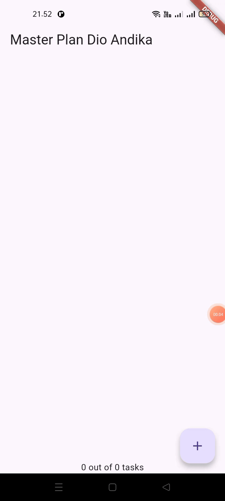
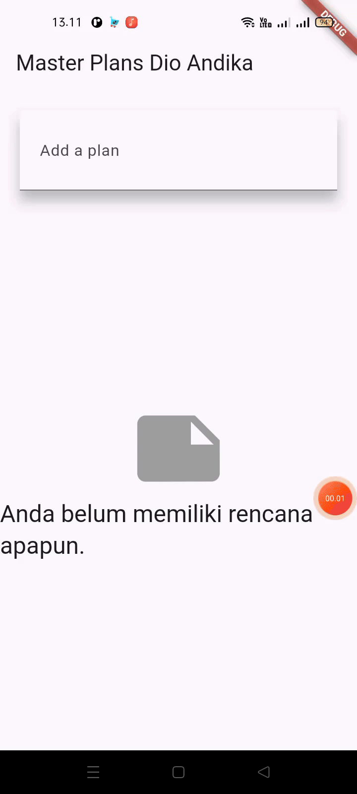
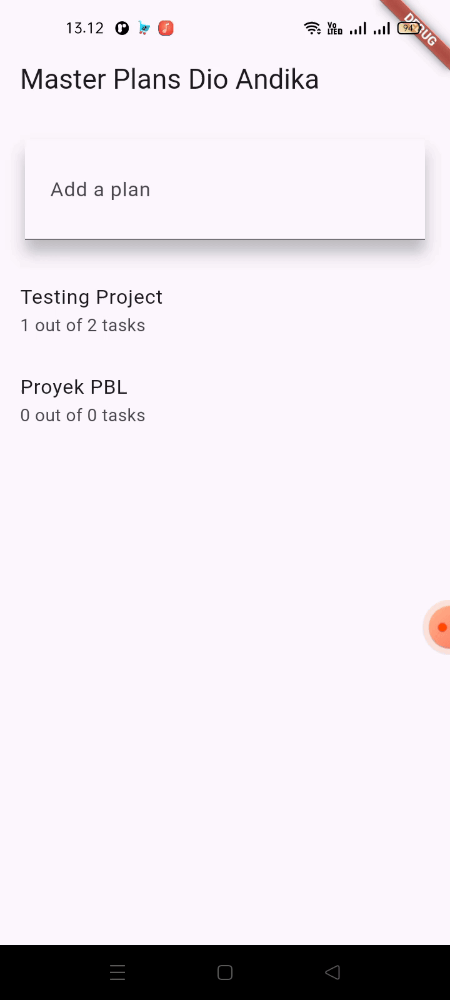
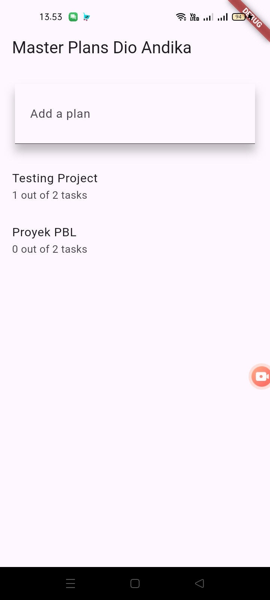
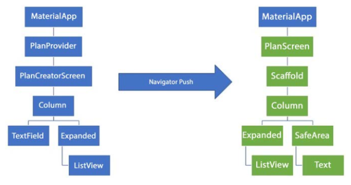

# Pemrograman Mobile - Dasar State Management

NIM : 2341720098 <br>
NAMA : Dio Andika Pradana Mulia Tama <br>
KELAS : TI-3F

## Praktikum 1: Dasar State dengan Model-View

### Langkah 1: Buat Project Baru

Buatlah sebuah project flutter baru dengan nama **master_plan** di folder **src week-10** repository GitHub Anda atau sesuai style laporan praktikum yang telah disepakati. Lalu buatlah susunan folder dalam project seperti gambar berikut ini.


### Langkah 2: Membuat model `task.dart`

Praktik terbaik untuk memulai adalah pada lapisan data (_data layer_). Ini akan memberi Anda gambaran yang jelas tentang aplikasi Anda, tanpa masuk ke detail antarmuka pengguna Anda. Di folder model, buat file bernama `task.dart` dan buat `class Task`. Class ini memiliki atribut `description` dengan tipe data String dan `complete` dengan tipe data Boolean, serta ada konstruktor. Kelas ini akan menyimpan data tugas untuk aplikasi kita. Tambahkan kode berikut:

```dart
class Task {
  final String description;
  final bool complete;

  const Task({
    this.complete = false,
    this.description = '',
  });
}
```

### Langkah 3: Buat file `plan.dart`

Kita juga perlu sebuah List untuk menyimpan daftar rencana dalam aplikasi to-do ini. Buat file `plan.dart` di dalam folder **models** dan isi kode seperti berikut.

```dart
import './task.dart';

class Plan {
  final String name;
  final List<Task> tasks;

  const Plan({this.name = '', this.tasks = const []});
}
```

### Langkah 4: Buat file `data_layer.dart`

Kita dapat membungkus beberapa data layer ke dalam sebuah file yang nanti akan mengekspor kedua model tersebut. Dengan begitu, proses impor akan lebih ringkas seiring berkembangnya aplikasi. Buat file bernama `data_layer.dart` di folder **models**. Kodenya hanya berisi `export` seperti berikut.

```dart
export 'plan.dart';
export 'task.dart';
```

### Langkah 5: Pindah ke file `main.dart`

Ubah isi kode `main.dart` sebagai berikut.

```dart
import 'package:flutter/material.dart';
import './views/plan_screen.dart';

void main() => runApp(MasterPlanApp());

class MasterPlanApp extends StatelessWidget {
  const MasterPlanApp({super.key});

  @override
  Widget build(BuildContext context) {
    return MaterialApp(
     theme: ThemeData(primarySwatch: Colors.purple),
     home: PlanScreen(),
    );
  }
}
```

### Langkah 6: buat `plan_screen.dart`

Pada folder `views`, buatlah sebuah file `plan_screen.dart` dan gunakan templat `StatefulWidget` untuk membuat `class PlanScreen`. Isi kodenya adalah sebagai berikut. Gantilah teks **‘Namaku'** dengan nama panggilan Anda pada `title AppBar`.

```dart
import '../models/data_layer.dart';
import 'package:flutter/material.dart';

class PlanScreen extends StatefulWidget {
  const PlanScreen({super.key});

  @override
  State createState() => _PlanScreenState();
}

class _PlanScreenState extends State<PlanScreen> {
  Plan plan = const Plan();

  @override
  Widget build(BuildContext context) {
   return Scaffold(
    // ganti ‘Namaku' dengan Nama panggilan Anda
    appBar: AppBar(title: const Text('Master Plan Dio Andika')),
    body: _buildList(),
    floatingActionButton: _buildAddTaskButton(),
   );
  }
}
```

### Langkah 7: buat method `_buildAddTaskButton()`

Anda akan melihat beberapa error di langkah 6, karena method yang belum dibuat. Ayo kita buat mulai dari yang paling mudah yaitu tombol **Tambah Rencana**. Tambah kode berikut di bawah method `build` di dalam `class _PlanScreenState`.

```dart
Widget _buildAddTaskButton() {
  return FloatingActionButton(
   child: const Icon(Icons.add),
   onPressed: () {
     setState(() {
      plan = Plan(
       name: plan.name,
       tasks: List<Task>.from(plan.tasks)
       ..add(const Task()),
     );
    });
   },
  );
}
```

### Langkah 8: buat widget `\_buildList()`

Kita akan buat widget berupa `List` yang dapat dilakukan scroll, yaitu `ListView.builder`. Buat widget `ListView` seperti kode berikut ini.

```dart
Widget _buildList() {
  return ListView.builder(
   itemCount: plan.tasks.length,
   itemBuilder: (context, index) =>
   _buildTaskTile(plan.tasks[index], index),
  );
}
```

### Langkah 9: buat widget `\_buildTaskTile`

Dari langkah 8, kita butuh `ListTile` untuk menampilkan setiap nilai dari `plan.tasks`. Kita buat dinamis untuk setiap `index` data, sehingga membuat `view` menjadi lebih mudah. Tambahkan kode berikut ini.

```dart
 Widget _buildTaskTile(Task task, int index) {
    return ListTile(
      leading: Checkbox(
          value: task.complete,
          onChanged: (selected) {
            setState(() {
              plan = Plan(
                name: plan.name,
                tasks: List<Task>.from(plan.tasks)
                  ..[index] = Task(
                    description: task.description,
                    complete: selected ?? false,
                  ),
              );
            });
          }),
      title: TextFormField(
        initialValue: task.description,
        onChanged: (text) {
          setState(() {
            plan = Plan(
              name: plan.name,
              tasks: List<Task>.from(plan.tasks)
                ..[index] = Task(
                  description: text,
                  complete: task.complete,
                ),
            );
          });
        },
      ),
    );
  }
```

**Run** atau tekan **F5** untuk melihat hasil aplikasi yang Anda telah buat. Capture hasilnya untuk soal praktikum nomor 4.


### Langkah 10: Tambah Scroll Controller

Anda dapat menambah tugas sebanyak-banyaknya, menandainya jika sudah beres, dan melakukan scroll jika sudah semakin banyak isinya. Namun, ada salah satu fitur tertentu di iOS perlu kita tambahkan. Ketika keyboard tampil, Anda akan kesulitan untuk mengisi yang paling bawah. Untuk mengatasi itu, Anda dapat menggunakan `ScrollController` untuk menghapus focus dari semua `TextField` selama event scroll dilakukan. Pada file `plan_screen.dart`, tambahkan variabel scroll controller di class State tepat setelah variabel `plan`.

```dart
late ScrollController scrollController;
```

### Langkah 11: Tambah Scroll Listener

Tambahkan method `initState()` setelah deklarasi variabel `scrollController` seperti kode berikut.

```dart
@override
void initState() {
  super.initState();
  scrollController = ScrollController()
    ..addListener(() {
      FocusScope.of(context).requestFocus(FocusNode());
    });
}
```

### Langkah 12: Tambah controller dan keyboard behavior

Tambahkan controller dan keyboard behavior pada ListView di method `_buildList` seperti kode berikut ini.

```dart
return ListView.builder(
  controller: scrollController,
 keyboardDismissBehavior: Theme.of(context).platform ==
 TargetPlatform.iOS
          ? ScrollViewKeyboardDismissBehavior.onDrag
          : ScrollViewKeyboardDismissBehavior.manual,
```

### Langkah 13: Terakhir, tambah method dispose()

Terakhir, tambahkan method `dispose()` berguna ketika widget sudah tidak digunakan lagi.

```dart
@override
void dispose() {
  scrollController.dispose();
  super.dispose();
}
```

### Langkah 14: Hasil

Lakukan Hot restart (**bukan** hot reload) pada aplikasi Flutter Anda. Anda akan melihat tampilan akhir seperti gambar berikut. Jika masih terdapat error, silakan diperbaiki hingga bisa running.


## Tugas Praktikum 1: Dasar State dengan Model-View

1. Selesaikan langkah-langkah praktikum tersebut, lalu dokumentasikan berupa GIF hasil akhir praktikum beserta penjelasannya di file `README.md`! Jika Anda menemukan ada yang error atau tidak berjalan dengan baik, silakan diperbaiki. ꪜ
2. Jelaskan maksud dari langkah 4 pada praktikum tersebut! Mengapa dilakukan demikian?

   Langkah ke-4 dalam praktikum ini bertujuan untuk menyederhanakan proses import dan merapikan struktur folder model. Pada file `plan_screen.dart`, hanya perlu menulis satu baris kode import untuk mendapatkan semua model yang dibutuhkan: `import '../models/data_layer.dart';`. Tanpa adanya file `data_layer.dart`, maka harus mengimpor setiap file model satu per satu.

   Mengapa dilakukan demikian?

   - Praktis dan Ringkas: Proses import di file lain menjadi lebih ringkas, cukup satu baris. Dengan membuat satu file "gateway" seperti `data_layer.dart`, maka hanya perlu satu baris import di file lain (`plan_screen.dart`) untuk bisa mengakses semua class model (Plan dan Task).
   - Maintainable: Lebih mudah mengelola dependencies antar file. Ketika aplikasi berkembang dan memiliki puluhan file model, lalu ada file lain yang membutuhkan model-model tersebut, maka tidak perlu menulis puluhan baris `import`. Cukup impor `data_layer.dart` saja. Ini membuat kode lebih bersih dan mudah dikelola.
   - Struktur proyek menjadi lebih rapi dan terorganisir. Jadi, meskipun file `data_layer.dart` terlihat sangat sederhana karena hanya berisi export, perannya sangat penting untuk menjaga agar struktur proyek tetap rapi dan efisien seiring dengan perkembangannya.

3. Mengapa perlu variabel plan di langkah 6 pada praktikum tersebut? Mengapa dibuat konstanta ?

   Variabel `plan` digunakan sebagai state utama pada halaman `PlanScreen`. Variabel `plan` inilah yang menyimpan semua informasi yang akan ditampilkan di layar, yaitu daftar tugas (_list of tasks_). Setiap kali menambahkan tugas baru, menandai tugas sebagai selesai, atau mengedit deskripsi tugas, perubahan tersebut disimpan di dalam variabel `plan` ini. Karena data bisa berubah (misal, menambah task baru), `plan` harus menjadi variabel di dalam `State` supaya bisa di-update dan UI bisa di-refresh dengan `setState`.

   Widget `\_buildList()` juga menggunakan `plan.tasks.length` untuk mengetahui berapa banyak item yang harus ditampilkan. Demikian pula, `\_buildTaskTile()` juga menggunakan data dari `plan.tasks` untuk menampilkan deskripsi dan status checkbox setiap tugas.

   Ketika tombol `FloatingActionButton` ditekan atau ketika mengubah checkbox, kode di dalam `setState` dieksekusi. Di dalamnya, `plan` yang lama tidak diubah, melainkan membuat objek `Plan` yang baru dengan data yang sudah diperbarui, lalu menugaskannya kembali ke variabel `plan`. Pemanggilan `setState` ini memberi sinyal kepada Flutter sehingga perubahan tersebut bisa langsung terlihat oleh pengguna.

   Jadi, tanpa variabel `plan`, layar `PlanScreen` tidak akan tahu data apa yang harus ditampilkan dan bagaimana merespons interaksi pengguna.

   Mengapa dibuat konstanta ? <br>
   Untuk memberikan nilai awal. Setiap variabel harus punya nilai awal. `Plan()` adalah konstruktor untuk membuat objek `Plan`. Dengan menginisialisasinya seperti ini, dipastikan bahwa saat layar pertama kali dimuat, `plan` memiliki keadaan awal yang jelas, yaitu sebuah rencana kosong tanpa nama dan tanpa tugas sama sekali (`tasks = const []`). Hal ini dapat mencegah aplikasi dari error karena mencoba mengakses data yang belum ada.

4. Lakukan capture hasil dari Langkah 9 berupa GIF, kemudian jelaskan apa yang telah Anda buat!

   

   Hasil dari langkah 9 adalah sebuah Aplikasi To_Do List yang memungkinkan pengguna untuk mengelola daftar tugas (tasks) dalam sebuah rencana (plan).

   Fungsionalitas Aplikasi:

   - Menambah Tugas Baru: Dengan menekan tombol + (_FloatingActionButton_) di pojok kanan bawah, sebuah item tugas baru akan ditambahkan ke dalam daftar.
   - Mengedit Deskripsi Tugas: Untuk memberikan atau mengubah deskripsi tugas tersebut, bisa langsung mengetikkan di dalam kolom teks pada setiap item.
   - Menandai Tugas Selesai: Di sebelah kiri setiap tugas, terdapat checkbox yang dapat ditekan untuk menandai sebuah tugas sebagai selesai (atau membatalkannya).

5. Apa kegunaan method pada Langkah 11 dan 13 dalam _lifecyle state_ ?

   Method `initState()` pada langkah 11 adalah langkah inisialisasi atau persiapan yang dijalankan satu kali ketika sebuah widget pertama kali dibuat dan dimasukkan ke dalam pohon widget (widget tree).

   Kegunaannya adalah:

   - Membuat `ScrollController`: Di sinilah objek `ScrollController` dibuat yang akan digunakan untuk mengontrol `ListView`.
   - Menambahkan `Listener`: `Listener` ditambahkan ke controller tersebut. `Listener` ini bertugas menjalankan kode `FocusScope.of(context).requestFocus(FocusNode())` setiap kali terjadi scroll. Kode ini secara efektif memerintahkan semua `TextFormField` untuk melepaskan fokusnya, yang mengakibatkan keyboard tertutup.

   Persiapan ini hanya perlu dilakukan sekali seumur hidup widget sehingga `initState()` adalah tempat yang paling tepat untuk melakukannya.

   Method `dispose()` pada langkah 13 adalah kebalikan dari `initState()`. Ini merupakan langkah pembersihan yang dijalankan ketika sebuah widget akan dihapus secara permanen dari widget tree.
   Kegunaannya adalah:

   - Membersihkan Resource: `ScrollController` yang dibuat di `initState()` menggunakan memori. Jika tidak dibersihkan saat widget sudah tidak dipakai lagi, controller tersebut akan tetap ada di memori dan menyebabkan kebocoran memori (_memory leak_).
   - Mencegah Error: Dengan memanggil `scrollController.dispose()`, Flutter diberi tahu bahwa controller ini sudah tidak digunakan lagi dan sumber dayanya bisa dilepaskan. Ini merupakan praktik wajib untuk semua objek yang memiliki method `dispose()`.

   Jadi, `initState()` berfungsi untuk mempersiapkan resource saat widget "lahir", dan `dispose()` berfungsi untuk membersihkan resource tersebut saat widget "mati", memastikan aplikasi berjalan efisien dan bebas dari _memory leak_.

6. Kumpulkan laporan praktikum Anda berupa link commit atau repository GitHub ke dosen yang telah disepakati ! ꪜ

## Praktikum 2: Mengelola Data Layer dengan InheritedWidget dan InheritedNotifier

### Langkah 1: Buat file `plan_provider.dart`

Buat folder baru `provider` di dalam folder `lib`, lalu buat file baru dengan nama `plan_provider.dart` berisi kode seperti berikut.

```dart
import 'package:flutter/material.dart';
import '../models/data_layer.dart';

class PlanProvider extends InheritedNotifier<ValueNotifier<Plan>> {
  const PlanProvider({super.key, required Widget child, required
   ValueNotifier<Plan> notifier})
  : super(child: child, notifier: notifier);

  static ValueNotifier<Plan> of(BuildContext context) {
   return context.
    dependOnInheritedWidgetOfExactType<PlanProvider>()!.notifier!;
  }
}
```

### Langkah 2: Edit `main.dart`

Gantilah pada bagian atribut `home` dengan `PlanProvider` seperti berikut. Jangan lupa sesuaikan bagian impor jika dibutuhkan.

```dart
import 'package:flutter/material.dart';
import 'package:master_plan/models/data_layer.dart';
import 'package:master_plan/provider/plan_provider.dart';
import './views/plan_screen.dart';

void main() => runApp(MasterPlanApp());

class MasterPlanApp extends StatelessWidget {
  const MasterPlanApp({super.key});

  @override
  Widget build(BuildContext context) {
    return MaterialApp(
      theme: ThemeData(primarySwatch: Colors.purple),
      home: PlanProvider(
        notifier: ValueNotifier<Plan>(const Plan()),
        child: const PlanScreen(),
      ),
    );
  }
}
```

### Langkah 3: Tambah method pada model `plan.dart`

Tambahkan dua method di dalam model `class Plan` seperti kode berikut.

```dart
int get completedCount => tasks
  .where((task) => task.complete)
  .length;

String get completenessMessage =>
  '$completedCount out of ${tasks.length} tasks';
```

### Langkah 4: Pindah ke PlanScreen

Edit `PlanScreen` agar menggunakan data dari `PlanProvider`. Hapus deklarasi variabel `plan` (ini akan membuat error). Kita akan perbaiki pada langkah 5 berikut ini.

### Langkah 5: Edit method `_buildAddTaskButton`

Tambahkan `BuildContext` sebagai parameter dan gunakan `PlanProvider` sebagai sumber datanya. Edit bagian kode seperti berikut.

```dart
Widget _buildAddTaskButton(BuildContext context) {
  ValueNotifier<Plan> planNotifier = PlanProvider.of(context);
  return FloatingActionButton(
    child: const Icon(Icons.add),
    onPressed: () {
      Plan currentPlan = planNotifier.value;
      planNotifier.value = Plan(
        name: currentPlan.name,
        tasks: List<Task>.from(currentPlan.tasks)..add(const Task()),
      );
    },
  );
}
```

Langkah 6: Edit method `\_buildTaskTile`
Tambahkan parameter `BuildContext`, gunakan `PlanProvider` sebagai sumber data. Ganti `TextField` menjadi `TextFormField` untuk membuat inisial `data provider` menjadi lebih mudah.

```dart
Widget _buildTaskTile(Task task, int index, BuildContext context) {
  ValueNotifier<Plan> planNotifier = PlanProvider.of(context);
  return ListTile(
    leading: Checkbox(
       value: task.complete,
       onChanged: (selected) {
         Plan currentPlan = planNotifier.value;
         planNotifier.value = Plan(
           name: currentPlan.name,
           tasks: List<Task>.from(currentPlan.tasks)
             ..[index] = Task(
               description: task.description,
               complete: selected ?? false,
             ),
         );
       }),
    title: TextFormField(
      initialValue: task.description,
      onChanged: (text) {
        Plan currentPlan = planNotifier.value;
        planNotifier.value = Plan(
          name: currentPlan.name,
          tasks: List<Task>.from(currentPlan.tasks)
            ..[index] = Task(
              description: text,
              complete: task.complete,
            ),
        );
      },
    ),
  );
}
```

### Langkah 7: Edit `_buildList`

Sesuaikan parameter pada bagian `buildTaskTile` seperti kode berikut.

```dart
Widget _buildList(Plan plan) {
   return ListView.builder(
     controller: scrollController,
     itemCount: plan.tasks.length,
     itemBuilder: (context, index) =>
        _buildTaskTile(plan.tasks[index], index, context),
   );
}
```

### Langkah 8: Tetap di `class PlanScreen`

Edit method build sehingga bisa tampil progress pada bagian bawah (footer). Caranya, bungkus (wrap) \_buildList dengan widget Expanded dan masukkan ke dalam widget Column seperti kode pada Langkah 9.

### Langkah 9: Tambah widget `SafeArea`

Terakhir, tambahkan widget `SafeArea` dengan berisi `completenessMessage` pada akhir widget `Column`. Perhatikan kode berikut ini.

```dart
@override
Widget build(BuildContext context) {
   return Scaffold(
     appBar: AppBar(title: const Text('Master Plan Dio Andika')),
     body: ValueListenableBuilder<Plan>(
       valueListenable: PlanProvider.of(context),
       builder: (context, plan, child) {
         return Column(
           children: [
             Expanded(child: _buildList(plan)),
             SafeArea(child: Text(plan.completenessMessage))
           ],
         );
       },
     ),
     floatingActionButton: _buildAddTaskButton(context),
   );
}
```

Akhirnya, **run** atau tekan **F5** jika aplikasi belum running. Tidak akan terlihat perubahan pada UI, namun dengan melakukan langkah-langkah di atas, Anda telah menerapkan cara memisahkan dengan baik antara **view** dan **model**. Ini merupakan hal terpenting dalam mengelola **state** di aplikasi Anda.



## Tugas Praktikum 2: InheritedWidget

1. Selesaikan langkah-langkah praktikum tersebut, lalu dokumentasikan berupa GIF hasil akhir praktikum beserta penjelasannya di file `README.md`! Jika Anda menemukan ada yang error atau tidak berjalan dengan baik, silakan diperbaiki sesuai dengan tujuan aplikasi tersebut dibuat. ꪜ

2. Jelaskan mana yang dimaksud `InheritedWidget` pada langkah 1 tersebut! Mengapa yang digunakan `InheritedNotifier`?

   Secara teknis, `InheritedWidget` adalah superclass (induk) dari `InheritedNotifier`. Jadi, ketika membuat `class PlanProvider extends InheritedNotifier`, sebenarnya sedang membuat sebuah `InheritedWidget` yang lebih canggih dan terspesialisasi.

   ```dart
   static ValueNotifier<Plan> of(BuildContext context) {
    return context
        .dependOnInheritedWidgetOfExactType<PlanProvider>()! // <- Ini adalah inti dari InheritedWidget
        .notifier!;
   }
   ```

   Method `dependOnInheritedWidgetOfExactType` inilah yang menjadi mekanisme dasar dari `InheritedWidget` untuk "mencari" widget `PlanProvider` terdekat dari atas widget tree dan membuat widget yang memanggilnya menjadi "terdaftar" sebagai listener.

   Mengapa menggunakan `InheritedNotifier`?

   Alasan utamanya adalah untuk efisiensi dan kemudahan dalam menangani perubahan data. `InheritedNotifier` secara khusus dirancang untuk membawa objek yang bisa "memberi tahu" jika ada perubahan. Dalam kasus ini, objek tersebut adalah `ValueNotifier<Plan>`. Ketika `PlanProvider.of(context)` dipanggil, maka tidak hanya mendapatkan data, tetapi juga "mendaftarkan diri" untuk mendengarkan bel notifikasi dari `ValueNotifier`.

   Ketika nilai di dalam `ValueNotifier` berubah (misalnya ketika menambah tugas baru), ia akan "membunyikan bel". `InheritedNotifier` yang mendengar bel ini hanya akan memerintahkan widget-widget yang terdaftar sebagai listener saja untuk rebuild. Widget lain yang tidak peduli dengan data tersebut tidak akan ikut di-rebuild.

   Jadi, `InheritedNotifier` digunakan karena ia menggabungkan kemampuan `InheritedWidget` untuk menyediakan data ke seluruh widget tree dengan efisiensi dari `Notifier` untuk memperbarui hanya bagian UI yang benar-benar membutuhkan pembaruan. Ini membuat aplikasi lebih cepat dan responsif.

3. Jelaskan maksud dari method di langkah 3 pada praktikum tersebut! Mengapa dilakukan demikian?
   Penambahan kedua method di langkah 3 bertujuan untuk memisahkan logika bisnis dari kode tampilan (UI).

   - `int get completedCount` : Getter ini secara dinamis menghitung jumlah tugas yang sudah selesai (dicentang). Ia memfilter (`.where`) daftar tasks untuk hanya mengambil tugas (`task`) yang properti `complete`-nya bernilai `true`, lalu menghitung (`.length`) jumlahnya.
   - `String get completenessMessage`: Getter ini menggunakan hasil dari `completedCount` untuk membuat sebuah pesan progres task dalam format String yang mudah dibaca oleh pengguna. Ia mengambil nilai `completedCount` dan jumlah total tugas (`tasks.length`) untuk menyusun kalimat seperti "2 out of 5 tasks".

   Mengapa dilakukan demikian?

   Alasan utamanya adalah untuk membuat kode lebih bersih, terorganisir, dan mudah dikelola:

   - Separation of Concerns: Model (`plan.dart`) bertanggung jawab atas data dan logika yang berkaitan dengan data tersebut (seperti cara menghitung progres). Sedangkan View (`plan_screen.dart`) hanya bertanggung jawab untuk menampilkan data yang sudah diolah oleh model. Ia tidak perlu tahu bagaimana cara menghitung jumlah tugas yang selesai, ia hanya perlu meminta pesannya (`plan.completenessMessage`).
   - Reusability: Jika nanti ada halaman lain di aplikasi yang perlu menampilkan pesan progres yang sama, maka tidak perlu menulis ulang logikanya. Cukup panggil `plan.completenessMessage` lagi.
   - Maintainability: Misalnya suatu saat ingin mengubah format pesannya dari "2 out of 5 tasks" menjadi "Selesai: 2/5", hanya perlu mengubahnya di satu tempat, yaitu di dalam file `plan.dart`.

4. Lakukan capture hasil dari Langkah 9 berupa GIF, kemudian jelaskan apa yang telah Anda buat!

   

   Terlihat tidak ada perubahan yang mecolok pada UI (hanya ada sedikit perubahan yaitu muncul pesan progres task pada bagian bawah layar). Fungsionalitas yang terlihat di aplikasi tetap sama, namun cara kerja di balik layarnya telah berubah secara fundamental.

   Sebelumnya (dengan `setState`), data (`plan`) disimpan sebagai variabel lokal di dalam `_PlanScreenState`. Setiap ada perubahan, maka harus memanggil `setState()` secara manual untuk memberitahu Flutter agar membangun ulang seluruh widget.

   Sekarang (dengan `InheritedNotifier`), State (`Plan`) "disediakan" oleh `PlanProvider` dari level yang lebih tinggi di widget tree (tepatnya di `main.dart`). `PlanScreen` tidak lagi memiliki data, ia hanya "meminta" data dari `Provider`. `PlanScreen` menggunakan `ValueListenableBuilder` untuk "mendengarkan" setiap perubahan pada data yang ada di `PlanProvider`.

   Ketika menambah, mengedit, atau mencentang tugas, kode akan langsung mengubah nilai di dalam `PlanProvider`. Perubahan ini secara otomatis dideteksi oleh `ValueListenableBuilder`, yang kemudian hanya melakukan rebuild bagian UI yang diperlukan, bukan seluruh layar.

5. Kumpulkan laporan praktikum Anda berupa link commit atau repository GitHub ke dosen yang telah disepakati ! ꪜ

## Praktikum 3: Membuat State di Multiple Screens

### Langkah 1: Edit `PlanProvider`

Perhatikan kode berikut, edit class `PlanProvider` sehingga dapat menangani List Plan.

```dart
class PlanProvider extends
InheritedNotifier<ValueNotifier<List<Plan>>> {
  const PlanProvider({super.key, required Widget child, required
ValueNotifier<List<Plan>> notifier})
     : super(child: child, notifier: notifier);

  static ValueNotifier<List<Plan>> of(BuildContext context) {
    return context.
dependOnInheritedWidgetOfExactType<PlanProvider>()!.notifier!;
  }
}
```

### Langkah 2: Edit `main.dart`

Langkah sebelumnya dapat menyebabkan error pada `main.dart` dan `plan_screen.dart`. Pada method `build`, gantilah menjadi kode seperti ini.

```dart
@override
Widget build(BuildContext context) {
  return PlanProvider(
    notifier: ValueNotifier<List<Plan>>(const []),
    child: MaterialApp(
      title: 'State management app',
      theme: ThemeData(
        primarySwatch: Colors.blue,
      ),
      home: const PlanScreen(),
    ),
  );
}
```

### Langkah 3: Edit `plan_screen.dart`

Tambahkan variabel `plan` dan atribut pada _constructor_-nya seperti berikut.

```dart
final Plan plan;
const PlanScreen({super.key, required this.plan});
```

### Langkah 4: Error

Itu akan terjadi error setiap kali memanggil `PlanProvider.of(context)`. Itu terjadi karena screen saat ini hanya menerima tugas-tugas untuk satu kelompok `Plan`, tapi sekarang `PlanProvider` menjadi list dari objek plan tersebut.

### Langkah 5: Tambah `getter Plan`

Tambahkan getter pada `_PlanScreenState` seperti kode berikut.

```dart
class _PlanScreenState extends State<PlanScreen> {
  late ScrollController scrollController;
  Plan get plan => widget.plan;
```

### Langkah 6: Method `initState()`

Pada bagian ini kode tetap seperti berikut.

```dart
@override
void initState() {
   super.initState();
   scrollController = ScrollController()
    ..addListener(() {
      FocusScope.of(context).requestFocus(FocusNode());
    });
}
```

### Langkah 7: Widget `build`

Pastikan Anda telah merubah ke `List` dan mengubah nilai pada `currentPlan` seperti kode berikut ini.

```dart
@override
  Widget build(BuildContext context) {
    ValueNotifier<List<Plan>> plansNotifier = PlanProvider.of(context);

    return Scaffold(
      appBar: AppBar(title: Text(plan.name)),
      body: ValueListenableBuilder<List<Plan>>(
        valueListenable: plansNotifier,
        builder: (context, plans, child) {
          Plan currentPlan = plans.firstWhere((p) => p.name == plan.name);
          return Column(
            children: [
              Expanded(child: _buildList(currentPlan)),
              SafeArea(child: Text(currentPlan.completenessMessage)),
            ],);},),
      floatingActionButton: _buildAddTaskButton(context,)
  ,);
 }

  Widget _buildAddTaskButton(BuildContext context) {
    ValueNotifier<List<Plan>> planNotifier = PlanProvider.of(context);
    return FloatingActionButton(
      child: const Icon(Icons.add),
      onPressed: () {
        final currentPlan = plan;
        final plans = List<Plan>.from(planNotifier.value);
        final planIndex = plans.indexWhere((p) => p.name == currentPlan.name);

        if (planIndex != -1) {
          final updatedTasks = List<Task>.from(plans[planIndex].tasks)
            ..add(const Task());
          plans[planIndex] = Plan(name: currentPlan.name, tasks: updatedTasks);
          planNotifier.value = plans;
        }
      },
    );
  }
```

### Langkah 8: Edit `_buildTaskTile`

Pastikan ubah ke `List` dan variabel `planNotifier` seperti kode berikut ini.

```dart
  Widget _buildTaskTile(Task task, int index, BuildContext context) {
    ValueNotifier<List<Plan>> planNotifier = PlanProvider.of(context);

    return ListTile(
      leading: Checkbox(
        value: task.complete,
        onChanged: (selected) {
          final plans = List<Plan>.from(planNotifier.value);
          final planIndex = plans.indexWhere((p) => p.name == plan.name);

          if (planIndex != -1) {
            final currentPlan = plans[planIndex];
            final updatedTasks = List<Task>.from(currentPlan.tasks);
            updatedTasks[index] = Task(
              description: task.description,
              complete: selected ?? false,
            );
            plans[planIndex] = Plan(
              name: currentPlan.name,
              tasks: updatedTasks,
            );
            planNotifier.value = plans; // Tugaskan list yang sudah dimodifikasi
          }
        },
      ),
      title: TextFormField(
        initialValue: task.description,
        onChanged: (text) {
          final plans = List<Plan>.from(planNotifier.value);
          final planIndex = plans.indexWhere((p) => p.name == plan.name);

          if (planIndex != -1) {
            final currentPlan = plans[planIndex];
            final updatedTasks = List<Task>.from(currentPlan.tasks);
            updatedTasks[index] = Task(
              description: text,
              complete: task.complete,
            );
            plans[planIndex] = Plan(
              name: currentPlan.name,
              tasks: updatedTasks,
            );
            planNotifier.value = plans;
          }
        },
      ),
    );
  }
```

### Langkah 9: Buat screen baru

Pada folder **view**, buatlah file baru dengan nama `plan_creator_screen.dart` dan deklarasikan dengan `StatefulWidget` bernama `PlanCreatorScreen`. Gantilah di `main.dart` pada atribut home menjadi seperti berikut.

```dart
home: const PlanCreatorScreen(),
```

### Langkah 10: Pindah ke class `_PlanCreatorScreenState`

Kita perlu tambahkan variabel `TextEditingController` sehingga bisa membuat `TextField` sederhana untuk menambah Plan baru. Jangan lupa tambahkan dispose ketika widget unmounted seperti kode berikut.

```dart
final textController = TextEditingController();

@override
void dispose() {
  textController.dispose();
  super.dispose();
}
```

### Langkah 11: Pindah ke method build

Letakkan method Widget `build` berikut di atas `void dispose`. Gantilah ‘**Namaku**' dengan nama panggilan Anda.

```dart
@override
Widget build(BuildContext context) {
  return Scaffold(
    // ganti ‘Namaku' dengan nama panggilan Anda
    appBar: AppBar(title: const Text('Master Plans Dio Andika')),
    body: Column(children: [
      _buildListCreator(),
      Expanded(child: _buildMasterPlans())
    ]),
  );
}
```

### Langkah 12: Buat widget `_buildListCreator`

Buatlah widget berikut setelah widget build.

```dart
Widget _buildListCreator() {
  return Padding(
     padding: const EdgeInsets.all(20.0),
     child: Material(
       color: Theme.of(context).cardColor,
       elevation: 10,
       child: TextField(
          controller: textController,
          decoration: const InputDecoration(
             labelText: 'Add a plan',
             contentPadding: EdgeInsets.all(20)),
          onEditingComplete: addPlan),
     ));
}
```

### Langkah 13: Buat void `addPlan()`

Tambahkan method berikut untuk menerima inputan dari user berupa text plan.

```dart
void addPlan() {
  final text = textController.text;
    if (text.isEmpty) {
      return;
    }
    final plan = Plan(name: text, tasks: []);
    ValueNotifier<List<Plan>> planNotifier = PlanProvider.of(context);
    planNotifier.value = List<Plan>.from(planNotifier.value)..
add(plan);
    textController.clear();
    FocusScope.of(context).requestFocus(FocusNode());
    setState(() {});
}
```

### Langkah 14: Buat widget `_buildMasterPlans()`

Tambahkan widget seperti kode berikut.

```dart
Widget _buildMasterPlans() {
  ValueNotifier<List<Plan>> planNotifier = PlanProvider.of(context);
    List<Plan> plans = planNotifier.value;

    if (plans.isEmpty) {
      return Column(
         mainAxisAlignment: MainAxisAlignment.center,
         children: <Widget>[
           const Icon(Icons.note, size: 100, color: Colors.grey),
           Text('Anda belum memiliki rencana apapun.',
              style: Theme.of(context).textTheme.headlineSmall)
         ]);
    }
    return ListView.builder(
        itemCount: plans.length,
        itemBuilder: (context, index) {
          final plan = plans[index];
          return ListTile(
              title: Text(plan.name),
              subtitle: Text(plan.completenessMessage),
              onTap: () {
                Navigator.of(context).push(
                   MaterialPageRoute(builder: (_) => PlanScreen(plan: plan,)));
              });
        });
}
```

Terakhir, **run** atau tekan **F5** untuk melihat hasilnya jika memang belum running. Bisa juga lakukan **hot restart** jika aplikasi sudah running. Maka hasilnya akan seperti gambar berikut ini.







## Tugas Praktikum 3: State di Multiple Screens

1. Selesaikan langkah-langkah praktikum tersebut, lalu dokumentasikan berupa GIF hasil akhir praktikum beserta penjelasannya di file `README.md`! Jika Anda menemukan ada yang error atau tidak berjalan dengan baik, silakan diperbaiki sesuai dengan tujuan aplikasi tersebut dibuat. ꪜ

2. Berdasarkan Praktikum 3 yang telah Anda lakukan, jelaskan maksud dari gambar diagram berikut ini!

   

   Gambar diagram tersebut menjelaskan alur navigasi dan struktur widget (widget tree) saat berpindah dari layar utama ke layar detail plan. Gambar tersebut dengan sempurna merangkum arsitektur state management "Lift State Up" yang dibangun di Praktikum 3.

   Widget Tree sebelah kiri (sebelum `Navigator.push`) adalah kondisi awal aplikasi saat membuka `PlanCreatorScreen` (layar utama).

   - `MaterialApp`: Widget paling dasar dari aplikasi.
   - `PlanProvider`: Berada di atas `PlanCreatorScreen`, `PlanProvider` membungkus seluruh aplikasi sehingga data `List<Plan>` (daftar semua rencana) dapat diakses oleh semua layar di bawahnya.
   - `PlanCreatorScreen`: Ini adalah layar yang sedang tampil, berisi Column dengan dua child:
     - `TextField`: Kolom input untuk menambahkan plan baru.
     - `ListView`: Daftar semua plan yang sudah dibuat.

   Widget Tree sebelah kanan (setelah `Navigator.push`) adalah kondisi setelah mengetuk salah satu plan di `ListView`, yang memicu `Navigator.of(context).push(...)`.

   - `Navigator.push`: Aksi ini "mendorong" sebuah rute baru (layar baru) ke atas tumpukan navigasi.
   - `PlanScreen`: Layar baru yang muncul adalah `PlanScreen`, yang khusus menampilkan detail dari plan yang dipilih.
   - Akses ke `PlanProvider`: `PlanProvider` tidak ada di widget tree sebelah kanan. Ini karena `PlanScreen` tetap merupakan child dari `MaterialApp` dan `PlanProvider` dari widget tree awal. Jadi, meskipun `PlanScreen` adalah layar baru, ia masih bisa mengakses ke atas dan menemukan `PlanProvider` untuk membaca dan memperbarui data.
   - Struktur `PlanScreen`: Layar ini berisi `Scaffold`, `Column`, `ListView` (untuk daftar task), dan `Text` (untuk pesan progres), sesuai dengan kode yang ada di `plan_screen.dart`.

   Jadi, diagram tersebut secara visual menggambarkan bagaimana aplikasi multi-layar (multiple screens) di mana kedua layar (`PlanCreatorScreen` dan `PlanScreen`) terhubung ke satu sumber data terpusat (`PlanProvider`) sehingga memungkinkan data tetap sinkron di seluruh aplikasi.

3. Lakukan capture hasil dari Langkah 14 berupa GIF, kemudian jelaskan apa yang telah Anda buat!

   

   

   Saya telah berhasil membangun sebuah aplikasi To-Do List multi-halaman (multiple screens) yang mengelola beberapa rencana (plans) secara terpusat. Sekarang aplikasi memiliki dua layar yang berbeda yang berbagi dan memanipulasi sumber data yang sama.

   Fungsionalitas Aplikasi:

   - Layar utama (`PlanCreatorScreen`) berfungsi sebagai _dashboard_ atau halaman utama. Pada layar ini bisa membuat rencana baru dengan mengetik di kolom "Add a plan". Layar ini juga menampilkan daftar semua plan yang telah dibuat. Untuk setiap plan, layar ini menampilkan ringkasan progres (contoh: "1 out of 2 tasks"). Jika belum ada plan, aplikasi akan menampilkan pesan "Anda belum memiliki rencana apapun."
   - Layar detail rencana (`PlanScreen`) akan tampil ketika mengetuk salah satu rencana (plan) dari daftar plan di layar utama. Di sini, user dapat mengelola tugas-tugas spesifik untuk rencana yang dipilih seperti menambah tugas baru, mengedit deskripsinya, dan menandai tugas sebagai selesai dengan checkbox.

   `PlanProvider` telah dimodifikasi untuk mengelola sebuah daftar dari semua rencana (List<Plan>), bukan hanya satu rencana. Provider ini membungkus seluruh aplikasi (`MaterialApp`), sehingga datanya dapat diakses dari layar manapun.

   `PlanCreatorScreen` membaca dan menambahkan data ke List<Plan> yang ada di `PlanProvider`. `PlanScreen` (layar detail) menerima satu objek `Plan` spesifik untuk ditampilkan, tetapi setiap kali ia memodifikasi task (menambah/mencentang), ia akan memperbarui keseluruhan daftar di `PlanProvider`.

   Karena kedua layar "mendengarkan" sumber data yang sama (`PlanProvider`), perubahan yang dibuat di satu layar (misalnya, menyelesaikan task di `PlanScreen`) akan secara otomatis memperbarui tampilan di layar lain (misalnya, teks "1 out of 2 tasks" di `PlanCreatorScreen` akan diperbarui ketika kembali).

   Jadi, saya telah berhasil menerapkan pola state management yang memungkinkan data dibagikan dan disinkronkan di beberapa layar, yang merupakan fondasi penting untuk membangun aplikasi Flutter yang lebih besar dan kompleks.

4. Kumpulkan laporan praktikum Anda berupa link commit atau repository GitHub ke dosen yang telah disepakati ! ꪜ
