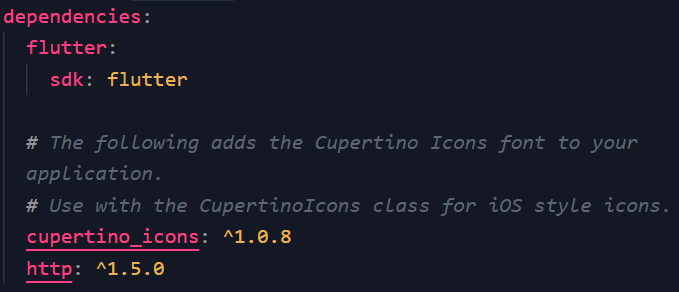
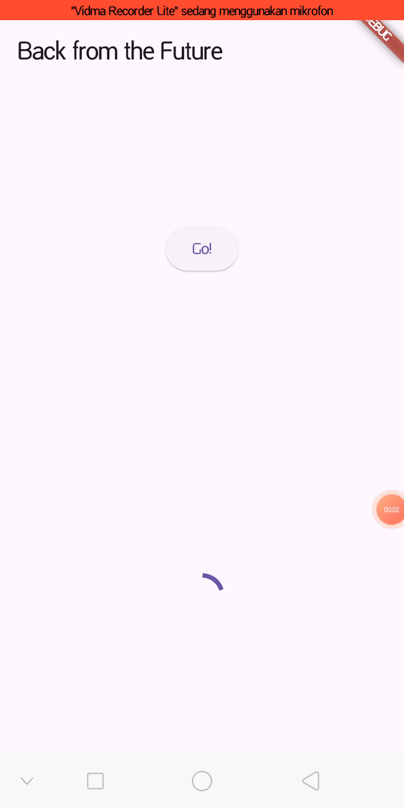
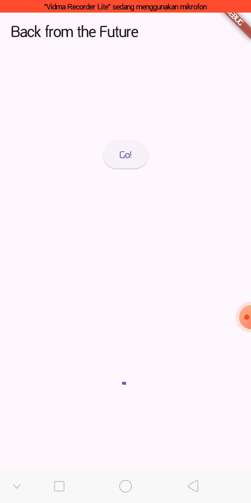
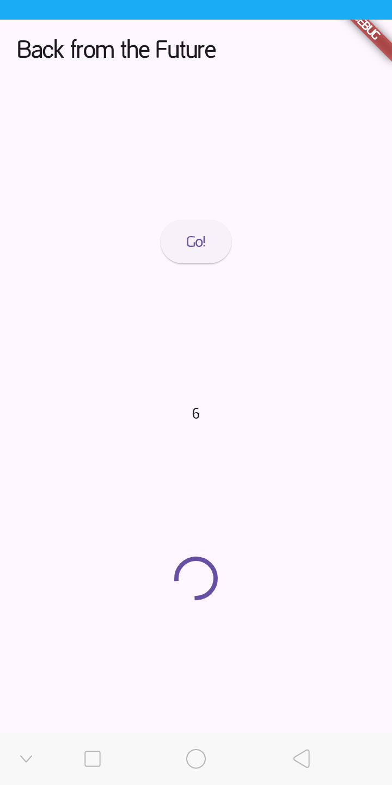
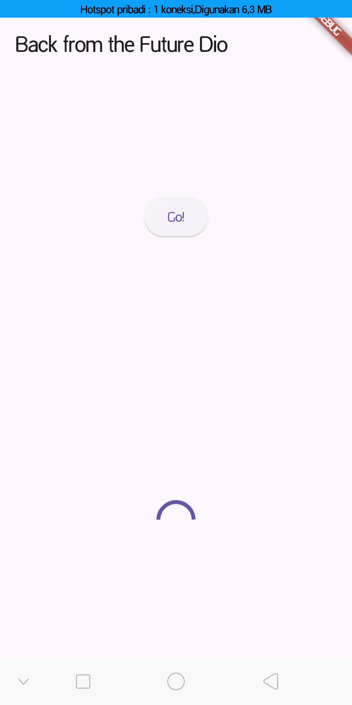
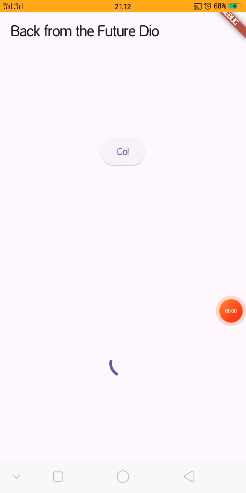
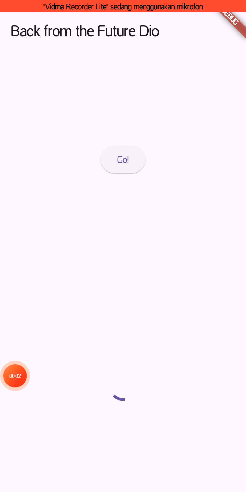
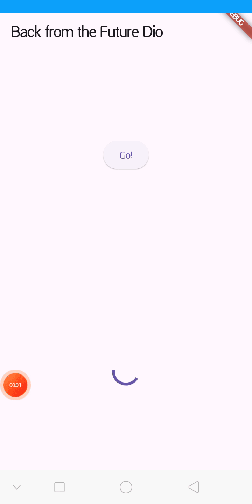
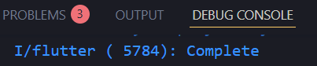

# Pemrograman Mobile - Pemrograman Asynchronous di Flutter

NIM : 2341720098 <br>
NAMA : Dio Andika Pradana Mulia Tama <br>
KELAS : TI-3F

## Praktikum 1: Mengunduh Data dari Web Service (API)

### Langkah 1: Buat Project Baru

Buatlah sebuah project flutter baru dengan nama **books** di folder **src week-11** repository GitHub Anda.

Kemudian Tambahkan dependensi `http` dengan mengetik perintah berikut di terminal.

```shell
flutter pub add http
```

### Langkah 2: Cek file `pubspec.yaml`

Jika berhasil install plugin, pastikan plugin `http` telah ada di file `pubspec` ini seperti berikut.



### Langkah 3: Buka file `main.dart`

Ketiklah kode seperti berikut ini.

> **Soal 1** <br>
> Tambahkan **nama panggilan Anda** pada `title` app sebagai identitas hasil pekerjaan Anda.

```dart
import 'dart:async';
import 'package:flutter/material.dart';
import 'package:http/http.dart';
import 'package:http/http.dart' as http;

void main() {
  runApp(const MyApp());
}

class MyApp extends StatelessWidget {
  const MyApp({super.key});

  @override
  Widget build(BuildContext context) {
    return MaterialApp(
      title: 'Future Demo Dio',
      theme: ThemeData(
        primarySwatch: Colors.blue,
        visualDensity: VisualDensity.adaptivePlatformDensity,
      ),
      home: const FuturePage(),
    );
  }
}

class FuturePage extends StatefulWidget {
  const FuturePage({super.key});

  @override
  State<FuturePage> createState() => _FuturePageState();
}

class _FuturePageState extends State<FuturePage> {
  String result = '';
  @override
  Widget build(BuildContext context) {
    return Scaffold(
      appBar: AppBar(title: const Text('Back from the Future')),
      body: Center(
        child: Column(
          children: [
            const Spacer(),
            ElevatedButton(child: const Text('Go'), onPressed: () {}),
            const Spacer(),
            Text(result),
            const Spacer(),
            const CircularProgressIndicator(),
            const Spacer(),
          ],
        ),
      ),
    );
  }
}
```

> Catatan: <br>
> Tidak ada yang spesial dengan kode di `main.dart` tersebut. Perlu diperhatikan di kode tersebut terdapat widget `CircularProgressIndicator` yang akan menampilkan animasi berputar secara terus-menerus, itu pertanda bagus bahwa aplikasi Anda responsif (tidak freeze/lag). Ketika animasi terlihat berhenti, itu berarti UI menunggu proses lain sampai selesai.

### Langkah 4: Tambah method `getData()`

Tambahkan method ini ke dalam `class \_FuturePageState` yang berguna untuk mengambil data dari API Google Books.

```dart
  Future<Response> getData() async {
    const authority = 'www.googleapis.com';
    const path = 'books/v1/volumes/Q5mJEAAAQBAJ';
    Uri uri = Uri.https(authority, path);
    return http.get(uri);
  }
```

> **Soal 2**
>
> - Carilah judul buku favorit Anda di Google Books, lalu ganti ID buku pada variabel `path` di kode tersebut. Caranya ambil di URL browser Anda seperti gambar berikut ini.
>   
> - Kemudian cobalah akses di browser URI tersebut dengan lengkap seperti ini. Jika menampilkan data JSON, maka Anda telah berhasil. Lakukan capture milik Anda dan tulis di `README` pada laporan praktikum. Lalu lakukan commit dengan pesan "**W11: Soal 2**". ꪜ
>   

### Langkah 5: Tambah kode di `ElevatedButton`

Tambahkan kode pada `onPressed` di `ElevatedButton` seperti berikut.

```dart
            ElevatedButton(
              child: Text('Go!'),
              onPressed: () {
                setState(() {});
                getData()
                    .then((value) {
                      result = value.body.toString().substring(0, 450);
                      setState(() {});
                    })
                    .catchError((_) {
                      result = 'An error occured';
                      setState(() {});
                    });
              },
            ),
```

Lakukan run aplikasi Flutter Anda. Anda akan melihat tampilan akhir seperti gambar berikut. Jika masih terdapat error, silakan diperbaiki hingga bisa running.

**Soal 3**

- Jelaskan maksud kode langkah 5 tersebut terkait `substring` dan `catchError`!

  Kode `substring(0, 450)` akan memotong atau memangkas data teks yang diterima. Fungsi `getData()` mengambil data dari Google Books API. Data yang dikembalikan (`value.body`) seringkali berupa teks yang sangat panjang, bisa ribuan karakter. Jika semua teks itu ditampilkan di layar, tampilannya akan berantakan atau terjadi overflow. Oleh karena itu, kode `value.body.toString().substring(0, 450)` digunakan untuk mengambil hanya 450 karakter pertama saja (dimulai dari indeks 0 hingga sebelum 450) dari data tersebut. Sisa datanya diabaikan. Ini memastikan data yang ditampilkan di `Text(result)` pas di layar sebagai cuplikan.

  Sedangkan `catchError` digunakan untuk menangani kegagalan (error handling). Fungsi `getData()` adalah operasi jaringan yang bergantung pada koneksi internet dan ketersediaan server Google. Operasi ini bisa gagal kapan saja (misalnya: HP tidak ada koneksi internet, server Google sedang down, atau URL salah). Jika `getData()` gagal, `Future` akan selesai dengan status error. Tanpa `catchError`, aplikasi akan crash. Jadi, blok `.catchError` berfungsi sebagai jaring pengaman. Jika terjadi error, kode di dalam `.then()` akan dilewati, dan kode di dalam `.catchError` akan dieksekusi.

- Capture hasil praktikum Anda berupa GIF dan lampirkan di README. Lalu lakukan commit dengan pesan "**W11: Soal 3**". ꪜ



## Praktikum 2: Menggunakan await/async untuk menghindari callbacks

### Langkah 1: Buka file `main.dart`

Tambahkan tiga method berisi kode seperti berikut di dalam `class _FuturePageState`.

```dart
Future<int> returnOneAsync() async {
  await Future.delayed(const Duration(seconds: 3));
  return 1;
}

Future<int> returnTwoAsync() async {
  await Future.delayed(const Duration(seconds: 3));
  return 2;
}

Future<int> returnThreeAsync() async {
  await Future.delayed(const Duration(seconds: 3));
  return 3;
}
```

### Langkah 2: Tambah method `count()`

Lalu tambahkan lagi method ini di bawah ketiga method sebelumnya.

```dart
  Future count() async {
    int total = 0;
    total = await returnOneAsync();
    total += await returnTwoAsync();
    total += await returnThreeAsync();
    setState(() {
      result = total.toString();
    });
  }
```

### Langkah 3: Panggil `count()`

Lakukan comment kode sebelumnya, ubah isi kode onPressed() menjadi seperti berikut.

```dart
            ElevatedButton(
              child: Text('Go!'),
              onPressed: () {
                count();
              },
            ),
```

### Langkah 4: Run

Akhirnya, **run** atau tekan **F5** jika aplikasi belum running. Maka Anda akan melihat seperti gambar berikut, hasil angka 6 akan tampil setelah delay 9 detik.





**Soal 4**

- Jelaskan maksud kode langkah 1 dan 2 tersebut!

  Langkah 1 menambahkan tiga method yaitu `returnOneAsync`, `returnTwoAsync`, dan `returnThreeAsync`.

  - Keyword `async` menandakan bahwa method ini adalah fungsi asinkron. Artinya, fungsi ini bisa melakukan pekerjaan yang butuh waktu (seperti download data, tulis data ke database) tanpa membuat seluruh aplikasi macet.
  - `Future<int>`: Ini adalah "janji" bahwa fungsi tersebut akan mengembalikan sebuah nilai int (angka) di masa depan (Future).
  - `await Future.delayed(...)`. `Future.delayed` adalah perintah untuk "diam/tunggu" selama durasi yang ditentukan, dalam kasus ini 3 detik. Keyword `await` adalah perintah untuk menjeda eksekusi fungsi ini di baris tersebut sampai perintah "tunggu 3 detik" selesai. Ketka fungsi ini "dijeda" (`await`), aplikasi Flutter tidak ikut macet. UI tetap berjalan, dan loading spinner (`CircularProgressIndicator`) bisa terus berputar.
  - `return 1;`: Setelah 3 detik selesai, jeda await berakhir, dan fungsi ini akhirnya mengembalikan nilai 1 (untuk `returnOneAsync`).

  Langkah 2 menambahkan method `count` untuk mengelola ketiga method dari Langkah 1.

  - `Future count() async` menandakan method ini juga merupakan fungsi asinkron.
  - `total = await returnOneAsync();`. Baris ini menjalankan method `returnOneAsync()`. Lalu menunggu (`await`) sampai method itu selesai (yang memakan waktu 3 detik). Setelah selesai dan mengembalikan nilai 1, masukkan nilai itu ke `total`. Saat ini `total` bernilai 1.
  - `total += await returnTwoAsync();`. Baris ini menjalankan method `returnTwoAsync()`. Lalu, menunggu lagi (`await`) sampai method itu selesai (3 detik lagi). Setelah selesai dan mengembalikan 2, tambahkan ke `total`. Saat ini `total` bernilai 1 + 2 = 3.
  - `total += await returnThreeAsync();`. Sama seperti sebelumnya, menunggu 3 detik lagi untuk `returnThreeAsync`. Setelah selesai, tambahkan 3 ke `total`. `total` akhirnya bernilai 3 + 3 = 6.
  - `setState(() { ... })`: Setelah semua proses `await` selesai (total 9 detik), baris ini dieksekusi. `setState` memberi tahu Flutter untuk memperbarui layar dengan nilai `result` yang baru, yaitu "6".

- Capture hasil praktikum Anda berupa GIF dan lampirkan di README. Lalu lakukan commit dengan pesan "**W11: Soal 4**". ꪜ

## Praktikum 3: Menggunakan Completer di Future

### Langkah 1: Buka `main.dart`

Pastikan telah impor package async berikut.

```dart
import 'package:async/async.dart';
```

### Langkah 2: Tambahkan variabel dan method

Tambahkan variabel late dan method di `class _FuturePageState` seperti ini.

```dart
late Completer completer;

Future getNumber() {
  completer = Completer<int>();
  calculate();
  return completer.future;
}

Future calculate() async {
  await Future.delayed(const Duration(seconds : 5));
  completer.complete(42);
}
```

### Langkah 3: Ganti isi kode `onPressed()`

Tambahkan kode berikut pada fungsi `onPressed()`. Kode sebelumnya bisa Anda comment.

```dart
            ElevatedButton(
              child: Text('Go!'),
              onPressed: () {
                getNumber().then((value) {
                  setState(() {
                    result = value.toString();
                  });
                });
              },
            ),
```

### Langkah 4:

Terakhir, **run** atau tekan **F5** untuk melihat hasilnya jika memang belum running. Bisa juga lakukan **hot restart** jika aplikasi sudah running. Maka hasilnya akan seperti gambar berikut ini. Setelah 5 detik, maka angka 42 akan tampil.



**Soal 5**

- Jelaskan maksud kode langkah 2 tersebut!

  Kode pada Langkah 2 ini memperkenalkan cara untuk mengontrol sebuah `Future` menggunakan `Completer`.

  - `late Completer completer;`. Ini adalah deklarasi variabel untuk `Completer`. `Completer` adalah objek khusus dari paket `async` yang memungkinkan membuat `Future` dan menyelesaikannya (mengisi nilainya) kapan pun kita mau.
  - `Future getNumber()`. Method ini bertugas membuat dan mengembalikan `Future` yang masih kosong (pending). Baris `completer = Completer<int>();` membuat "janji" baru bahwa akan ada data `int` di masa depan. Baris `calculate();` memulai fungsi `calculate` untuk berjalan di latar belakang. (**_Note: di sini tidak ada `await`, jadi `getNumber` tidak menunggu `calculate` selesai_**). `return completer.future;` adalah bagian kuncinya, method `getNumber` langsung mengembalikan objek `Future` yang masih kosong. Di Langkah 3, `onPressed` mengambil `Future` ini dan "mendengarkan" (`.then()`) kapan `Future` itu akan selesai.
  - `Future calculate() async`, method ini bertugas melakukan pekerjaan dan menepati janji yang dibuat oleh `getNumber`. `await Future.delayed(...)` adalah simulasi pekerjaan yang butuh waktu lama (5 detik). Aplikasi tidak macet di sini. `completer.complete(42);` merupakan inti dari `Completer`. Setelah 5 detik menunggu, baris ini dieksekusi. `complete(42)` secara manual "menepati" janji yang `Future`-nya sedang didengarkan oleh `onPressed`. Ia berkata, "Pekerjaan selesai, ini nilainya: 42."

- Capture hasil praktikum Anda berupa GIF dan lampirkan di README. Lalu lakukan commit dengan pesan "**W11: Soal 5**". ꪜ

### Langkah 5: Ganti method `calculate()`

Gantilah isi code method `calculate()` seperti kode berikut, atau Anda dapat membuat `calculate2()`

```dart
  Future calculate2() async {
    try {
      await Future.delayed(const Duration(seconds: 5));
      completer.complete(42);
    } catch (_) {
      completer.completeError({});
    }
  }
```

### Langkah 6: Pindah ke `onPressed()`

Ganti menjadi kode seperti berikut.

```dart
getNumber().then((value) {
  setState(() {
    result = value.toString();
  });
}).catchError((e) {
  result = 'An error occurred';
});
```

**Soal 6**

- Jelaskan maksud perbedaan kode langkah 2 dengan langkah 5-6 tersebut!

  Perbedaan utamanya adalah penanganan error (**error handling**) yang lengkap dan aman.

  Kode pada Langkah 2 (`calculate`) adalah versi "optimis". Ia hanya menangani skenario sukses:

  - Method `calculate()` didesain untuk selalu berhasil. Ia memanggil `completer.complete(42)` untuk menyelesaikan `Future` dengan sebuah nilai.
  - `onPressed()` hanya menggunakan `.then()`. Kode ini "optimis" dan hanya menangani kasus sukses. Jika `calculate` gagal, aplikasi bisa crash karena tidak ada yang menangkap error.

  Kode pada Langkah 5 dan 6 (`calculate2` dan `onPressed` baru) adalah versi yang jauh lebih aman (robust) karena menangani skenario sukses dan gagal:

  - Langkah 5 (`calculate2`):

    - Fungsi ini membungkus logika di dalam blok `try...catch`.
    - Jika `await Future.delayed` (atau kode lain di dalam try) berhasil, ia akan memanggil `completer.complete(42)` (skenario sukses).
    - Jika terjadi error apa pun, blok `catch` akan menangkapnya dan secara eksplisit memberi tahu `Future` bahwa telah terjadi kegagalan dengan memanggil `completer.completeError({})` (skenario gagal).

  - Langkah 6 (`onPressed`):

    - Karena sekarang ada kemungkinan `Future` selesai dengan error (dari `completer.completeError`), maka wajib menangkapnya di UI.
    - Blok `.catchError((e) { ... })` ditambahkan untuk "mendengarkan" skenario gagal tersebut. Jika `Future` selesai dengan error, kode inilah yang akan dieksekusi, dan UI akan menampilkan "An error occurred" alih-alih crash atau hang.

    Jadi singkatnya, Langkah 2 hanya menangani skenario sukses saja, sedangkan Langkah 5-6 secara lengkap menangani kesuksesan (`.then`) dan kegagalan (`.catchError`), membuat aplikasi menjadi lebih stabil.

- Capture hasil praktikum Anda berupa GIF dan lampirkan di README. Lalu lakukan commit dengan pesan "**W11: Soal 6**". ꪜ



## Praktikum 4: Memanggil Future secara paralel

### Langkah 1: Buka file `main.dart`

Tambahkan method ini ke dalam `class _FuturePageState`

```dart
  void returnFG() {
    FutureGroup<int> futureGroup = FutureGroup<int>();
    futureGroup.add(returnOneAsync());
    futureGroup.add(returnTwoAsync());
    futureGroup.add(returnThreeAsync());
    futureGroup.close();
    futureGroup.future.then((List<int> value) {
      int total = 0;
      for (var element in value) {
        total += element;
      }
      setState(() {
        result = total.toString();
      });
    });
  }
```

### Langkah 2: Edit `onPressed()`

Anda bisa hapus atau comment kode sebelumnya, kemudian panggil method dari langkah 1 tersebut.

```dart
              onPressed: () {
                returnFG();
              },
```

### Langkah 3: Run

Anda akan melihat hasilnya dalam 3 detik berupa angka 6 lebih cepat dibandingkan praktikum sebelumnya menunggu sampai 9 detik.



**Soal 7**

- Capture hasil praktikum Anda berupa GIF dan lampirkan di README. Lalu lakukan commit dengan pesan "**W11: Soal 7**". ꪜ

### Langkah 4: Ganti variabel `futureGroup`

Anda dapat menggunakan FutureGroup dengan `Future.wait` seperti kode berikut.

```dart
final futures = Future.wait<int>([
  returnOneAsync(),
  returnTwoAsync(),
  returnThreeAsync(),
]);
```

**Soal 8**

- Jelaskan maksud perbedaan kode langkah 1 dan 4!

  Maksud dari kedua potongan kode tersebut secara fungsional adalah sama persis. Keduanya menjalankan tiga method Future (`returnOneAsync`, `returnTwoAsync`, `returnThreeAsync`) secara paralel (bersamaan). Inilah mengapa hasilnya muncul dalam 3 detik, bukan 9 detik (seperti pada praktikum 2 yang menggunakan `await` secara berurutan).

  Perbedaannya hanya terletak pada cara penulisan (sintaksis) dan asalnya:

  - Langkah 1 (`FutureGroup`)

    - Menggunakan class `FutureGroup` yang berasal dari package eksternal `package:async/async.dart`.
    - Caranya lebih manual, yakni harus membuat objek `FutureGroup`, menambahkannya satu per satu (`.add()`), lalu "menutup" grup (`.close()`) untuk memberi tahu bahwa tidak ada lagi future yang akan ditambahkan.
    - Sedikit lebih fleksibel jika perlu menambahkan future ke grup secara dinamis.

  - Langkah 4 (`Future.wait`)

    - Menggunakan metode statis `Future.wait` yang merupakan bawaan (built-in) dari Dart.
    - Caranya jauh lebih ringkas dan umum digunakan.
    - Hanya perlu memberikan satu `List` yang berisi semua future yang ingin ditunggu.

  Intinya, langkah 4 (`Future.wait`) adalah cara standar yang lebih modern dan sederhana untuk mencapai apa yang dilakukan oleh langkah 1 (`FutureGroup`). Keduanya bertujuan untuk menjalankan beberapa tugas asynchronous secara bersamaan dan menunggu sampai semuanya selesai.



## Praktikum 5: Menangani Respon Error pada Async Code

### Langkah 1: Buka file `main.dart`

Tambahkan method ini ke dalam `class _FuturePageState`

```dart
  Future returnError() async {
    await Future.delayed(const Duration(seconds: 2));
    throw Exception('Something terrrible happened!');
  }
```

### Langkah 2: ElevatedButton

Ganti dengan kode berikut

```dart
                    .then((value) {
                      setState(() {
                        result = 'Success';
                      });
                    })
                    .catchError((onError) {
                      setState(() {
                        result = onError.toString();
                      });
                    })
                    .whenComplete(() => print('Complete'));
```

### Langkah 3: Run

Lakukan run dan klik tombol **GO!** maka akan menghasilkan seperti gambar berikut.


Pada bagian debug console akan melihat teks `Complete` seperti berikut.



**Soal 9**

- Capture hasil praktikum Anda berupa GIF dan lampirkan di README. Lalu lakukan commit dengan pesan "**W11: Soal 9**". ꪜ

### Langkah 4: Tambah method `handleError()`

Tambahkan kode ini di dalam `class _FutureStatePage`

```dart

```

**Soal 10**

- Panggil method `handleError()` tersebut di `ElevatedButton`, lalu run. Apa hasilnya? Jelaskan perbedaan kode langkah 1 dan 4!
  
