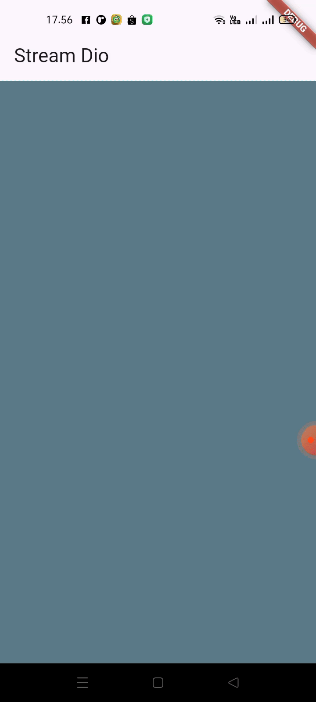
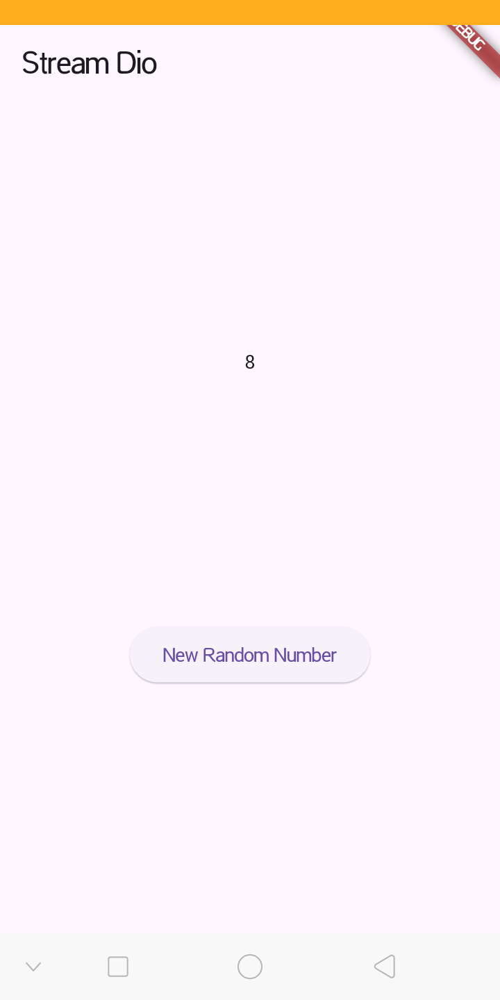
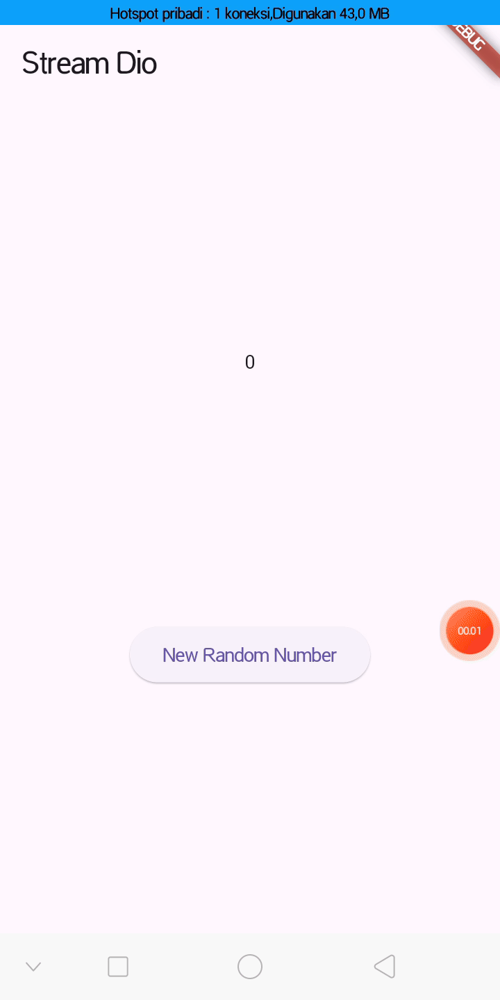

# Lanjutan State Management dengan Streams

NIM : 2341720098 <br>
NAMA : Dio Andika Pradana Mulia Tama <br>
KELAS : TI-3F

## Praktikum 1: Dart Streams

### Kode Program `main.dart`:

```dart
import 'package:flutter/material.dart';

void main() {
  runApp(const MyApp());
}

class MyApp extends StatelessWidget {
  const MyApp({super.key});

  @override
  Widget build(BuildContext context) {
    return MaterialApp(
      title: 'Stream Dio',
      theme: ThemeData(primarySwatch: Colors.indigo),
      home: const StreamHomePage(),
    );
  }
}

class StreamHomePage extends StatefulWidget {
  const StreamHomePage({super.key});

  @override
  State<StreamHomePage> createState() => _StreamHomePageState();
}

class _StreamHomePageState extends State<StreamHomePage> {
  @override
  Widget build(BuildContext context) {
    return Container();
  }
}
```

**Soal 1**

- Tambahkan **nama panggilan Anda** pada `title` app sebagai identitas hasil pekerjaan Anda. ꪜ

  ```dart
  class MyApp extends StatelessWidget {
    const MyApp({super.key});

    @override
    Widget build(BuildContext context) {
      return MaterialApp(
        title: 'Stream Dio',
        theme: ThemeData(primarySwatch: Colors.indigo),
        home: const StreamHomePage(),
      );
    }
  }
  ```

- Gantilah warna tema aplikasi sesuai kesukaan Anda. ꪜ

  ```dart
      theme: ThemeData(primarySwatch: Colors.indigo),
  ```

- Lakukan commit hasil jawaban Soal 1 dengan pesan "**W12: Jawaban Soal 1**" ꪜ

### Kode program `stream.dart`:

```dart
import 'package:flutter/material.dart';

class ColorStream {
  final List<Color> colors = [
    Colors.blueGrey,
    Colors.amber,
    Colors.deepPurple,
    Colors.lightBlue,
    Colors.teal,
  ];
}
```

**Soal 2**

- Tambahkan 5 warna lainnya sesuai keinginan Anda pada variabel `colors` tersebut. ꪜ
  ```dart
  final List<Color> colors = [
    Colors.blueGrey,
    Colors.amber,
    Colors.deepPurple,
    Colors.lightBlue,
    Colors.teal,
    Colors.yellow,
    Colors.pink,
    Colors.lime,
    Colors.cyan,
    Colors.orange,
  ];
  ```
- Lakukan commit hasil jawaban Soal 2 dengan pesan "**W12: Jawaban Soal 2**" ꪜ

#### Menambahkan method `getColors()` dan perintah `yield*` pada `stream.dart`:

```dart
  Stream<Color> getColors() async* {
    yield* Stream.periodic(const Duration(seconds: 1), (int t) {
      int index = t % colors.length;
      return colors[index];
    });
  }
```

**Soal 3**

- Jelaskan fungsi keyword `yield*` pada kode tersebut!

  Keyword `yield*` berfungsi untuk meneruskan (mendelegasikan) semua nilai dari _Stream_ lain ke dalam _Stream_ saat ini.

  - `yield` (tanpa \*): Digunakan untuk mengirim satu nilai ke dalam _Stream_.
  - `yield*` (dengan \*): Digunakan untuk mengambil seluruh _Stream_ lain dan membiarkan semua nilainya mengalir ke dalam _Stream_ saat ini, satu per satu.

  Pada kode tersebut, `yield* Stream.periodic(...)` dapat diartikan: "Ambil Stream yang dibuat oleh `Stream.periodic`, dan setiap kali Stream itu menghasilkan nilai, teruskan nilai tersebut seolah-olah itu adalah nilai dari Stream `getColors`."

- Apa maksud isi perintah kode tersebut?

  Singkatnya, kode tersebut bertujuan untuk membuat sebuah generator warna yang tidak pernah berhenti.
  Fungsi `getColors()` adalah sebuah Stream yang akan mengeluarkan satu warna baru setiap satu detik, secara berulang-ulang dari daftar yang ada.

  1. Class `ColorStream` memiliki sebuah List berisi 10 warna (`final List<Color> colors`).
  2. `Stream.periodic(const Duration(seconds: 1), ...)` adalah sebuah Stream bawaan Dart yang akan menghasilkan sebuah angka (`int `) setiap 1 detik. Angka ini akan terus bertambah (0, 1, 2, 3, ...).
  3. Kode `int index = t % colors.length;` menggunakan operasi modulo. `colors.length` adalah 10, jadi:

     - Ketika t = 0, index = 0 % 10 = 0
     - Ketika t = 1, index = 1 % 10 = 1
     - ...
     - Ketika t = 9, index = 9 % 10 = 9
     - Ketika t = 10, index = 10 % 10 = 0 (kembali ke awal)
     - Ketika t = 11, index = 11 % 10 = 1
     - Dan seterusnya...

  4. `return colors[index];` mengambil warna dari List berdasarkan index yang berulang tersebut.
  5. `yield\*` memastikan bahwa warna yang dipilih di langkah 4 dikeluarkan oleh Stream `getColors` setiap detiknya.

  Hasil akhirnya adalah sebuah Stream yang akan menampilkan: Colors.blueGrey (detik 1), Colors.amber (detik 2), ... Colors.orange (detik 10), lalu Colors.blueGrey (detik 11), dan seterusnya.

- Lakukan commit hasil jawaban Soal 3 dengan pesan "**W12: Jawaban Soal 3**" ꪜ

### Update kode `main.dart`:

```dart
import 'package:flutter/material.dart';
import 'stream.dart';

void main() {
  runApp(const MyApp());
}

class MyApp extends StatelessWidget {
  const MyApp({super.key});

  @override
  Widget build(BuildContext context) {
    return MaterialApp(
      title: 'Stream Dio',
      theme: ThemeData(primarySwatch: Colors.indigo),
      home: const StreamHomePage(),
    );
  }
}

class StreamHomePage extends StatefulWidget {
  const StreamHomePage({super.key});

  @override
  State<StreamHomePage> createState() => _StreamHomePageState();
}

class _StreamHomePageState extends State<StreamHomePage> {
  Color bgColor = Colors.blueGrey;
  late ColorStream colorStream;

  @override
  void initState() {
    super.initState();
    colorStream = ColorStream();
    changeColor();
  }

  @override
  Widget build(BuildContext context) {
    return Scaffold(
      appBar: AppBar(title: const Text('Stream Dio')),
      body: Container(decoration: BoxDecoration(color: bgColor)),
    );
  }

  void changeColor() async {
    await for (var eventColor in colorStream.getColors()) {
      setState(() {
        bgColor = eventColor;
      });
    }
  }
}
```

### Run

Lakukan running pada aplikasi Flutter Anda, maka akan terlihat berubah warna background setiap detik.



**Soal 4**

- Capture hasil praktikum Anda berupa GIF dan lampirkan di README. ꪜ
- Lakukan commit hasil jawaban Soal 4 dengan pesan "**W12: Jawaban Soal 4**" ꪜ

#### Mengganti isi method `changeColor()`:

```dart
  void changeColor() async {
    colorStream.getColors().listen((eventColor) {
      setState(() {
        bgColor = eventColor;
      });
    });
  }
```

**Soal 5**

- Jelaskan perbedaan menggunakan `listen` dan `await for` (langkah 9) !

  Perbedaan utamanya terletak pada cara eksekusi kodenya (**blocking vs non-blocking**).

  - `.listen()` adalah metode non-blocking. Method "berlangganan" ke Stream dan method akan langsung selesai, tapi akan mendapat "panggilan" setiap kali ada data baru. Analoginya seperti berlangganan notifikasi email. Hanya mendaftar sekali (`.listen`), lalu bebas melanjutkan pekerjaan lain. Setiap kali ada data baru (email masuk), maka akan "diberi tahu" (kode `callback` dipanggil).
  - `await for` adalah loop yang blocking (di dalam fungsi `async`). Method akan "berhenti sejenak" di loop tersebut, menunggu setiap data baru, mengeksekusi loop, lalu menunggu lagi. Jadi, method `changeColor()` akan berhenti (pause) di loop itu dan tidak akan pindah ke baris berikutnya.

- Lakukan commit hasil jawaban Soal 5 dengan pesan "**W12: Jawaban Soal 5**" ꪜ

## Praktikum 2: Stream controllers dan sinks

### Update kode `stream.dart`

```dart
import 'package:flutter/material.dart';
import 'dart:async';

class ColorStream {
  final List<Color> colors = [
    Colors.blueGrey,
    Colors.amber,
    Colors.deepPurple,
    Colors.lightBlue,
    Colors.teal,
    Colors.yellow,
    Colors.pink,
    Colors.lime,
    Colors.cyan,
    Colors.orange,
  ];

  Stream<Color> getColors() async* {
    yield* Stream.periodic(const Duration(seconds: 1), (int t) {
      int index = t % colors.length;
      return colors[index];
    });
  }
}

// Langkah 2, 3, 4, & 5 Praktikum 2
class NumberStream {
  final StreamController<int> controller = StreamController<int>();

  void addNumberToSink(int newNumber) {
    controller.sink.add(newNumber);
  }

  close() {
    controller.close();
  }
}
```

### Update kode `main.dart`

```dart
import 'package:flutter/material.dart';
import 'stream.dart';
import 'dart:async';
import 'dart:math';

void main() {
  runApp(const MyApp());
}

class MyApp extends StatelessWidget {
  const MyApp({super.key});

  @override
  Widget build(BuildContext context) {
    return MaterialApp(
      title: 'Stream Dio',
      theme: ThemeData(primarySwatch: Colors.indigo),
      home: const StreamHomePage(),
    );
  }
}

class StreamHomePage extends StatefulWidget {
  const StreamHomePage({super.key});

  @override
  State<StreamHomePage> createState() => _StreamHomePageState();
}

class _StreamHomePageState extends State<StreamHomePage> {
  Color bgColor = Colors.blueGrey;
  late ColorStream colorStream;
  // Langkah 7 Praktikum 2
  int lastNumber = 0;
  late StreamController numberStreamController;
  late NumberStream numberStream;

  @override
  void initState() {
    // Langkah 8 Praktikum 2
    numberStream = NumberStream();
    numberStreamController = numberStream.controller;
    Stream stream = numberStreamController.stream;
    stream.listen((event) {
      setState(() {
        lastNumber = event;
      });
    });
    super.initState();
    // colorStream = ColorStream();
    // changeColor();
  }

  // Langkah 9 Praktikum 2
  @override
  void dispose() {
    numberStreamController.close();
    super.dispose();
  }

  @override
  Widget build(BuildContext context) {
    return Scaffold(
      appBar: AppBar(title: const Text('Stream Dio')),
      // Langkah 11 Praktikum 2
      body: SizedBox(
        width: double.infinity,
        child: Column(
          mainAxisAlignment: MainAxisAlignment.spaceEvenly,
          crossAxisAlignment: CrossAxisAlignment.center,
          children: [
            Text(lastNumber.toString()),
            ElevatedButton(
              onPressed: () => addRandomNumber(),
              child: Text('New Random Number'),
            ),
          ],
        ),
      ),
      // body: Container(decoration: BoxDecoration(color: bgColor)),
    );
  }

  void changeColor() async {
    colorStream.getColors().listen((eventColor) {
      setState(() {
        bgColor = eventColor;
      });
    });

    /* Langkah 9
    await for (var eventColor in colorStream.getColors()) {
      setState(() {
        bgColor = eventColor;
      });
    } */
  }

  // Langkah 10 Praktikum 2
  void addRandomNumber() {
    Random random = Random();
    int myNum = random.nextInt(100);
    numberStream.addNumberToSink(myNum);
  }
}
```

### Run

Lakukan running pada aplikasi Flutter Anda, maka akan terlihat seperti gambar berikut.



**Soal 6**

- Jelaskan maksud kode langkah 8 dan 10 tersebut!

  Secara singkat, langkah 8 adalah kode untuk **"mendengarkan"** data, dan langkah 10 adalah kode untuk **"mengirim"** data. Keduanya bekerja bersama untuk membuat _stream_ berfungsi.

  - Langkah 8: `initState()`
    Maksud dari kode di `initState()` adalah untuk **menyiapkan dan berlangganan (subscribe) ke _stream_** saat halaman tersebut pertama kali dibuka. Ini adalah langkah "persiapan".
    1. `numberStream = NumberStream();`: Membuat objek `NumberStream`.
    2. `numberStreamController = numberStream.controller;`: Ini mengambil "otak" dari _stream_, yaitu `StreamController`.
    3. `Stream stream = numberStreamController.stream;`: Ini mengambil "ujung pipa" _stream_ yang bisa didengarkan oleh publik.
    4. `stream.listen((event) { ... });`: Ini adalah bagian terpenting. Kode ini "mendaftar" atau _subscribe_ ke _stream_. Kapanpun ada data baru (`event`) yang masuk, maka akan menjalankan kode di dalam kurung kurawal ini.
    5. `setState(() { lastNumber = event; });`: Setiap kali data baru (angka) diterima, ia memanggil `setState` untuk memperbarui variabel `lastNumber` dan memberi tahu Flutter untuk rebuild layar dengan angka yang baru.
  - Langkah 10: `addRandomNumber()`
    Maksud dari kode `addRandomNumber()` adalah untuk **menghasilkan data baru dan memasukkannya ke dalam _stream_**.
    1. `Random random = Random();`: Membuat generator angka acak.
    2. `int myNum = random.nextInt(100);`: Menghasilkan angka acak baru antara 0 dan 99.
    3. `numberStream.addNumberToSink(myNum);`: Merupakan aksi kunci. Kode ini mengambil angka acak (`myNum`) dan "menuangkannya" ke dalam _stream_ (melalui `sink`).

- Capture hasil praktikum Anda berupa GIF dan lampirkan di README. ꪜ

  

- Lalu lakukan commit dengan pesan "**W12: Jawaban Soal 6**". ꪜ

#### Menambahkan addError() pada `stream.dart`:

```dart
  addError() {
    controller.sink.addError("error");
  }
```

#### Menambahkan method `onError` di dalam class `StreamHomePageState` pada method `listen` di fungsi `initState()`:

```dart
    stream
        .listen((event) {
          setState(() {
            lastNumber = event;
          });
        })
        .onError((error) {
          setState(() {
            lastNumber = -1;
          });
        });
```

#### Mengedit method `addRandomNumber()`:

```dart
  void addRandomNumber() {
    Random random = Random();
    // int myNum = random.nextInt(100);
    // numberStream.addNumberToSink(myNum);
    numberStream.addError();
  }
```

**Soal 7**

- Jelaskan maksud kode langkah 13 sampai 15 tersebut!

  Maksud dari langkah 13, 14, dan 15 adalah untuk **mendemonstrasikan dan menguji cara kerja penanganan error (error handling) di dalam sebuah Stream.**

  - Langkah 13: `addError()`
    **Maksud:** Membuat fungsi untuk **mengirimkan sinyal error**. Tugas _method_ ini hanya satu: **sengaja mengirimkan sebuah objek error** ke dalam _stream_ melalui `sink`.
  - Langkah 14: `.onError()`
    **Maksud:** Menyiapkan "penangkap" atau **pendengar untuk sinyal error**. Dengan menambahkan `.onError((error) { ... })` pada kode `stream.liste`n di `initState`, maka _stream_ tahu apa yang harus dilakukan jika ia menerima _sinyal error_ alih-alih data. Dalam kasus ini, ia diperintahkan untuk memperbarui layar (`setState`) dan menampilkan angka `-1`.
  - Langkah 15: Mengubah `addRandomNumber()`
    **Maksud:** Mengubah tombol agar **memicu error** dengan menggantinya dengan `numberStream.addError()`, alih-alih mengirim data.
    Ketiga langkah ini bekerja bersama-sama. Sekarang, ketika tombol "New Random Number" ditekan (Langkah 15), akan memicu pengiriman sinyal error (Langkah 13). Sinyal error ini mengalir melalui _stream_ dan "ditangkap" oleh listener `.onError` (Langkah 14), yang kemudian menyebabkan layar menampilkan angka `-1`.

- Kembalikan kode seperti semula pada Langkah 15, comment `addError()` agar Anda dapat melanjutkan ke praktikum 3 berikutnya. ꪜ

  ```dart
  void addRandomNumber() {
    Random random = Random();
    int myNum = random.nextInt(100);
    numberStream.addNumberToSink(myNum);
    // numberStream.addError();
  }
  ```

- Lalu lakukan commit dengan pesan "**W12: Jawaban Soal 7**". ꪜ

## Praktikum 3: Injeksi data ke streams
