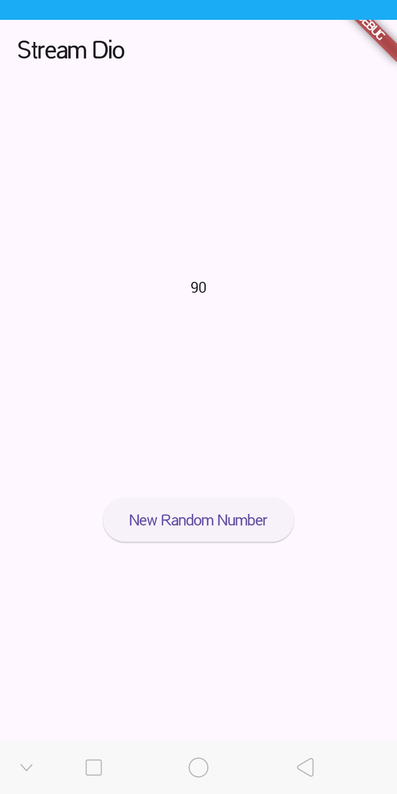
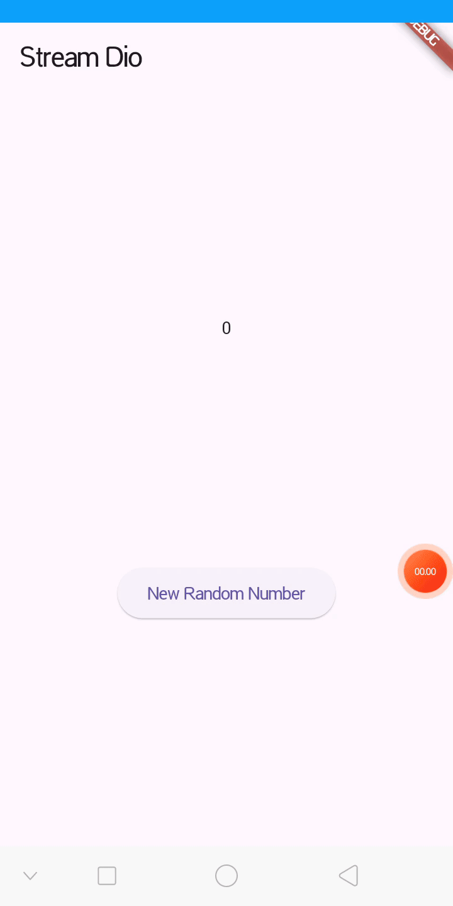
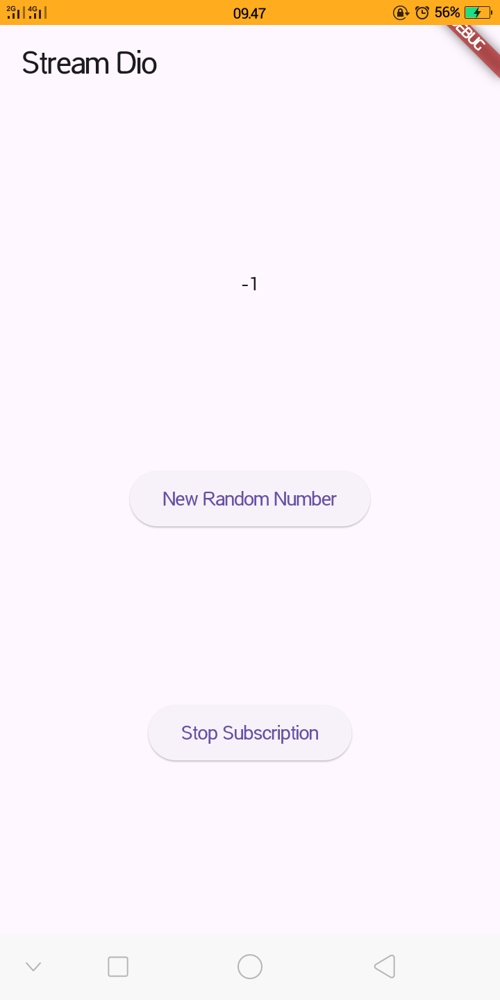
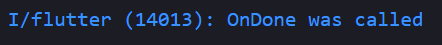
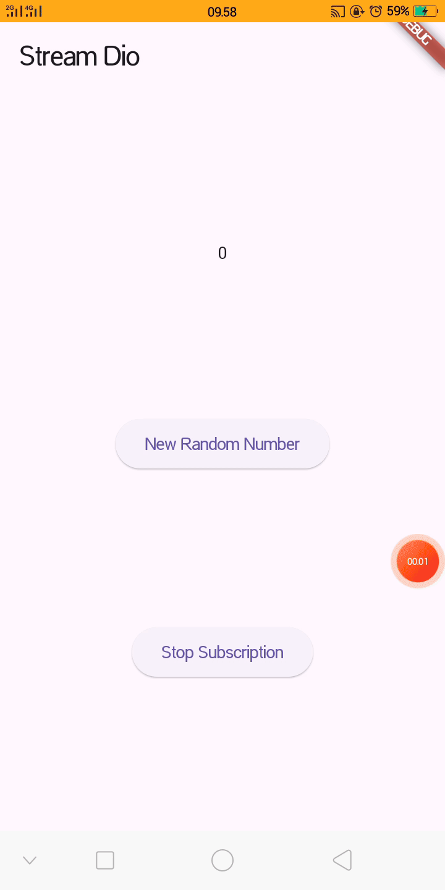
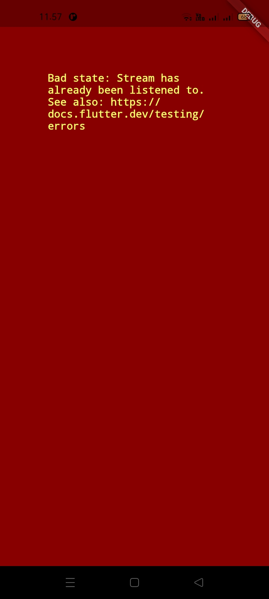
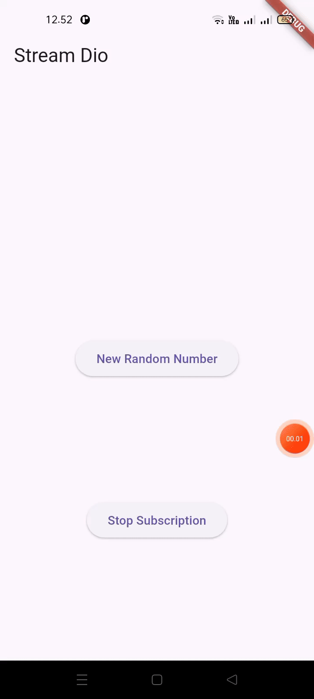
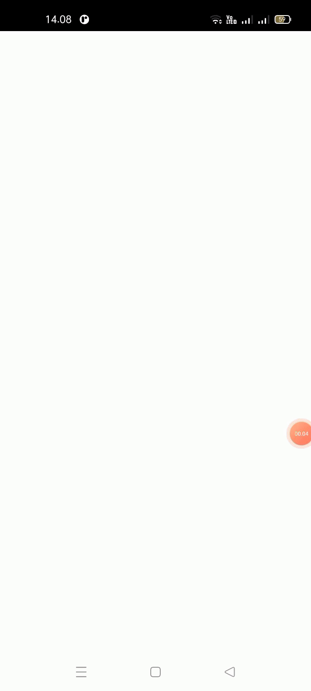
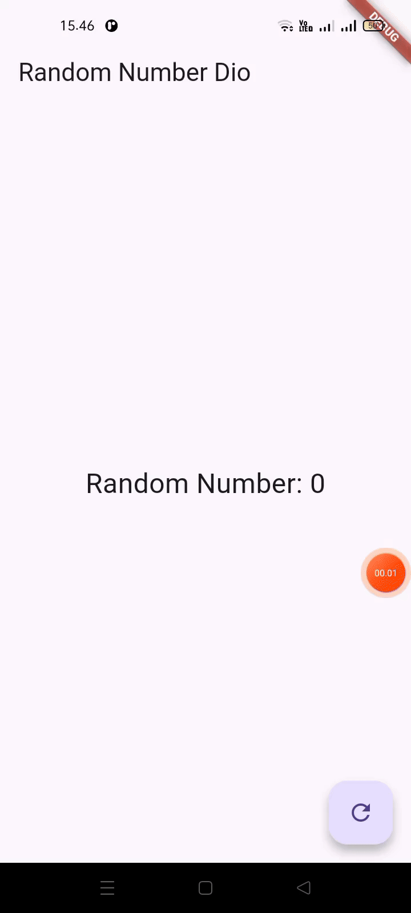

# Lanjutan State Management dengan Streams

NIM : 2341720098 <br>
NAMA : Dio Andika Pradana Mulia Tama <br>
KELAS : TI-3F

## Praktikum 1: Dart Streams

### Kode Program `main.dart`:

```dart
import 'package:flutter/material.dart';

void main() {
  runApp(const MyApp());
}

class MyApp extends StatelessWidget {
  const MyApp({super.key});

  @override
  Widget build(BuildContext context) {
    return MaterialApp(
      title: 'Stream Dio',
      theme: ThemeData(primarySwatch: Colors.indigo),
      home: const StreamHomePage(),
    );
  }
}

class StreamHomePage extends StatefulWidget {
  const StreamHomePage({super.key});

  @override
  State<StreamHomePage> createState() => _StreamHomePageState();
}

class _StreamHomePageState extends State<StreamHomePage> {
  @override
  Widget build(BuildContext context) {
    return Container();
  }
}
```

**Soal 1**

- Tambahkan **nama panggilan Anda** pada `title` app sebagai identitas hasil pekerjaan Anda. ꪜ

  ```dart
  class MyApp extends StatelessWidget {
    const MyApp({super.key});

    @override
    Widget build(BuildContext context) {
      return MaterialApp(
        title: 'Stream Dio',
        theme: ThemeData(primarySwatch: Colors.indigo),
        home: const StreamHomePage(),
      );
    }
  }
  ```

- Gantilah warna tema aplikasi sesuai kesukaan Anda. ꪜ

  ```dart
      theme: ThemeData(primarySwatch: Colors.indigo),
  ```

- Lakukan commit hasil jawaban Soal 1 dengan pesan "**W12: Jawaban Soal 1**" ꪜ

### Kode program `stream.dart`:

```dart
import 'package:flutter/material.dart';

class ColorStream {
  final List<Color> colors = [
    Colors.blueGrey,
    Colors.amber,
    Colors.deepPurple,
    Colors.lightBlue,
    Colors.teal,
  ];
}
```

**Soal 2**

- Tambahkan 5 warna lainnya sesuai keinginan Anda pada variabel `colors` tersebut. ꪜ
  ```dart
  final List<Color> colors = [
    Colors.blueGrey,
    Colors.amber,
    Colors.deepPurple,
    Colors.lightBlue,
    Colors.teal,
    Colors.yellow,
    Colors.pink,
    Colors.lime,
    Colors.cyan,
    Colors.orange,
  ];
  ```
- Lakukan commit hasil jawaban Soal 2 dengan pesan "**W12: Jawaban Soal 2**" ꪜ

#### Menambahkan method `getColors()` dan perintah `yield*` pada `stream.dart`:

```dart
  Stream<Color> getColors() async* {
    yield* Stream.periodic(const Duration(seconds: 1), (int t) {
      int index = t % colors.length;
      return colors[index];
    });
  }
```

**Soal 3**

- Jelaskan fungsi keyword `yield*` pada kode tersebut!

  Keyword `yield*` berfungsi untuk meneruskan (mendelegasikan) semua nilai dari _Stream_ lain ke dalam _Stream_ saat ini.

  - `yield` (tanpa \*): Digunakan untuk mengirim satu nilai ke dalam _Stream_.
  - `yield*` (dengan \*): Digunakan untuk mengambil seluruh _Stream_ lain dan membiarkan semua nilainya mengalir ke dalam _Stream_ saat ini, satu per satu.

  Pada kode tersebut, `yield* Stream.periodic(...)` dapat diartikan: "Ambil Stream yang dibuat oleh `Stream.periodic`, dan setiap kali Stream itu menghasilkan nilai, teruskan nilai tersebut seolah-olah itu adalah nilai dari Stream `getColors`."

- Apa maksud isi perintah kode tersebut?

  Singkatnya, kode tersebut bertujuan untuk membuat sebuah generator warna yang tidak pernah berhenti.
  Fungsi `getColors()` adalah sebuah Stream yang akan mengeluarkan satu warna baru setiap satu detik, secara berulang-ulang dari daftar yang ada.

  1. Class `ColorStream` memiliki sebuah List berisi 10 warna (`final List<Color> colors`).
  2. `Stream.periodic(const Duration(seconds: 1), ...)` adalah sebuah Stream bawaan Dart yang akan menghasilkan sebuah angka (`int `) setiap 1 detik. Angka ini akan terus bertambah (0, 1, 2, 3, ...).
  3. Kode `int index = t % colors.length;` menggunakan operasi modulo. `colors.length` adalah 10, jadi:

     - Ketika t = 0, index = 0 % 10 = 0
     - Ketika t = 1, index = 1 % 10 = 1
     - ...
     - Ketika t = 9, index = 9 % 10 = 9
     - Ketika t = 10, index = 10 % 10 = 0 (kembali ke awal)
     - Ketika t = 11, index = 11 % 10 = 1
     - Dan seterusnya...

  4. `return colors[index];` mengambil warna dari List berdasarkan index yang berulang tersebut.
  5. `yield\*` memastikan bahwa warna yang dipilih di langkah 4 dikeluarkan oleh Stream `getColors` setiap detiknya.

  Hasil akhirnya adalah sebuah Stream yang akan menampilkan: Colors.blueGrey (detik 1), Colors.amber (detik 2), ... Colors.orange (detik 10), lalu Colors.blueGrey (detik 11), dan seterusnya.

- Lakukan commit hasil jawaban Soal 3 dengan pesan "**W12: Jawaban Soal 3**" ꪜ

### Update kode `main.dart`:

```dart
import 'package:flutter/material.dart';
import 'stream.dart';

void main() {
  runApp(const MyApp());
}

class MyApp extends StatelessWidget {
  const MyApp({super.key});

  @override
  Widget build(BuildContext context) {
    return MaterialApp(
      title: 'Stream Dio',
      theme: ThemeData(primarySwatch: Colors.indigo),
      home: const StreamHomePage(),
    );
  }
}

class StreamHomePage extends StatefulWidget {
  const StreamHomePage({super.key});

  @override
  State<StreamHomePage> createState() => _StreamHomePageState();
}

class _StreamHomePageState extends State<StreamHomePage> {
  Color bgColor = Colors.blueGrey;
  late ColorStream colorStream;

  @override
  void initState() {
    super.initState();
    colorStream = ColorStream();
    changeColor();
  }

  @override
  Widget build(BuildContext context) {
    return Scaffold(
      appBar: AppBar(title: const Text('Stream Dio')),
      body: Container(decoration: BoxDecoration(color: bgColor)),
    );
  }

  void changeColor() async {
    await for (var eventColor in colorStream.getColors()) {
      setState(() {
        bgColor = eventColor;
      });
    }
  }
}
```

### Run

Lakukan running pada aplikasi Flutter Anda, maka akan terlihat berubah warna background setiap detik.


**Soal 4**

- Capture hasil praktikum Anda berupa GIF dan lampirkan di README. ꪜ
- Lakukan commit hasil jawaban Soal 4 dengan pesan "**W12: Jawaban Soal 4**" ꪜ

#### Mengganti isi method `changeColor()`:

```dart
  void changeColor() async {
    colorStream.getColors().listen((eventColor) {
      setState(() {
        bgColor = eventColor;
      });
    });
  }
```

**Soal 5**

- Jelaskan perbedaan menggunakan `listen` dan `await for` (langkah 9) !

  Perbedaan utamanya terletak pada cara eksekusi kodenya (**blocking vs non-blocking**).

  - `.listen()` adalah metode non-blocking. Method "berlangganan" ke Stream dan method akan langsung selesai, tapi akan mendapat "panggilan" setiap kali ada data baru. Analoginya seperti berlangganan notifikasi email. Hanya mendaftar sekali (`.listen`), lalu bebas melanjutkan pekerjaan lain. Setiap kali ada data baru (email masuk), maka akan "diberi tahu" (kode `callback` dipanggil).
  - `await for` adalah loop yang blocking (di dalam fungsi `async`). Method akan "berhenti sejenak" di loop tersebut, menunggu setiap data baru, mengeksekusi loop, lalu menunggu lagi. Jadi, method `changeColor()` akan berhenti (pause) di loop itu dan tidak akan pindah ke baris berikutnya.

- Lakukan commit hasil jawaban Soal 5 dengan pesan "**W12: Jawaban Soal 5**" ꪜ

## Praktikum 2: Stream controllers dan sinks

### Update kode `stream.dart`

```dart
import 'package:flutter/material.dart';
import 'dart:async';

class ColorStream {
  final List<Color> colors = [
    Colors.blueGrey,
    Colors.amber,
    Colors.deepPurple,
    Colors.lightBlue,
    Colors.teal,
    Colors.yellow,
    Colors.pink,
    Colors.lime,
    Colors.cyan,
    Colors.orange,
  ];

  Stream<Color> getColors() async* {
    yield* Stream.periodic(const Duration(seconds: 1), (int t) {
      int index = t % colors.length;
      return colors[index];
    });
  }
}

// Langkah 2, 3, 4, & 5 Praktikum 2
class NumberStream {
  final StreamController<int> controller = StreamController<int>();

  void addNumberToSink(int newNumber) {
    controller.sink.add(newNumber);
  }

  close() {
    controller.close();
  }
}
```

### Update kode `main.dart`

```dart
import 'package:flutter/material.dart';
import 'stream.dart';
import 'dart:async';
import 'dart:math';

void main() {
  runApp(const MyApp());
}

class MyApp extends StatelessWidget {
  const MyApp({super.key});

  @override
  Widget build(BuildContext context) {
    return MaterialApp(
      title: 'Stream Dio',
      theme: ThemeData(primarySwatch: Colors.indigo),
      home: const StreamHomePage(),
    );
  }
}

class StreamHomePage extends StatefulWidget {
  const StreamHomePage({super.key});

  @override
  State<StreamHomePage> createState() => _StreamHomePageState();
}

class _StreamHomePageState extends State<StreamHomePage> {
  Color bgColor = Colors.blueGrey;
  late ColorStream colorStream;
  // Langkah 7 Praktikum 2
  int lastNumber = 0;
  late StreamController numberStreamController;
  late NumberStream numberStream;

  @override
  void initState() {
    // Langkah 8 Praktikum 2
    numberStream = NumberStream();
    numberStreamController = numberStream.controller;
    Stream stream = numberStreamController.stream;
    stream.listen((event) {
      setState(() {
        lastNumber = event;
      });
    });
    super.initState();
    // colorStream = ColorStream();
    // changeColor();
  }

  // Langkah 9 Praktikum 2
  @override
  void dispose() {
    numberStreamController.close();
    super.dispose();
  }

  @override
  Widget build(BuildContext context) {
    return Scaffold(
      appBar: AppBar(title: const Text('Stream Dio')),
      // Langkah 11 Praktikum 2
      body: SizedBox(
        width: double.infinity,
        child: Column(
          mainAxisAlignment: MainAxisAlignment.spaceEvenly,
          crossAxisAlignment: CrossAxisAlignment.center,
          children: [
            Text(lastNumber.toString()),
            ElevatedButton(
              onPressed: () => addRandomNumber(),
              child: Text('New Random Number'),
            ),
          ],
        ),
      ),
      // body: Container(decoration: BoxDecoration(color: bgColor)),
    );
  }

  void changeColor() async {
    colorStream.getColors().listen((eventColor) {
      setState(() {
        bgColor = eventColor;
      });
    });

    /* Langkah 9
    await for (var eventColor in colorStream.getColors()) {
      setState(() {
        bgColor = eventColor;
      });
    } */
  }

  // Langkah 10 Praktikum 2
  void addRandomNumber() {
    Random random = Random();
    int myNum = random.nextInt(10);
    numberStream.addNumberToSink(myNum);
  }
}
```

### Run

Lakukan running pada aplikasi Flutter Anda, maka akan terlihat seperti gambar berikut.


**Soal 6**

- Jelaskan maksud kode langkah 8 dan 10 tersebut!

  Secara singkat, langkah 8 adalah kode untuk **"mendengarkan"** data, dan langkah 10 adalah kode untuk **"mengirim"** data. Keduanya bekerja bersama untuk membuat _stream_ berfungsi.

  - Langkah 8: `initState()`
    Maksud dari kode di `initState()` adalah untuk **menyiapkan dan berlangganan (subscribe) ke _stream_** saat halaman tersebut pertama kali dibuka. Ini adalah langkah "persiapan".
    1. `numberStream = NumberStream();`: Membuat objek `NumberStream`.
    2. `numberStreamController = numberStream.controller;`: Ini mengambil "otak" dari _stream_, yaitu `StreamController`.
    3. `Stream stream = numberStreamController.stream;`: Ini mengambil "ujung pipa" _stream_ yang bisa didengarkan oleh publik.
    4. `stream.listen((event) { ... });`: Ini adalah bagian terpenting. Kode ini "mendaftar" atau _subscribe_ ke _stream_. Kapanpun ada data baru (`event`) yang masuk, maka akan menjalankan kode di dalam kurung kurawal ini.
    5. `setState(() { lastNumber = event; });`: Setiap kali data baru (angka) diterima, ia memanggil `setState` untuk memperbarui variabel `lastNumber` dan memberi tahu Flutter untuk rebuild layar dengan angka yang baru.
  - Langkah 10: `addRandomNumber()`
    Maksud dari kode `addRandomNumber()` adalah untuk **menghasilkan data baru dan memasukkannya ke dalam _stream_**.
    1. `Random random = Random();`: Membuat generator angka acak.
    2. `int myNum = random.nextInt(100);`: Menghasilkan angka acak baru antara 0 dan 9.
    3. `numberStream.addNumberToSink(myNum);`: Merupakan aksi kunci. Kode ini mengambil angka acak (`myNum`) dan "menuangkannya" ke dalam _stream_ (melalui `sink`).

- Capture hasil praktikum Anda berupa GIF dan lampirkan di README. ꪜ

  

- Lalu lakukan commit dengan pesan "**W12: Jawaban Soal 6**". ꪜ

#### Menambahkan addError() pada `stream.dart`:

```dart
  addError() {
    controller.sink.addError("error");
  }
```

#### Menambahkan method `onError` di dalam class `StreamHomePageState` pada method `listen` di fungsi `initState()`:

```dart
    stream
        .listen((event) {
          setState(() {
            lastNumber = event;
          });
        })
        .onError((error) {
          setState(() {
            lastNumber = -1;
          });
        });
```

#### Mengedit method `addRandomNumber()`:

```dart
  void addRandomNumber() {
    Random random = Random();
    // int myNum = random.nextInt(10);
    // numberStream.addNumberToSink(myNum);
    numberStream.addError();
  }
```

**Soal 7**

- Jelaskan maksud kode langkah 13 sampai 15 tersebut!

  Maksud dari langkah 13, 14, dan 15 adalah untuk **mendemonstrasikan dan menguji cara kerja penanganan error (error handling) di dalam sebuah Stream.**

  - Langkah 13: `addError()`
    **Maksud:** Membuat fungsi untuk **mengirimkan sinyal error**. Tugas _method_ ini hanya satu: **sengaja mengirimkan sebuah objek error** ke dalam _stream_ melalui `sink`.
  - Langkah 14: `.onError()`
    **Maksud:** Menyiapkan "penangkap" atau **pendengar untuk sinyal error**. Dengan menambahkan `.onError((error) { ... })` pada kode `stream.liste`n di `initState`, maka _stream_ tahu apa yang harus dilakukan jika ia menerima _sinyal error_ alih-alih data. Dalam kasus ini, ia diperintahkan untuk memperbarui layar (`setState`) dan menampilkan angka `-1`.
  - Langkah 15: Mengubah `addRandomNumber()`
    **Maksud:** Mengubah tombol agar **memicu error** dengan menggantinya dengan `numberStream.addError()`, alih-alih mengirim data.
    Ketiga langkah ini bekerja bersama-sama. Sekarang, ketika tombol "New Random Number" ditekan (Langkah 15), akan memicu pengiriman sinyal error (Langkah 13). Sinyal error ini mengalir melalui _stream_ dan "ditangkap" oleh listener `.onError` (Langkah 14), yang kemudian menyebabkan layar menampilkan angka `-1`.

- Kembalikan kode seperti semula pada Langkah 15, comment `addError()` agar Anda dapat melanjutkan ke praktikum 3 berikutnya. ꪜ

  ```dart
  void addRandomNumber() {
    Random random = Random();
    int myNum = random.nextInt(10);
    numberStream.addNumberToSink(myNum);
    // numberStream.addError();
  }
  ```

- Lalu lakukan commit dengan pesan "**W12: Jawaban Soal 7**". ꪜ

## Praktikum 3: Injeksi data ke streams

### Update class `_StreamHomePageState` `main.dart`:

```dart
class _StreamHomePageState extends State<StreamHomePage> {
  Color bgColor = Colors.blueGrey;
  late ColorStream colorStream;
  // Langkah 7 Praktikum 2
  int lastNumber = 0;
  late StreamController numberStreamController;
  late NumberStream numberStream;
  // Langkah 1 Praktikum 3
  late StreamTransformer transformer;

  @override
  void initState() {
    // Langkah 8 Praktikum 2
    numberStream = NumberStream();
    numberStreamController = numberStream.controller;
    Stream stream = numberStreamController.stream;
    // Langkah 2 Praktikum 3
    transformer = StreamTransformer<int, int>.fromHandlers(
      handleData: (value, sink) {
        sink.add(value * 10);
      },
      handleError: (error, trace, sink) {
        sink.add(-1);
      },
      handleDone: (sink) => sink.close(),
    );
        // Langkah 3 Praktikum 3
    stream
        .transform(transformer)
        .listen((event) {
          setState(() {
            lastNumber = event;
          });
        })
        .onError((error) {
          setState(() {
            lastNumber = -1;
          });
        });
    super.initState();
    // colorStream = ColorStream();
    // changeColor();
  }

  // Existing code
}
```

### Run

**Run** atau tekan **F5** untuk melihat hasilnya jika memang belum running. Bisa juga lakukan **hot restart** jika aplikasi sudah running. Maka hasilnya akan seperti gambar berikut ini. Anda akan melihat tampilan angka dari 0 hingga 90.



**Soal 8**

- Jelaskan maksud kode langkah 1-3 tersebut!

  Maksud dari kode langkah 1-3 adalah untuk **membuat, mendefinisikan, dan menerapkan sebuah `StreamTransformer`** ke _stream_. Secara sederhana, `StreamTransformer` adalah "filter" atau "konverter" yang dipasang di tengah "pipa" _stream_. Ia akan mencegat setiap data (atau error) yang lewat, mengubahnya sesuai aturan, lalu mengirimkan data yang sudah diubah itu ke pendengar (_listener_).

  1. Langkah 1 (`late StreamTransformer transformer;`) adalah **deklarasi variabel** dan akan diberi nilainya nanti sebelum digunakan (makanya menggunakan `late`).
  2. Langkah 2 (`transformer = StreamTransformer.fromHandlers(...)`) merupakan **logic** dari _transformer_.

  - **`handleData: (value, sink) { sink.add(value * 10); }`** adalah aturan utama. Dikatakan: "Setiap kali ada data angka (`value`) yang masuk, **kalikan dengan 10**, lalu kirimkan (`sink.add`) hasil perkalian itu ke pipa keluaran.". _Contoh:_ Angka `2` masuk -> diubah jadi `20` -> `20` dikirim keluar.
  - **`handleError: (error, trace, sink) { sink.add(-1); }`** merupakan error handling. Dikatakan: "Jika ada _error_ yang masuk ke pipa, jangan teruskan errornya. Sebaliknya, tangkap error itu dan kirimkan angka `-1` sebagai gantinya."

  3. Langkah 3: `stream.transform(transformer).listen(...)` merupakan **penerapan** filter tersebut ke pipa _stream_.

  Hasil akhirnya adalah `setState` (yang menampilkan angka di layar) tidak lagi menerima angka acak asli (misal `2`), tetapi menerima **angka yang sudah di-transformasi** (yaitu `20`).

- Capture hasil praktikum Anda berupa GIF dan lampirkan di README. ꪜ

  

- Lalu lakukan commit dengan pesan "**W12: Jawaban Soal 8**". ꪜ

## Praktikum 4: Subscribe ke stream events

### Update kode `main.dart`:

```dart
// Existing code

class _StreamHomePageState extends State<StreamHomePage> {
  // Existing code
  // Langkah 1 Praktikum 4
  late StreamSubscription subscription;

  @override
  // Langkah 2 Praktikum 4
  void initState() {
    numberStream = NumberStream();
    numberStreamController = numberStream.controller;
    Stream stream = numberStreamController.stream;
    subscription = stream.listen((event) {
      setState(() {
        lastNumber = event;
      });
    });
    subscription.onError((error) {
      setState(() {
        lastNumber = -1;
      });
    });
    subscription.onDone(() {
      print("OnDone was called");
    });
    super.initState();
  }

  // Langkah 9 Praktikum 2
  @override
  void dispose() {
    subscription.cancel();
    super.dispose();
  }

  @override
  Widget build(BuildContext context) {
    return Scaffold(
      appBar: AppBar(title: const Text('Stream Dio')),
      // Langkah 11 Praktikum 2
      body: SizedBox(
        width: double.infinity,
        child: Column(
          mainAxisAlignment: MainAxisAlignment.spaceEvenly,
          crossAxisAlignment: CrossAxisAlignment.center,
          children: [
            Text(lastNumber.toString()),
            ElevatedButton(
              onPressed: () => addRandomNumber(),
              child: Text('New Random Number'),
            ),
            // Praktikum 4 Langkah 7
            ElevatedButton(
              onPressed: () => stopStream(),
              child: Text('Stop Subscription'),
            ),
          ],
        ),
      ),
      // body: Container(decoration: BoxDecoration(color: bgColor)),
    );
  }

  // Existing code

  // Langkah 10 Praktikum 2
  void addRandomNumber() {
    Random random = Random();
    int myNum = random.nextInt(10);
    if (!numberStreamController.isClosed) {
      numberStream.addNumberToSink(myNum);
    } else {
      setState(() {
        lastNumber = -1;
      });
    }
  }

  // Praktikum 4 Langkah 5
  void stopStream() {
    numberStreamController.close();
  }
}
```

### Run

Anda akan melihat dua button seperti gambar berikut.



### Tekan button ‘Stop Subscription'

Anda akan melihat pesan di Debug Console seperti berikut.



**Soal 9**

- Jelaskan maksud kode langkah 2, 6 dan 8 tersebut!

  Kode langkah 2 (`initState`) bermaksud untuk memulai langganan (subscription) ke stream dan menyimpan referensi langganan tersebut. `subscription = stream.listen(...)` merupakan inti dari langkah ini yaitu mulai "mendengarkan" stream dan, yang paling penting, menyimpan objek langganan itu ke dalam variabel `subscription` agar bisa mengontrolnya nanti.

  Kode langkah 6 (`dispose`) bermaksud untuk membersihkan subscription saat halaman ditutup guna mencegah kebocoran memori (_memory leak_). Ini adalah kode "pembersihan" yang berjalan secara otomatis saat halaman ditutup. `subscription.cancel();` adalah perintah untuk "berhenti berlangganan". Saat halaman ditutup, stream diberi tahu bahwa halaman ini tidak lagi tertarik menerima data. Ini penting karena jika tidak membatalkannya, subscription akan tetap hidup di memori bahkan setelah halaman ditutup. Ini akan membuang-buang sumber daya dan dapat menyebabkan error jika mencoba memperbarui halaman yang sudah tidak ada.

  Kode langkah 8 (`addRandomNumber`) bermaksud untuk menambahkan data baru ke stream dengan aman, mencegah crash jika stream sudah ditutup.

  - `if (!numberStreamController.isClosed)` adalah baris terpenting. Kode ini memeriksa, "Apakah controller stream-nya masih terbuka?"
  - Jika ya (masih terbuka), stream akan mengirimkan angka baru: `numberStream.addNumberToSink(myNum)`.
  - Jika tidak (sudah ditutup oleh tombol "Stop Subscription"), ia akan menjalankan blok `else` dan mengubah `lastNumber` menjadi -1.

  Ini penting karena jika mencoba menambahkan data (`.add()`) ke `StreamController` yang sudah ditutup (`.close()`), aplikasi akan crash. Langkah 8 ini mencegah crash tersebut.

- Capture hasil praktikum Anda berupa GIF dan lampirkan di README. ꪜ

  

- Lalu lakukan commit dengan pesan "**W12: Jawaban Soal 9**". ꪜ

## Praktikum 5: Multiple stream subscriptions

### Menambahkan variabel dan mengedit `initState()` class `_StreamHomePageState`:

```dart
class _StreamHomePageState extends State<StreamHomePage> {
  // Existing code

  // Praktikum 5 Langkah 1
  late StreamSubscription subscription2;
  String values = '';

  @override
  // Langkah 2 Praktikum 4
  void initState() {
    numberStream = NumberStream();
    numberStreamController = numberStream.controller;
    Stream stream = numberStreamController.stream;
    subscription = stream.listen((event) {
      setState(() {
        // Praktikum 5 Langkah 2
        values += '$event - ';
        // lastNumber = event;
      });
    });
    subscription.onError((error) {
      setState(() {
        lastNumber = -1;
      });
    });
    subscription.onDone(() {
      print("OnDone was called");
    });

    // Praktikum 5 Langkah 2
    subscription2 = stream.listen((event) {
      setState(() {
        values += '$event - ';
      });
    });
    super.initState();
  }

  // Existing code

}
```

### Run

Lakukan run maka akan tampil error seperti gambar berikut.



**Soal 10**

- Jelaskan mengapa error itu bisa terjadi ?

  Error tersebut terjadi karena mencoba mendaftarkan dua listener ke stream yang sama, padahal stream tersebut adalah stream **single-subscription** (hanya boleh satu listener). Di file `lib/stream.dart`, `StreamController<int>()` secara default adalah controller untuk single-subscription stream. Artinya, hanya satu objek `StreamSubscription` yang boleh mendengarkan stream tersebut dalam satu waktu. Sehingga inilah yang terjadi di `initState()`:

  - Panggilan `.listen()` yang pertama (`subscription = ...`) berhasil. `subscription` menjadi listener yang sah.
  - Ketika kode mencoba menjalankan panggilan `.listen()` yang kedua (`subscription2 = ...`) pada objek `stream` yang sama, stream tersebut mendeteksi bahwa ia sudah memiliki satu listener.
  - Karena ia adalah single-subscription stream, ia tidak mengizinkan listener kedua dan langsung melemparkan error "Bad state: Stream has already been listened to," yang menyebabkan crash (layar merah) seperti pada gambar.

#### Mengedit method `initState()` dan `build`:

```dart
  void initState() {
    numberStream = NumberStream();
    numberStreamController = numberStream.controller;
    // Praktikum 5 Langkah 4
    Stream stream = numberStreamController.stream.asBroadcastStream();
    // Existing code
  }

   @override
  Widget build(BuildContext context) {
    return Scaffold(
      appBar: AppBar(title: const Text('Stream Dio')),
      // Langkah 11 Praktikum 2
      body: SizedBox(
        width: double.infinity,
        child: Column(
          mainAxisAlignment: MainAxisAlignment.spaceEvenly,
          crossAxisAlignment: CrossAxisAlignment.center,
          children: [
            // Praktikum 5 Langkah 5
            Text(values),
            // Text(lastNumber.toString()),
            ElevatedButton(
              onPressed: () => addRandomNumber(),
              child: Text('New Random Number'),
            ),
            // Praktikum 4 Langkah 7
            ElevatedButton(
              onPressed: () => stopStream(),
              child: Text('Stop Subscription'),
            ),
          ],
        ),
      ),
      // body: Container(decoration: BoxDecoration(color: bgColor)),
    );
  }
```

### Run

Tekan button ‘**New Random Number**' beberapa kali, maka akan tampil teks angka terus bertambah sebanyak dua kali.



**Soal 11**

- Jelaskan mengapa hal itu bisa terjadi ?

  Alasan mengapa angka bertambah dua kali setiap menekan tombol adalah karena sekarang terdapat **dua listener aktif** yang mendengarkan _stream_ yang sama. Berikut adalah rinciannya:

  1. Di `initState()`, _stream_ diubah menggunakan `.asBroadcastStream()`. Ini menyelesaikan error "Stream has already been listened to" dari praktikum sebelumnya. _Broadcast stream_ memang dirancang untuk bisa memiliki banyak listener. Setelah itu, dibuat **dua** subscription terpisah ke _stream_ yang sama:

     - `subscription = stream.listen(...)`
     - `subscription2 = stream.listen(...)`

  2. Saat menekan tombol "New Random Number", method `addRandomNumber()` menambahkan **satu** angka acak (misalnya, angka `5`) ke dalam _stream_. Karena _stream_ ini adalah _broadcast_, ia mengirimkan angka `5` tersebut ke **semua listenernya**:
     - `subscription` menerima angka `5` dan menjalankan kodenya: `setState(() { values += '5 - '; });`.
     - `subscription2` **juga** menerima angka `5` yang sama dan menjalankan kodenya: `setState(() { values += '5 - '; });`.

  Akibatnya, untuk setiap **satu** angka yang dibuat, angka tersebut ditambahkan ke string `values` **dua kali**, sehingga string di layar bertambah sebanyak dua kali.

- Capture hasil praktikum Anda berupa GIF dan lampirkan di README. ꪜ

  

- Lalu lakukan commit dengan pesan "**W12: Jawaban Soal 10,11**". ꪜ

## Praktikum 6: StreamBuilder

### Kode program `stream.dart`:

```dart
import 'dart:math';

class NumberStream {
  Stream<int> getNumbers() async* {
    yield* Stream.periodic(const Duration(seconds: 1), (int t) {
      Random random = Random();
      int myNum = random.nextInt(10);
      return myNum;
    });
  }
}
```

### Kode program `main.dart`:

```dart
import 'package:flutter/material.dart';
import 'stream.dart';
import 'dart:async';

void main() {
  runApp(const MyApp());
}

class MyApp extends StatelessWidget {
  const MyApp({super.key});

  @override
  Widget build(BuildContext context) {
    return MaterialApp(
      title: 'Stream Dio',
      theme: ThemeData(primarySwatch: Colors.indigo),
      home: const StreamHomePage(),
    );
  }
}

class StreamHomePage extends StatefulWidget {
  const StreamHomePage({super.key});

  @override
  State<StreamHomePage> createState() => _StreamHomePageState();
}

class _StreamHomePageState extends State<StreamHomePage> {
  late Stream<int> numberStream;

  @override
  void initState() {
    numberStream = NumberStream().getNumbers();
    super.initState();
  }

  @override
  Widget build(BuildContext context) {
    return Scaffold(
      appBar: AppBar(title: const Text('Stream Dio')),
      body: StreamBuilder(
        stream: numberStream,
        builder: (context, snapshot) {
          if (snapshot.hasError) {
            print('Error!');
          }
          if (snapshot.hasData) {
            return Center(
              child: Text(
                snapshot.data.toString(),
                style: const TextStyle(fontSize: 96),
              ),
            );
          } else {
            return const SizedBox.shrink();
          }
        },
      ),
    );
  }
}
```

### Run

Hasilnya, setiap detik akan tampil angka baru seperti berikut.



**Soal 12**

- Jelaskan maksud kode pada langkah 3 dan 7 !

  Maksud kode langkah 3 adalah untuk membuat stream yang secara otomatis menghasilkan data baru (angka acak) setiap satu detik, tanpa perlu dipicu oleh tombol.

  - `Stream<int> getNumbers() async*` adalah asynchronous generator. Berbeda dengan `StreamController` (yang manual), `async*` adalah fungsi yang menghasilkan data stream dari waktu ke waktu.
  - `yield* Stream.periodic(...)` adalah inti kodenya.
    - `Stream.periodic(const Duration(seconds: 1), ...)`: Membuat stream baru yang "berdetak" (mengirimkan event) setiap 1 detik.
    - `Random().nextInt(10)`: Setiap kali "detak" itu terjadi, kode ini akan menghasilkan angka acak baru antara 0 dan 9.
    - `yield*`: Meneruskan setiap angka acak yang baru dibuat itu ke dalam stream `getNumbers()`.

  Maksud kode langkah 7 (`StreamBuilder`) adalah untuk menampilkan data dari stream di layar (UI) secara otomatis, tanpa perlu `setState` manual.

  - `body: StreamBuilder(...)` adalah widget khusus dari Flutter yang dirancang untuk "mendengarkan" stream dan rebuild UI secara otomatis setiap kali ada data baru.
  - `builder: (context, snapshot)` adalah fungsi yang dipanggil `StreamBuilder` setiap kali stream mengirimkan data baru (atau error, atau selesai).
    - `snapshot.hasData` memeriksa apakah data sudah tiba.
    - `return Center(child: Text(snapshot.data.toString(), ...),);` Jika data ada, `StreamBuilder` secara otomatis menampilkan data tersebut (`snapshot.data`) di layar.

  Jadi, langkah 3 adalah sumber data (penghasil angka acak otomatis) dan langkah 7 adalah tampilan UI-nya (otomatis menampilkan angka yang dihasilkan).

- Capture hasil praktikum Anda berupa GIF dan lampirkan di README. ꪜ

  

- Lalu lakukan commit dengan pesan "**W12: Jawaban Soal 12**". ꪜ

## Praktikum 7: BLoC Pattern

### Kode program `random_bloc.dart`:

```dart
import 'dart:async';
import 'dart:math';

class RandomNumberBloc {
  // StreamController for input events
  final _generateRandomController = StreamController<void>();
  // StreamController for output
  final _randomNumberController = StreamController<int>();
  // Input Sink
  Sink<void> get generateRandom => _generateRandomController.sink;
  // Output Stream
  Stream<int> get randomNumber => _randomNumberController.stream;
  // _secondsStreamController.sink;

  RandomNumberBloc() {
    _generateRandomController.stream.listen((_) {
      final random = Random().nextInt(
        10,
      ); // Generate random number between 0 and 9
      _randomNumberController.sink.add(random);
    });
  }

  void dispose() {
    _generateRandomController.close();
    _randomNumberController.close();
  }
}
```

### Kode program `random_screen.dart`:

```dart
import 'package:flutter/material.dart';
import 'random_bloc.dart';

class RandomScreen extends StatefulWidget {
  const RandomScreen({super.key});

  @override
  State<RandomScreen> createState() => _RandomScreenState();
}

class _RandomScreenState extends State<RandomScreen> {
  final _bloc = RandomNumberBloc();

  @override
  void dispose() {
    _bloc.dispose();
    super.dispose();
  }

  @override
  Widget build(BuildContext context) {
    return Scaffold(
      appBar: AppBar(title: const Text('Random Number Dio')),
      body: Center(
        child: StreamBuilder<int>(
          stream: _bloc.randomNumber,
          initialData: 0,
          builder: (context, snapshot) {
            return Text(
              'Random Number: ${snapshot.data}',
              style: const TextStyle(fontSize: 24),
            );
          },
        ),
      ),
      floatingActionButton: FloatingActionButton(
        onPressed: () => _bloc.generateRandom.add(null),
        child: const Icon(Icons.refresh),
      ),
    );
  }
}
```

### Kode program `main.dart`:

```dart
import 'package:flutter/material.dart';
import 'random_screen.dart';

void main() {
  runApp(const MyApp());
}

class MyApp extends StatelessWidget {
  const MyApp({super.key});

  // This widget is the root of your application.
  @override
  Widget build(BuildContext context) {
    return MaterialApp(
      title: 'BLoC Demo Dio',
      theme: ThemeData(primarySwatch: Colors.indigo),
      home: const RandomScreen(),
    );
  }
}
```

### Run

Run aplikasi, maka Anda akan melihat angka acak antara angka 0 sampai 9 setiap kali menekan tombol `FloactingActionButton`.



**Soal 13**

- Jelaskan maksud praktikum ini ! Dimanakah letak konsep pola BLoC-nya ?

  Maksud dari praktikum ini adalah untuk memisahkan total antara logika bisnis (proses membuat angka acak) dengan tampilan UI (tampilan layar yang menampilkan angka tersebut dan tombol untuk memicunya). Alur aplikasi ini adalah:

  - Bermula dengan "Random Number: 0".
  - Setiap kali tombol refresh (`FloatingActionButton`) ditekan, tombol itu memberi tahu BLoC untuk membuat angka baru.
  - BLoC membuat angka baru dan memberi tahu UI bahwa ada data baru.
  - UI (melalui `StreamBuilder`) secara otomatis memperbarui dirinya untuk menampilkan angka baru tersebut.

  Dimanakah letak konsep pola BLoC-nya ?

  Konsep BLoC sepenuhnya berada di dalam file `lib/random_bloc.dart` dan cara file itu berinteraksi dengan `lib/random_screen.dart`. Pola BLoC adalah tentang mengelola state (data) aplikasi dengan menggunakan Sinks (untuk input) dan Streams (untuk output).

  1. Komponen BLoC (Logic) <br>
     Ini adalah class `RandomNumberBloc` di `lib/random_bloc.dart`. Class ini sama sekali "buta" terhadap UI. Ia tidak tahu ada `Text` atau `FloatingActionButton`.
  2. Input (Sink) <br>
     Merupakan "kotak masuk" untuk BLoC, tempat UI mengirimkan perintah atau _event_ (`Sink<void> get generateRandom => _generateRandomController.sink;`). Tombol `FloatingActionButton` menggunakan sink ini untuk mengirim _event_ (perintah "buat angka baru") saat ditekan (`onPressed: () => _bloc.generateRandom.add(null)`).
  3. Output (Stream) <br>
     Ini adalah "kotak keluar" dari BLoC, tempat BLoC mengirimkan state (data) baru ke UI (`Stream<int> get randomNumber => _randomNumberController.stream;`). `StreamBuilder` "mendengarkan" stream ini dan secara otomatis membangun ulang `Text` setiap kali ada angka baru yang keluar.
  4. Logika Bisnis (Business Logic) <br>
     Merupakan "jembatan" di dalam BLoC yang menghubungkan input ke output. Logika ini ada di dalam konstruktor `RandomNumberBloc`. Ia mendengarkan input stream (`_generateRandomController.stream`), menjalankan logika (membuat angka acak), dan mengirimkan hasilnya ke output stream (`_randomNumberController.sink.add(random)`).

  Pemisahan ini merupakan inti dari BLoC, yang membuat kode menjadi sangat terorganisir dan mudah diuji.

- Capture hasil praktikum Anda berupa GIF dan lampirkan di README. ꪜ

  

- Lalu lakukan commit dengan pesan "**W12: Jawaban Soal 13**". ꪜ
