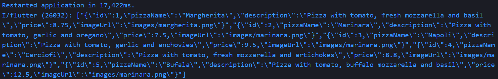
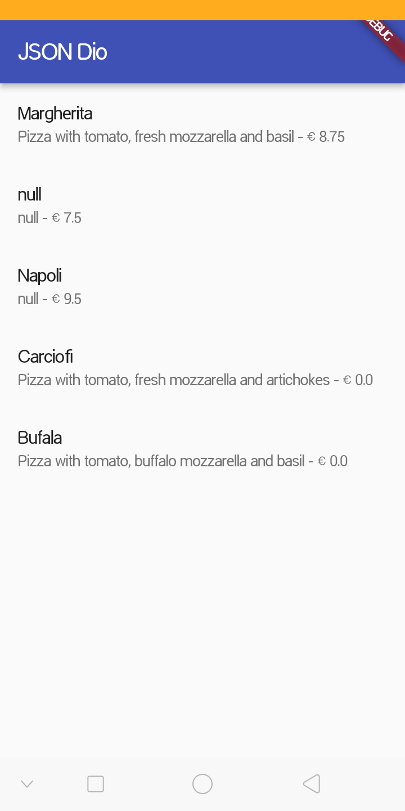
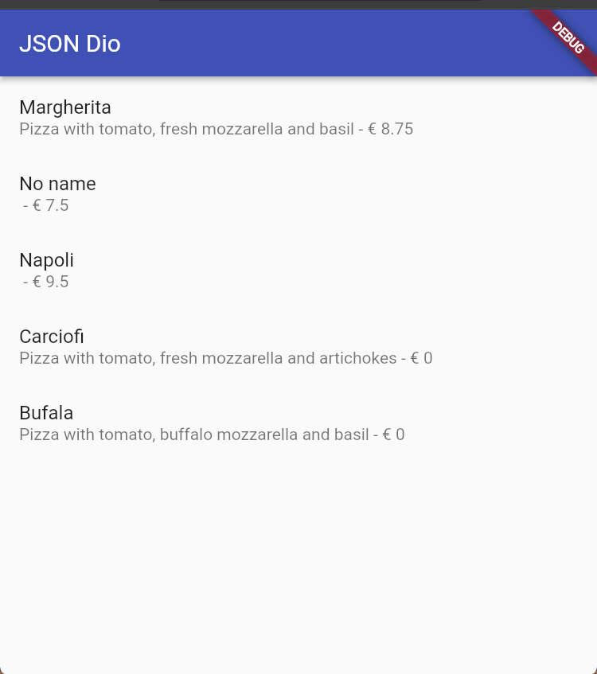
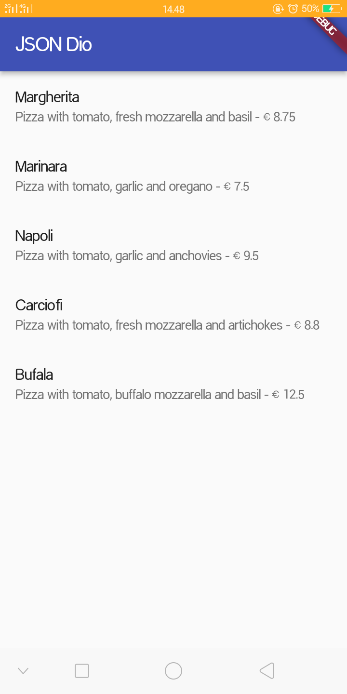
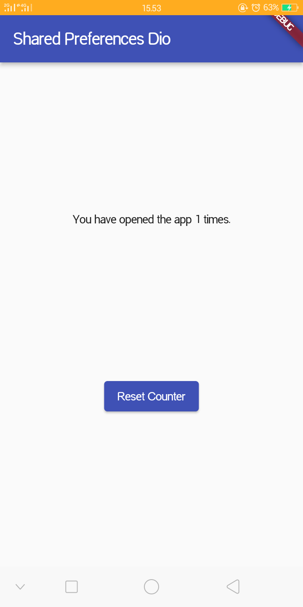
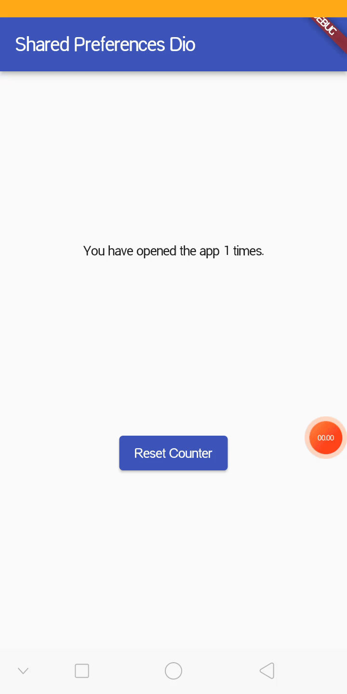
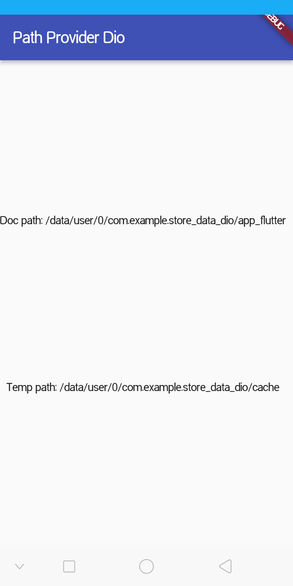
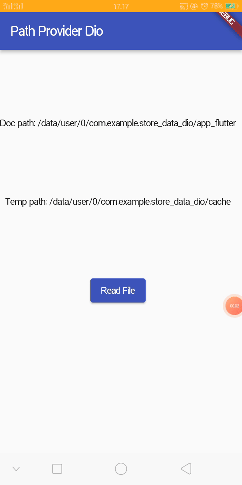

# Persistensi Data

NIM : 2341720098 <br>
NAMA : Dio Andika Pradana Mulia Tama <br>
KELAS : TI-3F

## Praktikum 1: Konversi Dart model ke JSON

### Kode Program `main.dart`:

```dart
import 'package:flutter/material.dart';

void main() {
  runApp(const MyApp());
}

class MyApp extends StatelessWidget {
  const MyApp({super.key});

  // This widget is the root of your application.
  @override
  Widget build(BuildContext context) {
    return MaterialApp(
      title: 'Flutter JSON Demo Dio',
      theme: ThemeData(primarySwatch: Colors.indigo, useMaterial3: false),
      home: const MyHomePage(),
    );
  }
}

class MyHomePage extends StatefulWidget {
  const MyHomePage({super.key});

  @override
  State<MyHomePage> createState() => _MyHomePageState();
}

class _MyHomePageState extends State<MyHomePage> {
  @override
  Widget build(BuildContext context) {
    return Scaffold(
      appBar: AppBar(title: const Text('JSON Dio')),
      body: Container(),
    );
  }
}
```

**Soal 1**

- Tambahkan **nama panggilan Anda** pada `title` app sebagai identitas hasil pekerjaan Anda. ꪜ
- Gantilah warna tema aplikasi sesuai kesukaan Anda. ꪜ
- Lakukan commit hasil jawaban Soal 1 dengan pesan "**W13: Jawaban Soal 1**" ꪜ

### Update Kode Program Class `_MyHomePageState` di `main.dart`:

```dart
class _MyHomePageState extends State<MyHomePage> {
  String pizzaString = '';

  @override
  void initState() {
    super.initState();
    readJsonFile();
  }

  @override
  Widget build(BuildContext context) {
    return Scaffold(
      appBar: AppBar(title: const Text('JSON Dio')),
      body: Text(pizzaString),
    );
  }

  Future readJsonFile() async {
    String myString = await DefaultAssetBundle.of(
      context,
    ).loadString('assets/pizzalist.json');
    setState(() {
      pizzaString = myString;
    });
  }
}
```

### Run


**Soal 2**

- Masukkan hasil capture layar ke laporan praktikum Anda. ꪜ
- Lakukan commit hasil jawaban Soal 2 dengan pesan "**W13: Jawaban Soal 2**" ꪜ

### Kode Program file `lib/model/pizza.dart`:

```dart
class Pizza {
  final int id;
  final String pizzaName;
  final String description;
  final double price;
  final String imageUrl;

  Pizza.fromJson(Map<String, dynamic> json)
    : id = json['id'],
      pizzaName = json['pizzaName'],
      description = json['description'],
      price = json['price'],
      imageUrl = json['imageUrl'];
}
```

### Update Kode Program Class `_MyHomePageState` di `main.dart`:

```dart
class _MyHomePageState extends State<MyHomePage> {
  String pizzaString = '';
  List<Pizza> myPizzas = [];

  @override
  void initState() {
    super.initState();
    readJsonFile().then((value) {
      setState(() {
        myPizzas = value;
      });
    });
  }

  @override
  Widget build(BuildContext context) {
    return Scaffold(
      appBar: AppBar(title: const Text('JSON Dio')),
      body: ListView.builder(
        itemCount: myPizzas.length,
        itemBuilder: (context, index) {
          return ListTile(
            title: Text(myPizzas[index].pizzaName),
            subtitle: Text(myPizzas[index].description),
          );
        },
      ),
    );
  }

  Future<List<Pizza>> readJsonFile() async {
    String myString = await DefaultAssetBundle.of(
      context,
    ).loadString('assets/pizzalist.json');
    List pizzaMapList = jsonDecode(myString);
    List<Pizza> myPizzas = [];
    for (var pizza in pizzaMapList) {
      Pizza myPizza = Pizza.fromJson(pizza);
      myPizzas.add(myPizza);
    }
    return myPizzas;
    // setState(() {
    //   pizzaString = pizzaMapList.toString();
    // });
  }
}
```

### Run

Jalankan aplikasi. Sekarang, Anda akan melihat data pizza ditampilkan dalam daftar yang lebih terstruktur sebagai objek List Dart.


**Soal 3**

- Masukkan hasil capture layar ke laporan praktikum Anda. ꪜ
- Lakukan commit hasil jawaban Soal 2 dengan pesan "**W13: Jawaban Soal 3**" ꪜ

### Update Kode Program file `lib/model/pizza.dart`:

```dart
class Pizza {
  // Existing code

  Map<String, dynamic> toJson() {
    return {
      'id': id,
      'pizzaName': pizzaName,
      'description': description,
      'price': price,
      'imageUrl': imageUrl,
    };
  }
}
```

### Update Kode Program Class `_MyHomePageState` di `main.dart`:

```dart
class _MyHomePageState extends State<MyHomePage> {
  // Existing code

  Future<List<Pizza>> readJsonFile() async {
    // Existing code
    String json = convertToJSON(myPizzas);
    print(json);
    return myPizzas;
  }

  String convertToJSON(List<Pizza> pizzas) {
    return jsonEncode(pizzas.map((pizza) => jsonEncode(pizza)).toList());
  }
}
```

### Cek Output Konsol

Jalankan aplikasi. Periksa Debug Console untuk melihat List objek Pizza telah berhasil dikonversi kembali menjadi JSON String.



## Praktikum 2: Handle kompatibilitas data JSON

### Update Kode Program `Class Pizza`:

```dart
class Pizza {
    // Existing code

  Pizza.fromJson(Map<String, dynamic> json)
    : id = int.tryParse(json['id'].toString()) ?? 0,
      pizzaName = json['pizzaName'].toString(),
      description = json['description'].toString(),
      price = double.tryParse(json['price'].toString()) ?? 0,
      imageUrl = json['imageUrl'].toString();

  // Existing code
}
```

### Run dan Perhatikan Output Null

Setelah mengimplementasikan semua perbaikan tipe data, aplikasi akan berjalan, tetapi mungkin menampilkan "null" di UI jika ada bidang yang hilang atau gagal diparsing (seperti pizzaName atau description).



### Menambahkan Operator Ternary untuk Output User-Friendly

```dart
  Pizza.fromJson(Map<String, dynamic> json)
    : id = int.tryParse(json['id'].toString()) ?? 0,
      pizzaName = json['pizzaName'] != null
          ? json['pizzaName'].toString()
          : 'No name',
      description = json['description'] != null
          ? json['description'].toString()
          : '',
      price = double.tryParse(json['price'].toString()) ?? 0,
      imageUrl = json['imageUrl'] ?? '';
```

### Run

Jalankan aplikasi. Sekarang data yang tidak konsisten telah ditangani dengan baik, dan UI tidak menampilkan nilai null.



**Soal 4**

- Capture hasil running aplikasi Anda, kemudian impor ke laporan praktikum Anda! ꪜ
- Lalu lakukan commit dengan pesan "**W13: Jawaban Soal 4**". ꪜ

## Praktikum 3: Menangani error JSON

### Update Kode Program file `lib/model/pizza.dart`:

```dart
const keyId = 'id';
const keyName = 'pizzaName';
const keyDescription = 'description';
const keyPrice = 'price';
const keyImage = 'imageUrl';

class Pizza {
  final int id;
  final String pizzaName;
  final String description;
  final double price;
  final String imageUrl;

  Pizza.fromJson(Map<String, dynamic> json)
    : id = int.tryParse(json[keyId].toString()) ?? 0,
      pizzaName = json[keyName] != null ? json[keyName].toString() : 'No name',
      description = json[keyDescription] != null
          ? json[keyDescription].toString()
          : '',
      price = double.tryParse(json[keyPrice].toString()) ?? 0,
      imageUrl = json[keyImage] ?? '';

  Map<String, dynamic> toJson() {
    return {
      keyId: id,
      keyName: pizzaName,
      keyDescription: description,
      keyPrice: price,
      keyImage: imageUrl,
    };
  }
}
```

### Run

Jalankan aplikasi. Tidak akan ada perubahan visual, tetapi kode Anda kini lebih safe dan maintainable.



**Soal 5**

- Jelaskan maksud kode lebih safe dan maintainable!

  Perubahan kode tersebut membuat aplikasi lebih safe (aman) dan maintainable (mudah dikelola) karena penggunaan konstanta untuk key JSON (seperti `keyId`, `keyName`, dll) menggantikan penulisan string manual secara langsung.

  Lebih maintainable maksudnya adalah kode lebih mudah untuk diperbarui atau diubah di masa depan tanpa harus melakukan banyak edit di berbagai tempat. Bayangkan jika API server berubah dan key JSON `'pizzaName'` diganti menjadi `'productName'`.

  - Sebelumnya harus mencari setiap tulisan `'pizzaName'` di dalam file dan mengubahnya satu per satu (di `fromJson`, `toJson`, dan mungkin tempat lain).
  - Sekarang hanya perlu mengubah nilai konstanta di satu tempat saja, yaitu di baris `const keyName = 'pizzaName';`. Seluruh kode yang menggunakan `keyName` akan otomatis ikut berubah.

  Lebih safe maksudnya adalah kode lebih terlindungi dari kesalahan manusia (human error) seperti _typo_ (salah ketik) yang bisa menyebabkan bug saat aplikasi berjalan.

  - Sebelumnya, jika tidak sengaja mengetik `'pizaName'` (kurang satu 'z') di dalam `fromJson`, Dart tidak akan menganggapnya error saat compile. Aplikasi akan tetap berjalan, tetapi data pizza tidak akan muncul (error logika/runtime) karena kuncinya tidak cocok.
  - Sekarang, jika salah mengetik nama variabel konstanta, misalnya `keyNme` (kurang 'a'), code editor atau compiler akan langsung memberi tahu bahwa variabel tersebut tidak ditemukan. Ini mencegah error tersebut lolos ke aplikasi yang sedang berjalan.

- Capture hasil praktikum Anda dan lampirkan di README. ꪜ
- Lalu lakukan commit dengan pesan "**W13: Jawaban Soal 5**". ꪜ

## Praktikum 4: SharedPreferences

### Update Kode Program `main.dart`:

```dart
import 'dart:convert';
import './model/pizza.dart';
import 'package:flutter/material.dart';
import 'package:shared_preferences/shared_preferences.dart';

// Existing code

class _MyHomePageState extends State<MyHomePage> {
  String pizzaString = '';
  List<Pizza> myPizzas = [];
  int appCounter = 0;

  @override
  void initState() {
    super.initState();
    readAndWritePreference();
  }

  @override
  Widget build(BuildContext context) {
    return Scaffold(
      appBar: AppBar(title: const Text('Shared Preferences Dio')),
      body: Center(
        child: Column(
          mainAxisAlignment: MainAxisAlignment.spaceEvenly,
          children: [
            Text('You have opened the app $appCounter times.'),
            ElevatedButton(onPressed: () {}, child: Text('Reset Counter')),
          ],
        ),
      ),
    );
  }

  // Existing code

  Future readAndWritePreference() async {
    SharedPreferences prefs = await SharedPreferences.getInstance();
    appCounter = prefs.getInt('appCounter') ?? 0;
    appCounter++;
    await prefs.setInt('appCounter', appCounter);
    setState(() {
      appCounter = appCounter;
    });
  }
}
```

### Run

Aplikasi sekarang akan menampilkan "You have opened the app 1 times" (jika ini pembukaan pertama).



### Membuat method `deletePreference()` dan memanggilnya

```dart
class _MyHomePageState extends State<MyHomePage> {
  // Existing code

  @override
  Widget build(BuildContext context) {
    return Scaffold(
      appBar: AppBar(title: const Text('Shared Preferences Dio')),
      body: Center(
        child: Column(
          mainAxisAlignment: MainAxisAlignment.spaceEvenly,
          children: [
            Text('You have opened the app $appCounter times.'),
            ElevatedButton(
              onPressed: () {
                deletePreference();
              },
              child: Text('Reset Counter'),
            ),
          ],
        ),
      ),
    );
  }

  // Existing code

  Future deletePreference() async {
    SharedPreferences prefs = await SharedPreferences.getInstance();
    await prefs.clear();
    setState(() {
      appCounter = 0;
    });
  }
}
```

### Run

Jalankan aplikasi. Tombol reset sekarang akan berfungsi, menghapus semua pasangan kunci-nilai dan mereset hitungan.



**Soal 6**

- Capture hasil praktikum Anda berupa GIF dan lampirkan di README. ꪜ
- Lalu lakukan commit dengan pesan "**W13: Jawaban Soal 6**". ꪜ

## Praktikum 5: Akses filesystem dengan path_provider

### Update Kode Program `main.dart`:

```dart
import 'dart:convert';
import './model/pizza.dart';
import 'package:flutter/material.dart';
import 'package:shared_preferences/shared_preferences.dart';
import 'package:path_provider/path_provider.dart'

// Existing code

class _MyHomePageState extends State<MyHomePage> {
  // Existing code
  String documentsPath = '';
  String tempPath = '';

  @override
  void initState() {
    super.initState();
    getPaths();
  }

  @override
  Widget build(BuildContext context) {
    return Scaffold(
      appBar: AppBar(title: const Text('Path Provider Dio')),
      body: Column(
        mainAxisAlignment: MainAxisAlignment.spaceEvenly,
        children: [
          Text('Doc path: $documentsPath'),
          Text('Temp path: $tempPath'),
        ],
      ),
    );
  }

  // Existing code

  Future getPaths() async {
    final docDir = await getApplicationDocumentsDirectory();
    final tempDir = await getTemporaryDirectory();
    setState(() {
      documentsPath = docDir.path;
      tempPath = tempDir.path;
    });
  }
}
```

### Run

Jalankan aplikasi. Anda akan melihat path absolut ke direktori dokumen dan cache aplikasi di perangkat Anda.



**Soal 7**

- Capture hasil praktikum Anda dan lampirkan di README. ꪜ
- Lalu lakukan commit dengan pesan "**W13: Jawaban Soal 7**". ꪜ

## Praktikum 6: Akses filesystem dengan direktori

### Update Kode Program `main.dart`:

```dart
import 'dart:convert';
import './model/pizza.dart';
import 'package:flutter/material.dart';
import 'package:shared_preferences/shared_preferences.dart';
import 'package:path_provider/path_provider.dart';
import 'dart:io';

// Existing code

class _MyHomePageState extends State<MyHomePage> {
  // Existing code
  String documentsPath = '';
  String tempPath = '';
  late File myFile;
  String fileText = '';

  @override
  void initState() {
    getPaths().then((_) {
      myFile = File('$documentsPath/pizzas.txt');
      writeFile();
    });
    super.initState();
  }

  @override
  Widget build(BuildContext context) {
    return Scaffold(
      appBar: AppBar(title: const Text('Path Provider Dio')),
      body: Column(
        mainAxisAlignment: MainAxisAlignment.spaceEvenly,
        children: [
          Text('Doc path: $documentsPath'),
          Text('Temp path: $tempPath'),

          ElevatedButton(
            child: const Text('Read File'),
            onPressed: () => readFile(),
          ),
          Text(fileText),
        ],
      ),
    );
  }

  // Existing code

  Future<bool> writeFile() async {
    try {
      await myFile.writeAsString('Dio Andika Pradana Mulia Tama, 2341720098');
      return true;
    } catch (e) {
      return false;
    }
  }

  Future<bool> readFile() async {
    try {
      String fileContent = await myFile.readAsString();
      setState(() {
        fileText = fileContent;
      });
      return true;
    } catch (e) {
      return false;
    }
  }
}
```

### Run

Jalankan aplikasi. Setelah menekan tombol 'Read File', konten yang ditulis (Margherita, Capricciosa, Napoli) akan ditampilkan atau sesuai nama dan NIM Anda.



**Soal 8**

- Jelaskan maksud kode pada langkah 3 dan 7 !

  Maksud dari kode pada langkah 3 (`writeFile`) adalah untuk menuliskan data teks (String) ke dalam sebuah file di penyimpanan lokal perangkat secara asinkron.

  1. `Future<bool> writeFile() async` mendefinisikan method bernama `writeFile` yang bersifat asynchronous (`async`). Method ini mengembalikan `Future<bool>`, yang berarti akan menghasilkan nilai `true` (berhasil) atau `false` (gagal) di masa depan, tanpa memblokir UI saat proses penulisan berlangsung.
  2. `try { ... } catch (e) { ... }` adalah error handling. Program akan mencoba menjalankan kode di dalam `try`. Jika terjadi kesalahan saat menulis file (misalnya memori penuh atau izin akses ditolak), program tidak akan crash, melainkan melompat ke blok `catch` dan mengembalikan `false`.
  3. `await myFile.writeAsString(...)` artinya objek `myFile` memanggil metode `.writeAsString().` Perintah ini menuliskan teks `'Dio Andika Pradana Mulia Tama, 2341720098'` ke dalam file tersebut. Konten file yang lama akan tertimpa oleh teks baru ini. Keyword `await` digunakan untuk menunggu proses penulisan selesai sebelum lanjut ke baris berikutnya (`return true`).

- Capture hasil praktikum Anda berupa GIF dan lampirkan di README. ꪜ
- Lalu lakukan commit dengan pesan "**W13: Jawaban Soal 8**". ꪜ
