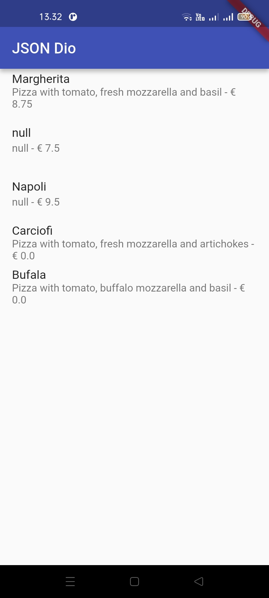
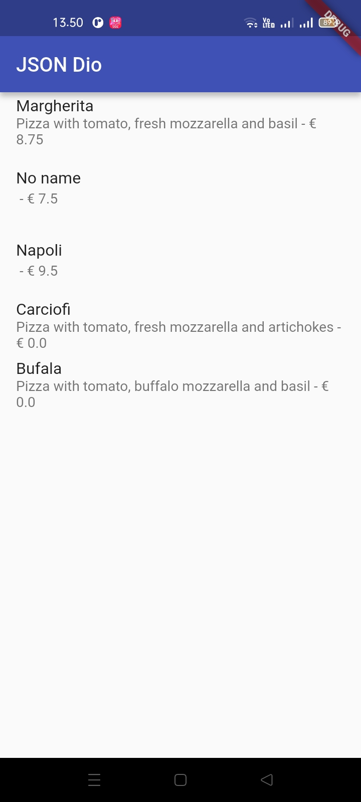

# Persistensi Data

NIM : 2341720098 <br>
NAMA : Dio Andika Pradana Mulia Tama <br>
KELAS : TI-3F

## Praktikum 1: Konversi Dart model ke JSON

### Kode Program `main.dart`:

```dart
import 'package:flutter/material.dart';

void main() {
  runApp(const MyApp());
}

class MyApp extends StatelessWidget {
  const MyApp({super.key});

  // This widget is the root of your application.
  @override
  Widget build(BuildContext context) {
    return MaterialApp(
      title: 'Flutter JSON Demo Dio',
      theme: ThemeData(primarySwatch: Colors.indigo, useMaterial3: false),
      home: const MyHomePage(),
    );
  }
}

class MyHomePage extends StatefulWidget {
  const MyHomePage({super.key});

  @override
  State<MyHomePage> createState() => _MyHomePageState();
}

class _MyHomePageState extends State<MyHomePage> {
  @override
  Widget build(BuildContext context) {
    return Scaffold(
      appBar: AppBar(title: const Text('JSON Dio')),
      body: Container(),
    );
  }
}
```

**Soal 1**

- Tambahkan **nama panggilan Anda** pada `title` app sebagai identitas hasil pekerjaan Anda. ꪜ
- Gantilah warna tema aplikasi sesuai kesukaan Anda. ꪜ
- Lakukan commit hasil jawaban Soal 1 dengan pesan "**W13: Jawaban Soal 1**" ꪜ

### Update Kode Program Class `_MyHomePageState` di `main.dart`:

```dart
class _MyHomePageState extends State<MyHomePage> {
  String pizzaString = '';

  @override
  void initState() {
    super.initState();
    readJsonFile();
  }

  @override
  Widget build(BuildContext context) {
    return Scaffold(
      appBar: AppBar(title: const Text('JSON Dio')),
      body: Text(pizzaString),
    );
  }

  Future readJsonFile() async {
    String myString = await DefaultAssetBundle.of(
      context,
    ).loadString('assets/pizzalist.json');
    setState(() {
      pizzaString = myString;
    });
  }
}
```

### Run


**Soal 2**

- Masukkan hasil capture layar ke laporan praktikum Anda. ꪜ
- Lakukan commit hasil jawaban Soal 2 dengan pesan "**W13: Jawaban Soal 2**" ꪜ

### Kode Program file `lib/model/pizza.dart`:

```dart
class Pizza {
  final int id;
  final String pizzaName;
  final String description;
  final double price;
  final String imageUrl;

  Pizza.fromJson(Map<String, dynamic> json)
    : id = json['id'],
      pizzaName = json['pizzaName'],
      description = json['description'],
      price = json['price'],
      imageUrl = json['imageUrl'];
}
```

### Update Kode Program Class `_MyHomePageState` di `main.dart`:

```dart
class _MyHomePageState extends State<MyHomePage> {
  String pizzaString = '';
  List<Pizza> myPizzas = [];

  @override
  void initState() {
    super.initState();
    readJsonFile().then((value) {
      setState(() {
        myPizzas = value;
      });
    });
  }

  @override
  Widget build(BuildContext context) {
    return Scaffold(
      appBar: AppBar(title: const Text('JSON Dio')),
      body: ListView.builder(
        itemCount: myPizzas.length,
        itemBuilder: (context, index) {
          return ListTile(
            title: Text(myPizzas[index].pizzaName),
            subtitle: Text(myPizzas[index].description),
          );
        },
      ),
    );
  }

  Future<List<Pizza>> readJsonFile() async {
    String myString = await DefaultAssetBundle.of(
      context,
    ).loadString('assets/pizzalist.json');
    List pizzaMapList = jsonDecode(myString);
    List<Pizza> myPizzas = [];
    for (var pizza in pizzaMapList) {
      Pizza myPizza = Pizza.fromJson(pizza);
      myPizzas.add(myPizza);
    }
    return myPizzas;
    // setState(() {
    //   pizzaString = pizzaMapList.toString();
    // });
  }
}
```

### Run

Jalankan aplikasi. Sekarang, Anda akan melihat data pizza ditampilkan dalam daftar yang lebih terstruktur sebagai objek List Dart.


**Soal 3**

- Masukkan hasil capture layar ke laporan praktikum Anda. ꪜ
- Lakukan commit hasil jawaban Soal 2 dengan pesan "**W13: Jawaban Soal 3**" ꪜ

### Update Kode Program file `lib/model/pizza.dart`:

```dart
class Pizza {
  // Existing code

  Map<String, dynamic> toJson() {
    return {
      'id': id,
      'pizzaName': pizzaName,
      'description': description,
      'price': price,
      'imageUrl': imageUrl,
    };
  }
}
```

### Update Kode Program Class `_MyHomePageState` di `main.dart`:

```dart
class _MyHomePageState extends State<MyHomePage> {
  // Existing code

  Future<List<Pizza>> readJsonFile() async {
    // Existing code
    String json = convertToJSON(myPizzas);
    print(json);
    return myPizzas;
  }

  String convertToJSON(List<Pizza> pizzas) {
    return jsonEncode(pizzas.map((pizza) => jsonEncode(pizza)).toList());
  }
}
```

### Cek Output Konsol

Jalankan aplikasi. Periksa Debug Console untuk melihat List objek Pizza telah berhasil dikonversi kembali menjadi JSON String.


## Praktikum 2: Handle kompatibilitas data JSON

### Update Kode Program `Class Pizza`:

```dart
class Pizza {
    // Existing code

  Pizza.fromJson(Map<String, dynamic> json)
    : id = int.tryParse(json['id'].toString()) ?? 0,
      pizzaName = json['pizzaName'].toString(),
      description = json['description'].toString(),
      price = double.tryParse(json['price'].toString()) ?? 0,
      imageUrl = json['imageUrl'].toString();

  // Existing code
}
```

### Run dan Perhatikan Output Null

Setelah mengimplementasikan semua perbaikan tipe data, aplikasi akan berjalan, tetapi mungkin menampilkan "null" di UI jika ada bidang yang hilang atau gagal diparsing (seperti pizzaName atau description).



### Menambahkan Operator Ternary untuk Output User-Friendly

```dart
  Pizza.fromJson(Map<String, dynamic> json)
    : id = int.tryParse(json['id'].toString()) ?? 0,
      pizzaName = json['pizzaName'] != null
          ? json['pizzaName'].toString()
          : 'No name',
      description = json['description'] != null
          ? json['description'].toString()
          : '',
      price = double.tryParse(json['price'].toString()) ?? 0,
      imageUrl = json['imageUrl'] ?? '';
```

### Run

Jalankan aplikasi. Sekarang data yang tidak konsisten telah ditangani dengan baik, dan UI tidak menampilkan nilai null.




**Soal 4**

- Capture hasil running aplikasi Anda, kemudian impor ke laporan praktikum Anda! ꪜ
- Lalu lakukan commit dengan pesan "**W13: Jawaban Soal 4**". ꪜ
