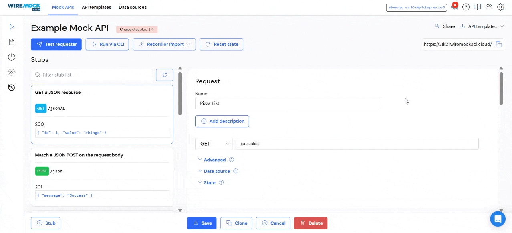
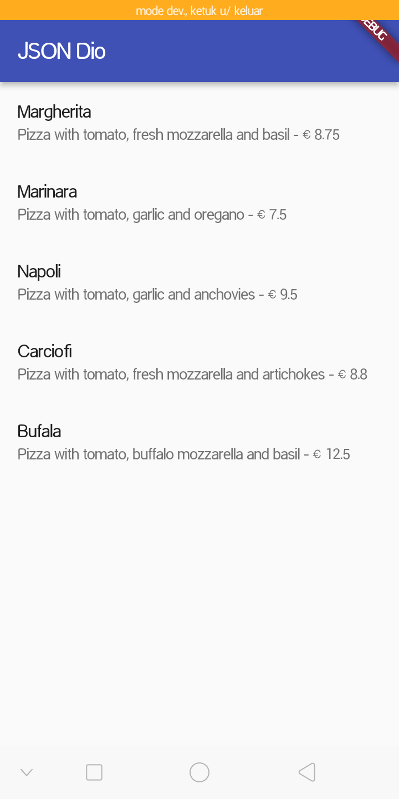
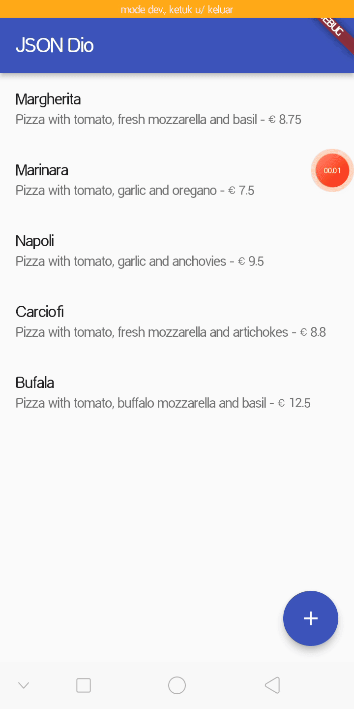
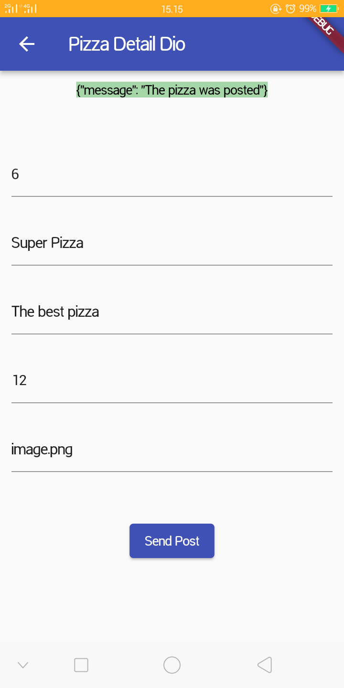
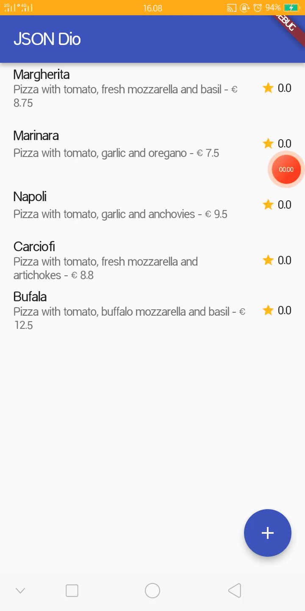
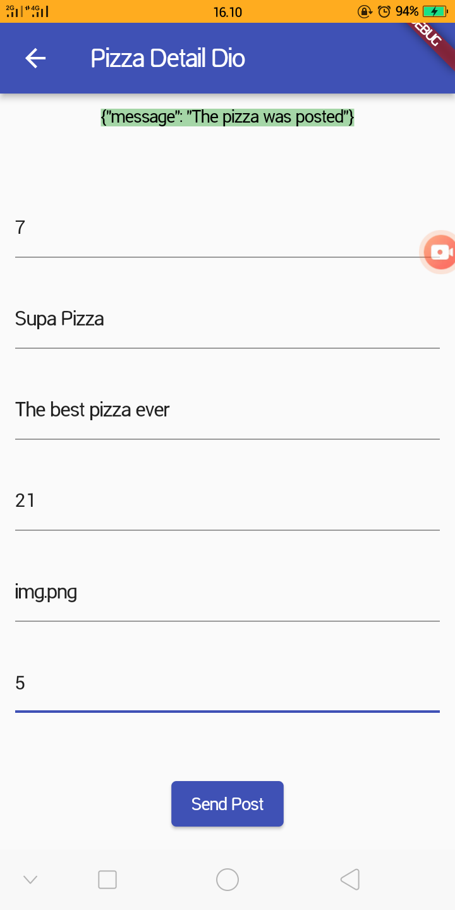
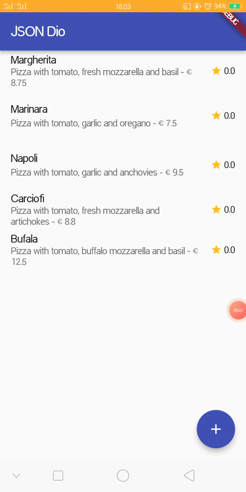
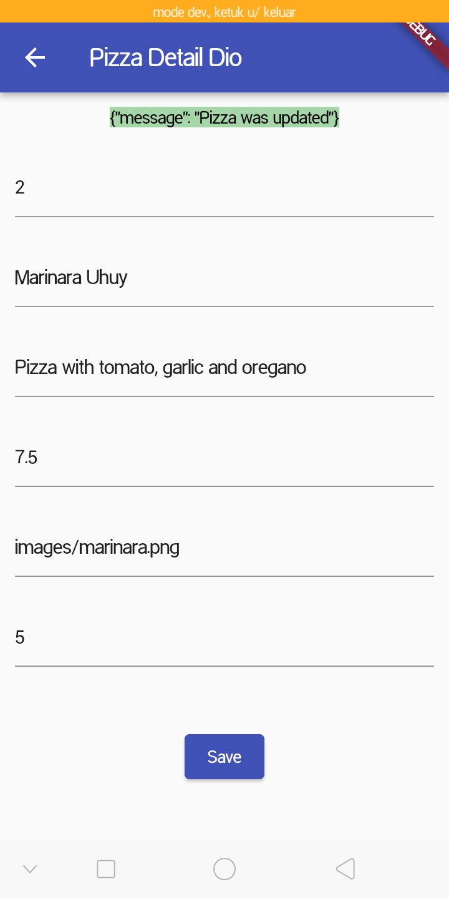
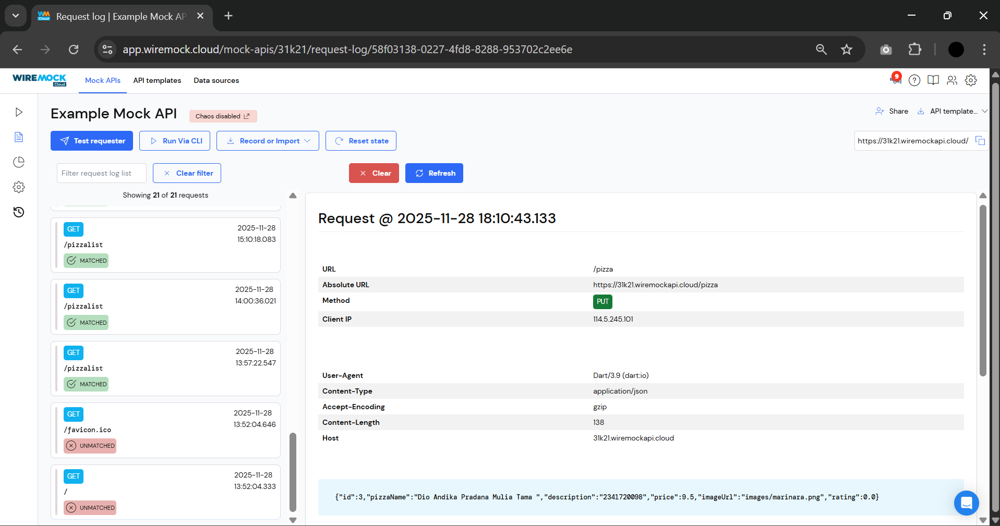
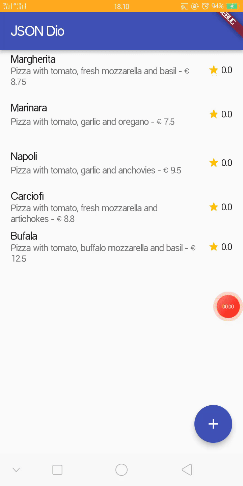

# RESTful API

NIM : 2341720098 <br>
NAMA : Dio Andika Pradana Mulia Tama <br>
KELAS : TI-3F

## Praktikum 1: Membuat layanan Mock API

### Mengatur Layanan Mock Back End (GET)



### Kode Program `pizza.dart`:

```dart
const keyId = 'id';
const keyName = 'pizzaName';
const keyDescription = 'description';
const keyPrice = 'price';
const keyImage = 'imageUrl';

class Pizza {
  final int id;
  final String pizzaName;
  final String description;
  final double price;
  final String imageUrl;

  Pizza.fromJson(Map<String, dynamic> json)
    : id = int.tryParse(json[keyId].toString()) ?? 0,
      pizzaName = json[keyName] != null ? json[keyName].toString() : 'No name',
      description = json[keyDescription] != null
          ? json[keyDescription].toString()
          : '',
      price = double.tryParse(json[keyPrice].toString()) ?? 0,
      imageUrl = json[keyImage] ?? '';

  Map<String, dynamic> toJson() {
    return {
      keyId: id,
      keyName: pizzaName,
      keyDescription: description,
      keyPrice: price,
      keyImage: imageUrl,
    };
  }
}
```

### Kode Program `httphelper.dart`:

```dart
import 'dart:io';
import 'package:http/http.dart' as http;
import 'dart:convert';
import 'pizza.dart';

class HttpHelper {
  final String authority = '31k21.wiremockapi.cloud';
  final String path = 'pizzalist';

  Future<List<Pizza>> getPizzaList() async {
    final Uri url = Uri.https(authority, path);
    final http.Response result = await http.get(url);

    if (result.statusCode == HttpStatus.ok) {
      final jsonResponse = json.decode(result.body);
      //provide a type argument to the map method to avoid type
      //error
      List<Pizza> pizzas = jsonResponse
          .map<Pizza>((i) => Pizza.fromJson(i))
          .toList();
      return pizzas;
    } else {
      return [];
    }
  }
}
```

### Kode Program `main.dart`:

```dart
import 'package:flutter/material.dart';
import 'httphelper.dart';
import 'pizza.dart';

void main() {
  runApp(const MyApp());
}

class MyApp extends StatelessWidget {
  const MyApp({super.key});

  // This widget is the root of your application.
  @override
  Widget build(BuildContext context) {
    return MaterialApp(
      title: 'Flutter Demo',
      theme: ThemeData(primarySwatch: Colors.indigo, useMaterial3: false),
      home: const MyHomePage(title: 'Flutter Demo Home Page'),
    );
  }
}

class MyHomePage extends StatefulWidget {
  const MyHomePage({super.key, required this.title});
  final String title;

  @override
  State<MyHomePage> createState() => _MyHomePageState();
}

class _MyHomePageState extends State<MyHomePage> {
  Future<List<Pizza>> callPizzas() async {
    HttpHelper helper = HttpHelper();
    List<Pizza> pizzas = await helper.getPizzaList();
    return pizzas;
  }

  @override
  Widget build(BuildContext context) {
    return Scaffold(
      appBar: AppBar(title: const Text('JSON Dio')),
      body: FutureBuilder(
        future: callPizzas(),
        builder: (BuildContext context, AsyncSnapshot<List<Pizza>> snapshot) {
          if (snapshot.hasError) {
            return const Text('Something went wrong');
          }
          if (!snapshot.hasData) {
            return const CircularProgressIndicator();
          }
          return ListView.builder(
            itemCount: (snapshot.data == null) ? 0 : snapshot.data!.length,
            itemBuilder: (BuildContext context, int position) {
              return ListTile(
                title: Text(snapshot.data![position].pizzaName),
                subtitle: Text(
                  snapshot.data![position].description +
                      ' - € ' +
                      snapshot.data![position].price.toString(),
                ),
              );
            },
          );
        },
      ),
    );
  }
}
```

### Run



**Soal 1**

- Tambahkan **nama panggilan Anda** pada `title` app sebagai identitas hasil pekerjaan Anda. ꪜ
- Gantilah warna tema aplikasi sesuai kesukaan Anda. ꪜ
- Capture hasil aplikasi Anda, lalu masukkan ke laporan di README dan lakukan commit hasil jawaban Soal 1 dengan pesan "**W14: Jawaban Soal 1**" ꪜ

## Praktikum 2: Mengirim Data ke Web Service (POST)

### Konfigurasi Stub POST


### Menambahkan method `postPizza()` di Class `HttpHelper`:

```dart
  Future<String> postPizza(Pizza pizza) async {
    const postPath = '/pizza';
    String post = json.encode(pizza.toJson());
    Uri url = Uri.https(authority, postPath);
    http.Response r = await http.post(url, body: post);
    return r.body;
  }
```

### Kode Program `pizza_detail.dart`:

```dart
import 'package:flutter/material.dart';
import 'httphelper.dart';
import 'pizza.dart';

class PizzaDetailScreen extends StatefulWidget {
  const PizzaDetailScreen({super.key});
  @override
  State<PizzaDetailScreen> createState() => _PizzaDetailScreenState();
}

class _PizzaDetailScreenState extends State<PizzaDetailScreen> {
  final TextEditingController txtId = TextEditingController();
  final TextEditingController txtName = TextEditingController();
  final TextEditingController txtDescription = TextEditingController();
  final TextEditingController txtPrice = TextEditingController();
  final TextEditingController txtImageUrl = TextEditingController();
  String operationResult = '';

  @override
  void dispose() {
    txtId.dispose();
    txtName.dispose();
    txtDescription.dispose();
    txtPrice.dispose();
    txtImageUrl.dispose();
    super.dispose();
  }

  @override
  Widget build(BuildContext context) {
    return Scaffold(
      appBar: AppBar(title: const Text('Pizza Detail Dio')),
      body: Padding(
        padding: const EdgeInsets.all(12),
        child: SingleChildScrollView(
          child: Column(
            children: [
              Text(
                operationResult,
                style: TextStyle(
                  backgroundColor: Colors.green[200],
                  color: Colors.black,
                ),
              ),
              const SizedBox(height: 24),
              TextField(
                controller: txtId,
                decoration: const InputDecoration(hintText: 'Insert ID'),
              ),
              const SizedBox(height: 24),
              TextField(
                controller: txtName,
                decoration: const InputDecoration(
                  hintText: 'Insert Pizza Name',
                ),
              ),
              const SizedBox(height: 24),
              TextField(
                controller: txtDescription,
                decoration: const InputDecoration(
                  hintText: 'Insert Description',
                ),
              ),
              const SizedBox(height: 24),
              TextField(
                controller: txtPrice,
                decoration: const InputDecoration(hintText: 'Insert Price'),
              ),
              const SizedBox(height: 24),
              TextField(
                controller: txtImageUrl,
                decoration: const InputDecoration(hintText: 'Insert Image Url'),
              ),
              const SizedBox(height: 48),
              ElevatedButton(
                child: const Text('Send Post'),
                onPressed: () {
                  postPizza();
                },
              ),
            ],
          ),
        ),
      ),
    );
  }

  Future postPizza() async {
    HttpHelper helper = HttpHelper();
    Pizza pizza = Pizza();
    pizza.id = int.tryParse(txtId.text);
    pizza.pizzaName = txtName.text;
    pizza.description = txtDescription.text;
    pizza.price = double.tryParse(txtPrice.text);
    pizza.imageUrl = txtImageUrl.text;
    String result = await helper.postPizza(pizza);
    setState(() {
      operationResult = result;
    });
  }
}
```

### Menambahkan `FloatingActionButton` di Scaffold dari metode `build()` kelas `_MyHomePageState`:

```dart
      floatingActionButton: FloatingActionButton(
        child: const Icon(Icons.add),
        onPressed: () {
          Navigator.push(
            context,
            MaterialPageRoute(builder: (context) => const PizzaDetailScreen()),
          );
        },
      ),
```

## Run





**Soal 2**

- Tambahkan **field baru** dalam JSON maupun POST ke Wiremock! ꪜ

  Saya menambahkan field **rating**.

  

  

- Capture hasil aplikasi Anda berupa GIF di README dan lakukan commit hasil jawaban Soal 2 dengan pesan "**W14: Jawaban Soal 2**" ꪜ

## Praktikum 3: Memperbarui Data di Web Service (PUT)

### Konfigurasi Stub PUT


### Menambahkan method `putPizza()` di Class `HttpHelper`:

```dart
  Future<String> putPizza(Pizza pizza) async {
    const putPath = '/pizza';
    String put = json.encode(pizza.toJson());
    Uri url = Uri.https(authority, putPath);
    http.Response r = await http.put(
      url,
      body: put,
      headers: {'Content-Type': 'application/json'},
    );
    return r.body;
  }
```

### Update Kode Program `pizza_detail.dart`:

```dart
import 'package:flutter/material.dart';
import 'httphelper.dart';
import 'pizza.dart';

class PizzaDetailScreen extends StatefulWidget {
  final Pizza pizza;
  final bool isNew;

  const PizzaDetailScreen({
    super.key,
    required this.pizza,
    required this.isNew,
  });
  @override
  State<PizzaDetailScreen> createState() => _PizzaDetailScreenState();
}

class _PizzaDetailScreenState extends State<PizzaDetailScreen> {
  final TextEditingController txtId = TextEditingController();
  final TextEditingController txtName = TextEditingController();
  final TextEditingController txtDescription = TextEditingController();
  final TextEditingController txtPrice = TextEditingController();
  final TextEditingController txtImageUrl = TextEditingController();
  final TextEditingController txtRating = TextEditingController();
  String operationResult = '';

  @override
  void initState() {
    if (!widget.isNew) {
      txtId.text = widget.pizza.id?.toString() ?? '';
      txtName.text = widget.pizza.pizzaName ?? '';
      txtDescription.text = widget.pizza.description ?? '';
      txtPrice.text = widget.pizza.price?.toString() ?? '';
      txtImageUrl.text = widget.pizza.imageUrl ?? '';
      txtRating.text = widget.pizza.rating?.toString() ?? '';
    }
    super.initState();
  }

  @override
  void dispose() {
    txtId.dispose();
    txtName.dispose();
    txtDescription.dispose();
    txtPrice.dispose();
    txtImageUrl.dispose();
    txtRating.dispose();
    super.dispose();
  }

  @override
  Widget build(BuildContext context) {
    return Scaffold(
      appBar: AppBar(title: const Text('Pizza Detail Dio')),
      body: Padding(
        padding: const EdgeInsets.all(12),
        child: SingleChildScrollView(
          child: Column(
            children: [
              Text(
                operationResult,
                style: TextStyle(
                  backgroundColor: Colors.green[200],
                  color: Colors.black,
                ),
              ),
              const SizedBox(height: 24),
              TextField(
                controller: txtId,
                decoration: const InputDecoration(hintText: 'Insert ID'),
              ),
              const SizedBox(height: 24),
              TextField(
                controller: txtName,
                decoration: const InputDecoration(
                  hintText: 'Insert Pizza Name',
                ),
              ),
              const SizedBox(height: 24),
              TextField(
                controller: txtDescription,
                decoration: const InputDecoration(
                  hintText: 'Insert Description',
                ),
              ),
              const SizedBox(height: 24),
              TextField(
                controller: txtPrice,
                decoration: const InputDecoration(hintText: 'Insert Price'),
              ),
              const SizedBox(height: 24),
              TextField(
                controller: txtImageUrl,
                decoration: const InputDecoration(hintText: 'Insert Image Url'),
              ),
              const SizedBox(height: 24),
              TextField(
                controller: txtRating,
                decoration: const InputDecoration(
                  hintText: 'Insert Rating (0-5)',
                ),
                keyboardType: TextInputType.number,
              ),
              const SizedBox(height: 48),
              ElevatedButton(
                child: const Text('Save'),
                onPressed: () {
                  // postPizza();
                  savePizza();
                },
              ),
            ],
          ),
        ),
      ),
    );
  }

  Future postPizza() async {
    HttpHelper helper = HttpHelper();
    Pizza pizza = Pizza();
    pizza.id = int.tryParse(txtId.text);
    pizza.pizzaName = txtName.text;
    pizza.description = txtDescription.text;
    pizza.price = double.tryParse(txtPrice.text);
    pizza.imageUrl = txtImageUrl.text;
    pizza.rating = double.tryParse(txtRating.text);
    String result = await helper.postPizza(pizza);
    setState(() {
      operationResult = result;
    });
  }

  Future savePizza() async {
    HttpHelper helper = HttpHelper();
    Pizza pizza = Pizza();
    pizza.id = int.tryParse(txtId.text);
    pizza.pizzaName = txtName.text;
    pizza.description = txtDescription.text;
    pizza.price = double.tryParse(txtPrice.text);
    pizza.imageUrl = txtImageUrl.text;
    pizza.rating = double.tryParse(txtRating.text);

    final result = await (widget.isNew
        ? helper.postPizza(pizza)
        : helper.putPizza(pizza));
    setState(() {
      operationResult = result;
    });
  }
}
```

### Update Kode Program `main.dart`:

```dart
import 'package:flutter/material.dart';
import 'httphelper.dart';
import 'pizza.dart';
import 'pizza_detail.dart';

// Existing code

class _MyHomePageState extends State<MyHomePage> {
  Future<List<Pizza>> callPizzas() async {
    HttpHelper helper = HttpHelper();
    List<Pizza> pizzas = await helper.getPizzaList();
    return pizzas;
  }

  @override
  Widget build(BuildContext context) {
    return Scaffold(
      appBar: AppBar(title: const Text('JSON Dio')),
      body: FutureBuilder(
        future: callPizzas(),
        builder: (BuildContext context, AsyncSnapshot<List<Pizza>> snapshot) {
          if (snapshot.hasError) {
            return const Text('Something went wrong');
          }
          if (!snapshot.hasData) {
            return const CircularProgressIndicator();
          }
          return ListView.builder(
            itemCount: (snapshot.data == null) ? 0 : snapshot.data!.length,
            itemBuilder: (BuildContext context, int position) {
              return ListTile(
                title: Text(snapshot.data![position].pizzaName ?? ''),
                subtitle: Text(
                  '${snapshot.data![position].description ?? ''} - € ${snapshot.data![position].price ?? 0}',
                ),
                trailing: Row(
                  mainAxisSize: MainAxisSize.min,
                  children: [
                    const Icon(Icons.star, color: Colors.amber, size: 16),
                    Text(' ${snapshot.data![position].rating ?? 0}'),
                  ],
                ),
                onTap: () {
                  Navigator.push(
                    context,
                    MaterialPageRoute(
                      builder: (context) => PizzaDetailScreen(
                        pizza: snapshot.data![position],
                        isNew: false,
                      ),
                    ),
                  );
                },
              );
            },
          );
        },
      ),
      floatingActionButton: FloatingActionButton(
        child: const Icon(Icons.add),
        onPressed: () {
          Navigator.push(
            context,
            MaterialPageRoute(
              builder: (context) =>
                  PizzaDetailScreen(pizza: Pizza(), isNew: true),
            ),
          );
        },
      ),
    );
  }
}
```

## Run





**Soal 3**

- Ubah salah satu data dengan Nama dan NIM Anda, lalu perhatikan hasilnya di Wiremock. ꪜ

  

  

- Capture hasil aplikasi Anda berupa GIF di README dan lakukan commit hasil jawaban Soal 3 dengan pesan "**W14: Jawaban Soal 3**" ꪜ

  
